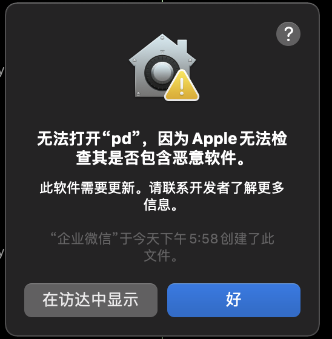
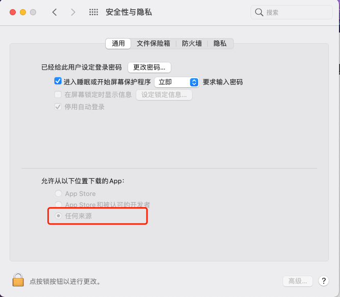

---
nav:
  title: Q&A
  order: 6
  toc: menu
---
# Q & A


### **前端依赖安装出现问题**

如果安装node 包报 401、404 解决方法：在用户目录( ~) 下新建 .npmrc 文件，

Mac、linux电脑执行命令：**cd ~  && vim .npmrc**

文件内容如下：

```Bash
registry=https://npm2.myones.net/
@ones-ai:registry=https://npm2.myones.net/
@ones-design:registry=https://npm2.myones.net/
@ones-plugin:registry=https://npm2.myones.net/
always-auth=true
//npm2.myones.net/:_password="SGFpbE9uZXM="
//npm2.myones.net/:username=ones
//npm2.myones.net/:email=你的邮箱@ones.ai
//npm2.myones.net/:always-auth=true
unsafe-perm=true
```

保存执行 **"./工具名称  init -m=depend"** ,交互界面提示成功即可。

<br >

windows电脑通常是在 C盘的用户目录下（C:\Users\用户名\） ，也可以在终端输入命令**"npm config list"**查询到，然后修改该文件，添加上述内容。


<br >

<br >

### **后端依赖安装提示cmake没有安装**

提示error ：cmake: command not found

1、从CMake [官网下载](https://cmake.org/download/) 下载dmg文件并安装

2、mac系统：安装好之后执行 ：sudo "/Applications/CMake.app/Contents/bin/cmake-gui" --install

3、cmake --version查看版本

<br >

提示：CMake Error: The source directory "/Users/tony/dev/plugin-test/backend/node_modules/zeromq/build/libzmq" does not appear to contain CMakeLists.txt

解决办法：cmake版本在：3.22.x，当前已知cmake-3.23.0-rc1版本有问题。

<br >

<br >

### **后端安装依赖提示代理出错**

提示：npm ERR! gyp ERR! stack FetchError: request to https://nodejs.org/download/release/v16.13.0/node-v16.13.0-headers.tar.gz failed, reason: **Hostname/IP does not match certificate's altnames: IP:xxx.xx.xx.xx is not in the cert's list:**

1、关闭代理

2、执行 npm set strict-ssl false

<br >

<br >

### **mac系统升级导致Xcode出现不可预期的错误**

提示：

```javascript
No receipt for 'com.apple.pkg.DeveloperToolsCLILeo' found at '/'.
No receipt for 'com.apple.pkg.DeveloperToolsCLI' found at '/'.
No receipt for 'com.apple.pkg.CLTools_Executables' found at '/'.
```

方法一（推荐）下载包地址：https://developer.apple.com/download/all/?q=Command%20Line%20Tools%20for%20Xcode

</br>

方法二（谨慎使用）

```shell
sudo rm -rf $(xcode-select -print-path)
xcode-select --install
```


<br >

<br >

### **提示端口被占用**

&emsp;&emsp;当goland终端运行pd工具，并且使用“ctrl + c”结束正在运行的插件项目时候，可能会出现端口被占用的情况，或者是异常结束插件项目，再次运行时候提示端口被占用。

方法一：用本地或者其他终端启动pd工具；

方法二：执行" killall node "命令，再次运行插件项目。


<br >

<br >

### **更换新电脑出现的依赖安装出错问题**

&emsp;&emsp;运行报错提示如下：

```javascript
dyld: lazy symbol binding failed: Symbol not found: _zmq_ctx_new
  Referenced from: /Users/xxx/gitlabworkspace/xxxxx-demo/backend/node_modules/zeromq/build/Release/zeromq.node
  Expected in: flat namespace

dyld: Symbol not found: _zmq_ctx_new
  Referenced from: /Users/xxx/gitlabworkspace/xxxx-demo/backend/node_modules/zeromq/build/Release/zeromq.node
  Expected in: flat namespace

zsh: abort      node ./backend/node_modules/@ones-op/node-host/dist/index.js  --tags=local
```


&emsp;&emsp;解决问题：排查编译Node.js二进制文件的操作系统CPU架构是不是跟当前操作系统的CPU架构一致。执行命令 " **node -p "process.arch"**  "得到当前编译该Node.js版本的CPU架构，如果与当前操作系统的CPU架构不符合，更新Node.js版本即可。


<br >

<br >

### **工具使用提示”无法打开“**



在Mac 的偏好设置 - 安全性与隐私 选项中选择”通用“，在”允许从以下位置下载的APP中“选择" 任何来源 " 。



