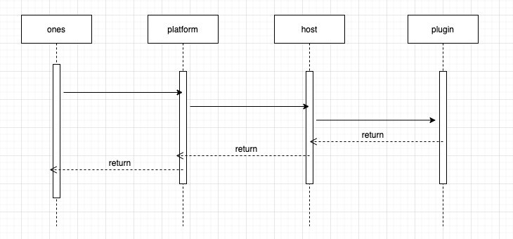
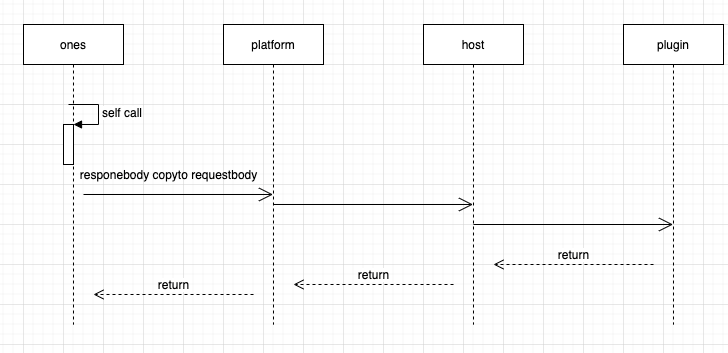
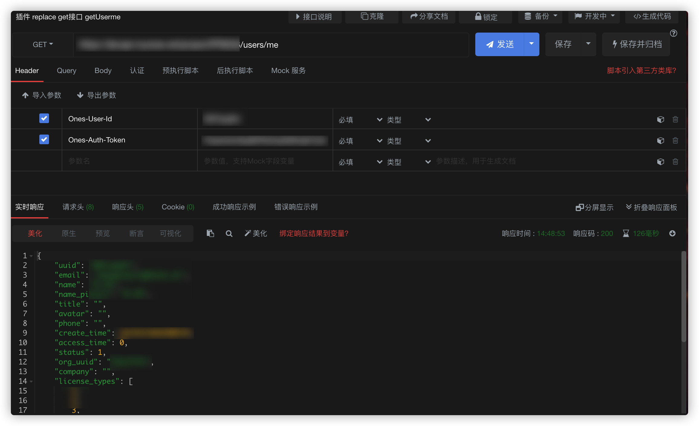

# Interface hijacking (to be abandoned)

## Description of ability

Plugins can hijack all standard interfaces provided by the project, supporting front, back and replacement methods;

- Forward hijacking means that when a request enters the standard system, it is forwarded to the plug-in before it is processed. After the request is modified by the plugin, it is sent back to the standard system and continues to execute. It is generally used to modify the parameters of the request or to check whether the request meets certain conditions.；
- Rear hijacking means that when the request is processed in the standard system, it will be passed to the plug-in, which will be aligned and modified by the plugin, and then transmitted back to the standard system and returned to the requestor. It is generally used to process the corresponding content.；
- In addition, the plug-in can "replace" an interface of the existing system, so that the plugin can fully customize a request of the existing system.。

:::caution Attention

Hijacking and replacement are relatively low-level operations, which may pose unknown risks to system functions.

At the same time, at present, only one plug-in can hijack or replace an interface.

There is a conflict between multiple plug-ins handling the same interface.

Interface hijacking capabilities can only be used if other capabilities do not meet the needs.

The ability to be abandoned does not guarantee subsequent continuous compatibility !!!

:::

## Ability use

### Interface type description

#### Replace （plugin replacement standard interface）



⚠️ In the plug-in code, if the plug-in also needs to request the interface where the subject is replaced, it needs to be put in the request header.

```javascript
headers: { 'Replace': "replace", }
```

#### prefix（Plugin pre-interception standard interface）


#### suffix（Plugin Rear Interception Specimens Interface）



### Statement of Competency

Add the following to the plugin.yaml

```yaml
apis:
    - type: replace
    methods:
      - GET
    url: /users/me
    function: jackFunc
    - type: prefix
    methods:
      - GET
    url: /project-url
    function: prefixFunc
     - type: suffix
    methods:
      - GET
    url: /project-url
    function: suffixFunc

```

:::caution Attention

If the plug-in profile is modified（`config/plugin.yaml`），Need to run `npx op invoke clear` And rerun `npx op invoke run` Instructions can make the configuration effective.。

:::

### Call the method

Write a functional methodology with apis configuration under the file ``backend/src/index.ts`，

```javascript
import { Logger } from '@ones-op/node-logger'
import { fetchHttp, fetchONES } from '@ones-op/node-fetch'

export async function jackFunc(
    request: PluginRequest<Record<string, any>>
): Promise<PluginResponse> {
    let userUUID = ''
    let userToken = ''
    if (request.headers['Ones-User-Id'] != null) {
    userUUID = request.headers['Ones-User-Id']
    userToken = request.headers['Ones-Auth-Token']
}
const response = await fetchONES({
    path: `/users/me`,
    method: 'GET',
    headers: {
        'Ones-User-Id': [userUUID],
        'Ones-Auth-Token': [userToken],
    },
    root: false,
})
if (response) {
    return response
}
return {
    body: {},
}

export async function prefixFunc(
    request: PluginRequest<Record<string, any>>
): Promise<PluginResponse> {
    let body = request?.body
    // code
    return {
        body: body,
    }
}

//suffix
export async function suffixFunc(
    request: PluginRequest<Record<string, any>>
): Promise<PluginResponse> {
    let body = {}
    // code
    return {
        body: body,
    }
}

```

### Implementation process

:::cautionAttention

1、The url of the standard is hijacked, so the url filled in is consistent with the standard;

2、Confirm whether the replaced interface itself is a POST request or a GET request.；

3、To confirm what parameters need to be set by the replaced interface request header, please refer to the api interface document.【[ONES-API](../../ones/readme/index.md)】
:::

```javascript
url：https://yourhost/users/me
headers:
    Ones-User-Id:{user_uuid}
    Ones-Auth-Token:{user_token}
    ...
method: GET
```

Or enter the following on the command line.

```javascript
curl --location --request GET 'https://yourhost/users/me' \
--header 'Ones-User-Id: {user_uuid}' \
--header 'Ones-Auth-Token: {user_token}' \
--header 'Content-Type: application/json' \
--data ''
```

The return result is as follows:


