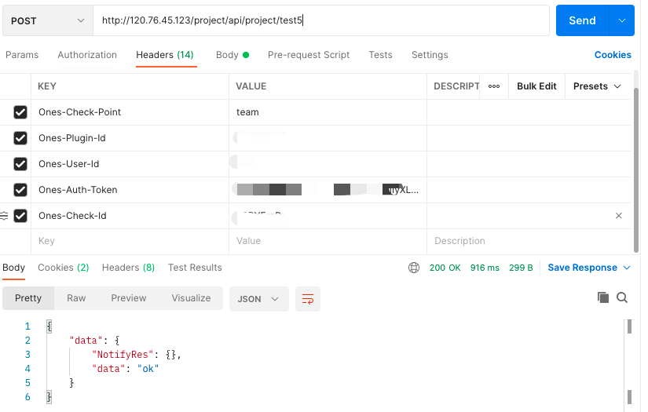
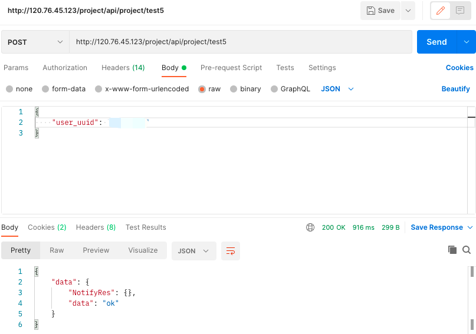
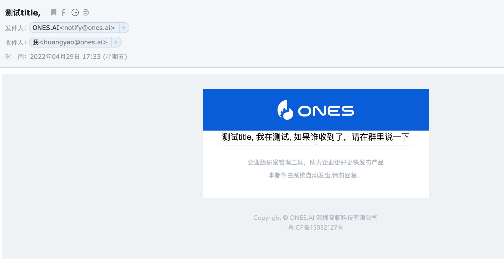

# 插件发送消息

## 能力描述

插件提供向用户发送消息(微信、钉钉、邮件、有度)的能力；

例如：我想通过邮件给 ONES 某用户发送操作成功通知

### API

提供了五种消息通知方法：NotifyWay.Email、NotifyWay.Lark、NotifyWay.YouDu、NotifyWay.WeChat、NotifyWay.DingDing

### 使用

调用方法输入用户的 user_uuid

```javascript
export async function test5(request: PluginRequest): Promise<PluginResponse> {
    const { user_uuid } = request?.body as any
    if(!user_uuid){
        return {
            body: {
                error: "缺少参数 user_uuid"
            }
        }
    }
    const NotifyRes = await Notify({
        Title: '测试title, ',
        ToUsers: [user_uuid],
        NotifyWay: NotifyWay.Email,
        MessageBody: [
            {
                Body: '我在测试, 如果谁收到了，请在群里说一下',
                Url: 'https://ones.cn/',
            },
        ],
        Ext: 'ext string',
        Source: 'source string',
    });
    return {
        body: {
            NotifyRes: NotifyRes,
            data: 'ok',
        },
    };
}
```

接下来安装完插件就可以调用这个接口




### 效果展示


