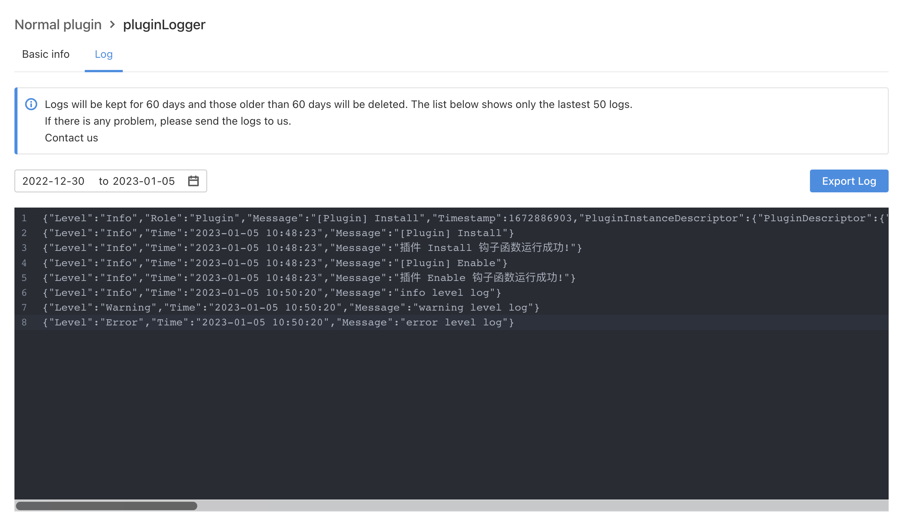

# Logger

## Requirements

| **ONES** |
| :------- |
| 3.6+     |

## Overview

This ability allows each plugin to print its own log, providing four levels of standard log printing methods： `debug`，`info`，`warning`，`error`, also support the export of log files.

Logs printed using the standard log method are displayed in the log page in the plugin details page, which only displays logs at the `info`,`warning` and `error` level.

You can view the log details in the plugin management, as shown in the following figure.



## Usage

When debugging locally, if you need to print the log to the console, you can open and configure `debug_mode: true` in `config/local.yaml`.

### Logger ability usage：

1. #### Install dependencies

   Run the following instructions under the plugin root directory to install the dependencies（Note that this ability is used by backend by default, and the directory is under `backend`）.

   ```shell
   cd backend
   npm i @ones-op/node-logger
   ```

2. #### Example

   ```javascript
   import { Logger } from '@ones-op/node-logger'

   function logExample() {
     Logger.debug('test')
     Logger.info('hello world')
     Logger.warning('hello', 'world')
     Logger.error('error: ', new Error('error message'))
   }
   ```
