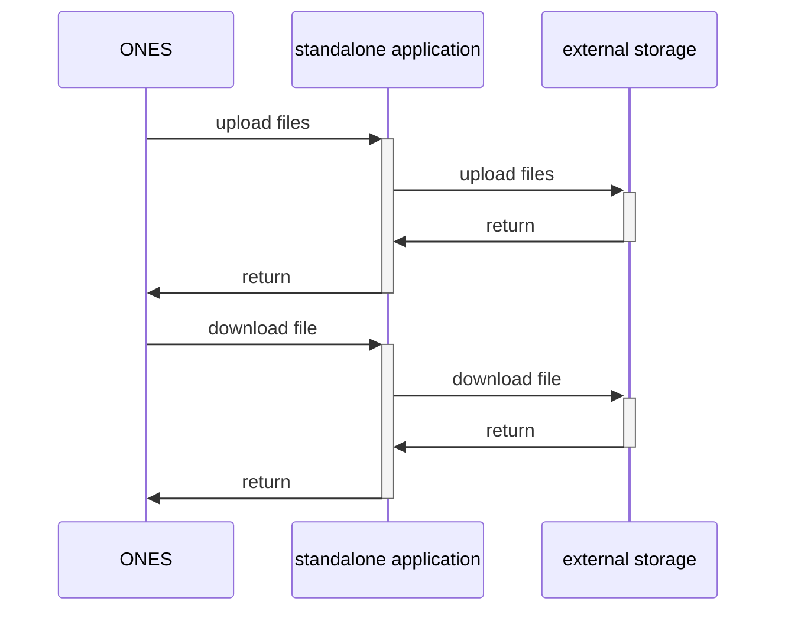

# Scene: Use external storage

## Scene Description

Users want to connect the underlying storage of the ONES to other storage services, such as user built file storage services or other storage services that are not directly supported by ONES.

## Solution

### Implementation idea:

Use the generic storage method (universal storage) of the ONES, and use standalone applications to implement generic interface specifications and convert related file operations to external storage. If you need to use wiz, the standalone application also needs to implement the interface specification of wiz general cloud storage. The developed service is deployed through the plugin using the ability to host standalone applications to realize the connection with external storage.

### Implementation principle:



## Plugin development

The development of the file storage plugin is divided into two steps, which are the development of standalone applications and the addition of host standalone application ability for plugin hosting.

### File storage standalone application development steps:

#### Step 1: Writing standalone application management scripts

The standalone application executable is named：`file_storage`

```shell title="workspace/start.sh"
#!/bin/bash
usage() {
    echo -e "Usage: $(basename $0) [options]"
    echo -e " start"

    exit 1
}
# Deal with startup service
start() {
    echo "/usr/bin/nohup ./file_storage --port=$PARAMS_PORT --args=$ARGS >/dev/null 2>&1 &"
    /usr/bin/nohup ./file_storage --port=$PARAMS_PORT --args=$ARGS > nohup.out 2>&1 &
}
# Processing stop service
stop() {
  # The pid.txt here must be consistent with the interior of the service
  echo "kill -9 $(cat pid.txt)"
  kill -9 "$(cat pid.txt)"
}
parse_config() {
    for arg in ${ARGS}
    do
        case ${arg} in
            --port=*)
                PARAMS_PORT=${arg#*=}
                ;;
            --path=*)
                PATH=${arg#*=}
                ;;
            --args=*)
                ARGS=${arg#*=}
                ;;
        esac
    done
}
ARGS="$@"
# Declaration instruction (this is the entrance)
parse_config
case $1 in
help) usage;;
start) start;;
stop) stop;;
*) usage;;
esac
```

#### Step 2: Write an standalone application program startup entry

```go
package main

var (
	port int
	args string
)

func initFlags() {
	flag.IntVar(&port, "port", 18000, "service port")
	flag.StringVar(&args, "args", "", "service other parameters")
	flag.Parse()
	parse_other_args()
}

func parse_other_args() {
    //Parse the incoming args string according to the specification, the specification can be customized, but there must be no blanks in the args string in the design
}

//standalone application saves process PID
func savePid() {
	pid := os.Getpid()
	log.Infof("process PID: %d \n", pid)

	err := os.WriteFile("./pid.txt", []byte(strconv.Itoa(pid)), 0644)
	if err != nil {
		log.Fatalf("Logging PID failed: %+v", err)
	}
}

func main() {
        //parsing parameters
	initFlags()
        savePid()

        //... Other initialization content
        //start web service
	addr := fmt.Sprintf("%s:%d", "localhost", port)
        // router.Run function can refer to step 3
	err := router.Run(addr)
	if err != nil {
		log.Fatal("start service fail")
	}
}
```

#### Step 3: Implement the interface specification for generic file storage in the ONES

If you need to enable wiz, you need to implement the interface specification of wiz general cloud storage. For the interface specifications of the generic general storage and wiz general cloud storage of the ONES, you can view the relevant documents. Both of them need to implement the following interfaces:

```go
package router

func Run(addr string) error {
	gin.SetMode(gin.ReleaseMode)
	api := gin.Default()

	//project generic storage
	generic := api
	generic.GET("/download/:hash", Download)
	generic.POST("/upload", Upload)
	generic.POST("/preupload", PreUpload)
	generic.POST("/mkzip", Mkzip)
	generic.POST("/persist", Persist)

	//wiki wiz The following interface is the wiz general cloud storage dependent interface
	wiki_wiz := api.Group("wiki")
	wiki_wiz.GET("/download", wiki.Download)
	wiki_wiz.GET("/download_stream", wiki.DownloadStream)
	wiki_wiz.POST("/upload", wiki.Upload)
	wiki_wiz.POST("/upload_stream", wiki.UploadStream)
	wiki_wiz.DELETE("/file", wiki.Delete)
	wiki_wiz.GET("/exists", wiki.Exists)
	wiki_wiz.POST("/copy", wiki.Copy)
	wiki_wiz.POST("/move", wiki.Move)

	return api.Run(addr)
}
```

#### Step 4: Compile into an executable and verify the compatibility of the executable

### Add host standalone application ability

The configuration is as follows: the configuration can be modified as needed

```yaml title="config/plugin.yaml"
abilities:
  - id: PJJUbGnq
    name: file_storage
    abilityType: web_service
    version: 1.0.0
    config:
      - fieldType: Input
        key: root_route
        show: false
        value: storage
      - fieldType: Input
        key: args
        show: true
        value: ''
      - fieldType: Input
        key: start_file
        show: false
        value: start.sh
      - fieldType: Switch
        key: is_open
        show: false
        value: true
```
