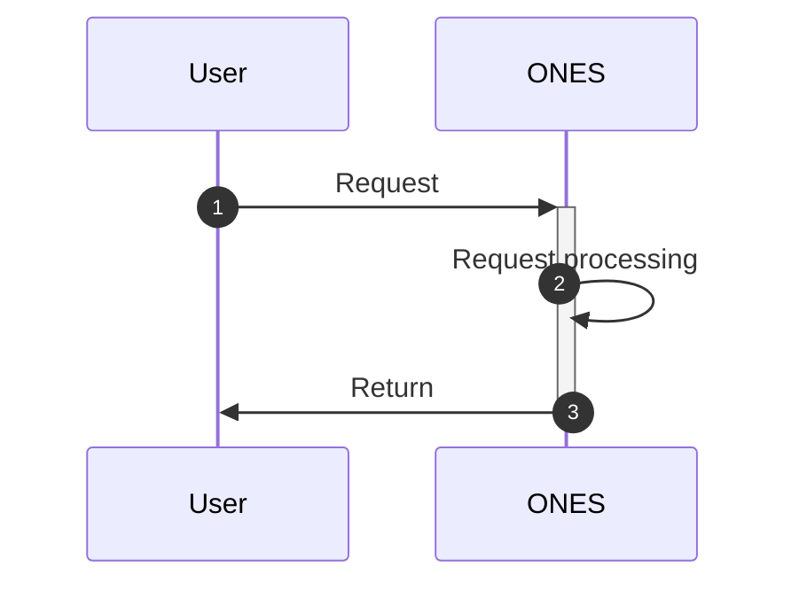

# ONES API hijacking

## Requirements

| **ONES** |
| -------- |
| 3.6+     |

## Overview

Sometimes we need to change the performance of certain behaviors in the ONES, add some operations before and after a certain behavior or replace the behavior itself to meet business. The plugin can use the ONES API hijacking ability to support all ONES API, such as prefix hijacking, subffix hijacking and replace API;

- Replace API, the plugin can "replace" an ONES API, allowing the plugin to fully customize a request from ONES.
- Prefix hijacking means that when the request enters ONES, it will be forwarded to the plugin before it is processed. After the request is modified by the plugin, it will be sent back to ONES and continue to execute the original logic. It is generally used to modify the parameters of the request, or to check the request for verification
- Subffix hijacking means that when the request is processed in the ONES, a notification will be sent to the plugin. The plugin can perform some post-processing at this time, but cannot modify the response content

hijack and replace are relatively low-level operations, which may cause unknown risks to ONES function. Generally speaking, the use of ONES API hijacking ability is considered only if other abilities do not meet the requirements.

> **Note: this ability is about to be abandoned and does not guarantee subsequent compatibility!**

## Usage

### **Instruction for use**

1. The difference between the organization-level API and the team-level API is that the url of the team-level API contains `/team/:teamUUID`. For the same API: the organization-level API only allows one plugin to hijack; the team-level API allows one plugin in each team to hijack, but only one plugin in the same team is allowed to hijack.
2. If you modify the plugin configuration file `config/plugin.yaml`, you need to run `npx op invoke clear` and rerun the `npx op invoke run` directive for the configuration to take effect.

### Usage of ONES API hijacking ability:

#### Standard request process:



#### replace

- Principle

  ```mermaid
  sequenceDiagram
      autonumber
      User->>ONES: Request
      ONES->>+Plugin: Forwarding
      Plugin->>-ONES: Return
      ONES->>User: Return
  ```

- Sample configuration

  ```yaml
  apis:
    - type: replace #API type: replace
      methods: #API request mode
        - POST
      url: /team/:teamUUID/page/:pageUUID/update_title #Hijacking API url
      scope: wiki #Project or wiki API. Without this attribute, it defaults to project
      function: jackFunc #The name is consistent with the function name in the code
  ```

- Sample writing of processing method

  In the plugin code, if the plugin also needs to request the replaced ONES API, it needs to include in the request header: `headers: { 'Replace': "replace", }`

  This example replaces the wiki's API for modifying the page title, and will set the page title to "plugin title"

  ```typescript
  import { fetchONES } from '@ones-op/node-fetch'
  import { Logger } from '@ones-op/node-logger'
  export async function jackFunc(
    request: PluginRequest<Record<string, any>>
  ): Promise<PluginResponse> {
    Logger.info('replace success')
    let userUUID = ''
    let userToken = ''
    if (request.headers['Ones-User-Id'] != null) {
      userUUID = request.headers['Ones-User-Id']
      userToken = request.headers['Ones-Auth-Token']
    }
    Logger.info('url:', request.url)
    let response = await fetchONES({
      path: '/wiki' + request.url,
      method: 'POST',
      headers: {
        'Ones-User-Id': [userUUID],
        'Ones-Auth-Token': [userToken],
        'Replace': 'replace',
      },
      body: {
        title: 'plugin title',
      },
      root: false,
    })
    Logger.info(JSON.stringify(response, undefined, 2))
    if (response) {
      return response
    }
    return {
      body: {},
    }
  }
  ```

- Matters needing attention

  The API request parameters should pay attention to the following points:

  - The ONES API is hijacked, so the url entered must be consistent with the API url that accesses the ONES.

  - Confirm whether the replaced API itself is a POST or GET

  - To confirm what parameters need to be set in the request header of the replaced API, please refer to [ONES-API](https://docs.partner.ones.cn/zh-CN/docs/ones/readme/) document.

#### prefix

- Principle

  ```mermaid
  sequenceDiagram
      autonumber
      User->>+ONES: Request
      ONES->>+Plugin: Return
      Plugin->>Plugin: Do prefix processing.
      Plugin->>-ONES: Return request
      ONES->>ONES: Request processing
      ONES->>-User: Return
  ```

- Sample configuration

  ```yaml
  apis:
    - type: prefix #API type: suffix
      methods:
        - POST
      url: /team/:teamUUID/page/:pageUUID/update_title
      scope: wiki
      function: prefixFunc
  ```

- Sample writing of processing method

  This example pre-hijacks the API for modifying the page title of the wiki, and adds a suffix to the title of this modification

  ```typescript
  //Prefix hijacking
  export async function prefixFunc(
    request: PluginRequest<Record<string, any>>
  ): Promise<PluginResponse> {
    let body = request?.body as any
    let headers = request?.headers as any
    body.title = body.title + '-prefix'
    return {
      headers: headers,
      body: body,
    }
  }
  ```

#### suffix

- Principle

  ```mermaid
  sequenceDiagram
      autonumber
      User->>+ONES: Request
      ONES->>ONES: Request processing
      ONES->>+Plugin: Forwarding
      Plugin->>Plugin: Do subfix processing
      Plugin->>-ONES: Return
      ONES->>-User: Return
  ```

- Sample configuration

  ```yaml
  apis:
    - type: suffix #API type: suffix
      methods:
        - GET
      url: /users/me
      scope: project
      function: suffixFunc
  ```

- Sample writing of processing method

  This example means that when the interface finishes processing, record some content to the `workspace/suffix.txt` file

  ```typescript
  import { createFile, writeStrings } from '@ones-op/node-file'
  import { Logger } from '@ones-op/node-logger'
  export async function Install() {
    await createFile('./suffix.txt')
    Logger.info('[Plugin] Install')
  }
  //suffix hijacking
  export async function suffixFunc(
    request: PluginRequest<Record<string, any>>
  ): Promise<PluginResponse> {
    Logger.info('suffix success')
    let body = request?.body as any
    await writeStrings('./suffix.txt', [JSON.stringify(request, undefined, 2)])
    return {
      // 可以返回任意 body
      body: {},
    }
  }
  ```

### Debug example

- Use the curl tool to access the API `/users/ me` as an example:

  ```shell
  curl --location --request GET 'https://yourhost/users/me' \
  --header 'Ones-User-Id: {user_uuid}' \
  --header 'Ones-Auth-Token: {user_token}' \
  --header 'Content-Type: application/json' \
  --data ''
  ```

- Code request parameter example

  ```
  url：https://yourhost/users/me
  headers:
      Ones-User-Id:{user_uuid}
      Ones-Auth-Token:{user_token}
      ...
  method: GET
  ```
