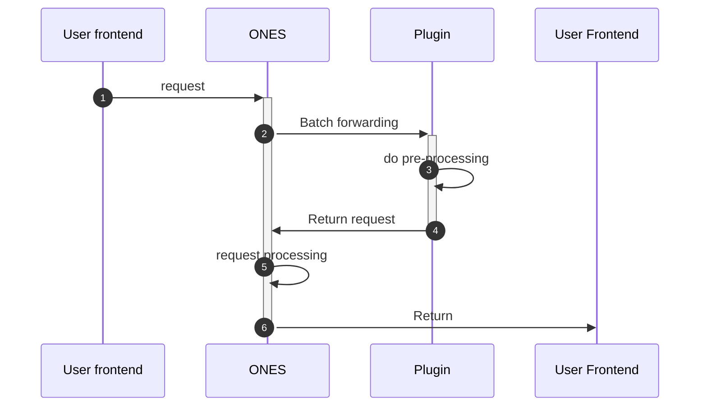

# ONES API Intercept

:::danger ability deprecation instructions
This ability is obsolete as of October 13, 2023. If relevant requirements require similar capabilities, please submit a new request form to the open platform.

:::

## Require

| ONES |
| :--- |
|      |

## Overview

Sometimes we need to change the performance of certain behaviors in the ONES system and add some operations before a certain behavior. The plug-in can pre-intercept all open interfaces in the ONES standard system.

## use

### Terms and Conditions

1. The difference between the organization-level interface and the team-level interface is that the `url` of the team-level interface contains `/team/:teamUUID`.
2. The same interface can be pre-intercepted by multiple plug-ins at the same time in its level context.
3. For the same interface in its level context, pre-interception and interface hijacking capabilities cannot be used at the same time.
4. For the same interface in the context of its level, pre-interception and post-subscription can be used at the same time.
5. The plug-in can reject this request and determine the error return of the interface, but it cannot perform other operations.
6. In local debugging, if the plug-in configuration file `config/plugin.yaml` is modified, you need to run `npx op invoke clear` and re-run the `npx op invoke run` command to make the configuration take effect.

### Request process



### Configuration file

Add the following configuration to the `apis` field in the plugin configuration file:

```yaml title='/config/plugin.yaml'
apis:
  - type: intercept #Interface type: intercept: pre-interception
    methods: #Interface request method
      - GET
    url: /users/me #Hijack interface url
    scope: project #project or wiki interface, without this attribute, the default is project
    function: jackFunc #The name should be consistent with the function name in the code
```

### Specific code

This example pre-intercepts the project's personal information acquisition interface. The headers and body in the code are the request header and request body of the original request respectively.

```typescript
import { Logger } from '@ones-op/node-logger'

export async function jackFunc(
  request: PluginRequest<Record<string, any>>,
): Promise<PluginResponse> {
  const body = request.body as any
  const headers = request.headers as any
  Logger.error('[Plugin] hello ======= Request successful')
  Logger.error('[Plugin] body ======= Request successful', body)
  Logger.error('[Plugin] headers ======= Request successful', headers)
  return {
    body: {
      res: 'hello world',
      requestBody: {},
    },
  }
}
```

- Precautions

  The following points need to be noted when using interface request parameters:

- - What is being intercepted is the ONES API, so the `url` filled in must be consistent with the `url` used to access the ONES API;
  - Confirm whether the intercepted interface itself is a `POST` request or a `GET` request;

### Debugging method

- Use the `curl` tool to access, taking the `/users/me` interface as an example:

  ```shell
  curl --location --request GET 'https://yourhost/users/me' \
  --header 'Ones-User-Id: {user_uuid}' \
  --header 'Ones-Auth-Token: {user_token}' \
  --header 'Content-Type: application/json' \
  --data ''
  ```

- Example of code request parameters

  ```
  url: https://yourhost/users/me
  headers:
      Ones-User-Id:{user_uuid}
      Ones-Auth-Token:{user_token}
      ...
  method: GET
  ```
