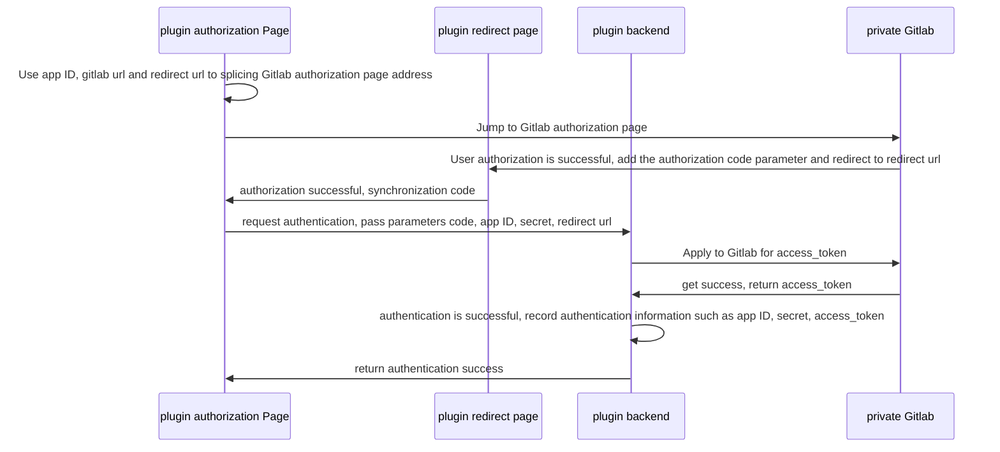

import Image from '@theme/IdealImage'

# Scene One: Integrate the private Gitlab code repository of the specified version

## Scene Description

Users want to integrate the private Gitlab code repository of a specified version. At this time, they can use the "custom code repository ability" in the plugin to achieve it. Here we take Gitlab15.4 version as an example.

## Performance

After the ONES system installs the plugin, you can view the newly added custom Gitlab15.4 in the linked code repository method list.

<Image img={require('./images/code-repo-example-connector-en.png')} style={{ maxWidth: 700 }} />

Developers can modify the [ones:settings:pipeline:default:repo:link](../../slot/module/code_repository/index.md#onessettingspipelinedefaultrepolink) module to customize the following linked code repository pages to implement Gitlab Authentication logic and add code repository logic.

<Image img={require('./images/code-repo-example-add-repo-en.png')} style={{ maxWidth: 700 }} />

After successfully linked a code repository, you can view it on the code repository management page. When a new commit and pull request are added to the code repository, if the work item ID is associated, you can view the associated records under iteration and work item.

## Solution

### Implementation idea

1. Authenticate Gitlab through OAuth and obtain the access_token of Gitlab;
2. Use the obtained Gitlab access_token to query the code repository from Gitlab for link;
3. Call the Gitlab api to create a webhook before link the code repository, and synchronize the commit and pull request data of the associated code repository to the ONES system. At this time, the plugin needs to define an web interface that can be used for Gitlab access.

### Plugin development

#### Step 1: add ability and module

Refer to [Custom Integrated Code Repository-Add abilities and modules to the plugin](./custom-code-repository.mdx#step-1-ability-configuration-to-add-ability-and-module-to-the-plugin), add ability and module configurations for the plugin, and add The configuration is as follows:

```yaml
service: ...
apis: ...
abilities:
  - id: CkrqExqC
    name: 自定义代码仓库
    version: 1.0.0
    abilityType: CustomCodeRepository
    relateModule:
      addRepoPage: 'ones-settings-pipeline-default-repo-link-R5w-'
    function:
      removeRepoFunc: removeRepo
    config:
      - key: repoToolName
        label: 关联代码仓工具名称
        value: 自定义关联代码仓工具
        fieldType: Input
        show: true
      - key: repoToolDesc
        label: 关联代码仓工具描述
        value: 自定义关联代码仓工具
        fieldType: Input
        show: true
      - key: repoToolIcon
        label: 关联代码仓工具图标
        value: logo.svg
        fieldType: Input
        show: false
modules:
  - id: ones-settings-pipeline-default-repo-link-R5w-
    title: 关联代码仓页面
    moduleType: ones:settings:pipeline:default:repo:link
    entry: modules/ones-settings-pipeline-default-repo-link-R5w-/index.html
```

#### Step 2: Implement OAuth authentication

The main steps of Gitlab Oauth authentication include:

- Prepare the redirect url for the callback page address of successful Gitlab authentication;
- Create an application in Gitlab, use the redirect url in the previous step to get the app ID and secret;
- Use the app ID and redirect url to splice the address of the Gitlab authentication page, the user authentication page is successfully authorized and automatically jumps to the redirect url, and the authorization code is spelled in the redirect url parameter;
- Use the app ID, secret, redirect url, and the code obtained in the previous step to call the Gitlab api to obtain an access_token, which can then be used to access Gitlab resources.

Gitlab OAuth can refer to the official document [Gitlab OAuth](https://docs.gitlab.com/ee/api/oauth2.html).

:::caution notice
For Gitlab 15.4 and later versions, the access_token is not permanently valid, and the valid time is generally 2 hours. At this time, you need to use the returned refresh_token to call the Gitlab api to obtain a new access_token.
:::

Here, in order to implement Gitlab's OAuth authentication, the following parameters need to be configured:

- app ID
- secret
- gitlab url
- redirect url

**1. Prepare redirect URL**

For the redirect url of the Gitlab authorization success callback page, it can be implemented by adding the `about-blank` type module in the plugin.

Suppose the `about-blank` module is configured as follows:

```yaml
modules:
  - id: about-blank-BE8t
    title: gitlab
    moduleType: about:blank
    entry: modules/about-blank-BE8t/index.html
```

Then the access rule of `aboud-blank` module page is:

- Team level plugin: `{{host}}/plugin/{{org_UUID}}/{{team_UUID}}/{{app_ID}}/1.0.0/modules/about-blank-BE8t/index.html`
- Organization level plugin: `{{host}}/plugin/{{org_UUID}}/{{app_ID}}/1.0.0/modules/about-blank-BE8t/index.html`

Then on the [ones:settings:pipeline:default:repo:link](../../slot/module/code_repository/index.md#onessettingspipelinedefaultrepolink) module page, splice the redirect url according to the above rules.

**2. Gitlab Create Application**

The user uses the redirect url to create an application in Gitlab, and can obtain the app ID and secret after the creation is successful.

**3. Authenticate Gitlab**

Authenticate Gitlab flow chart is as follows:



- Plugin authentication page: corresponding to `ones:settings:pipeline:default:repo:link` module;
- Plugin redirection page: corresponds to `about-blank` module.

The `about-blank` module receives the authorization code and synchronizes it to the implementation of the `ones:settings:pipeline:default:repo:link` module, please refer to [Code repository management-third-party authentication](../../slot/module/code_repository/index.md#third-party-authentication).

#### Step 3: add repositories

Add code repositories mainly includes two parts of work:

- Query code repositories from Gitlab;
- Add code repositories to ONES system.

**1. Query code repositories from Gitlab**

All associated code repositories can be selected from Gitlab according to the following logic.

```typescript
import { fetchHttp } from '@ones-op/node-fetch'

export interface GitlabRepo {
  id: number
  uri: string
  namespace: string
  name: string
}

export async function listGitlabRepo(): Promise<GitlabRepo[]> {
  const result: GitlabRepo[] = []

  const gitlabUrl = 'xxx'
  const accessToken = 'xxx'
  const url = `${gitlabUrl}/api/v4/projects`
  const response = await fetchHttp({
    method: 'get',
    url: url,
    headers: {
      accept: 'application/json',
      Authorization: `Bearer ${accessToken}`,
    },
  })
  const body = response?.body as any
  if (response?.statusCode !== 200) {
    throw new Error('gitlab request failed')
  }

  for (let i = 0; i < body.length; i++) {
    const repo: GitlabRepo = {
      id: body[i].id,
      uri: gitlabUrl,
      namespace: body[i].namespace.full_path,
      name: body[i].path,
    }
    result.push(repo)
  }
  return result
}
```

**2. Add code repositories to ONES system**

After obtaining the list of code repositories that can be added, you can call the [add code repositories](../../../reference/packages/node-ability/node-ability.md#addrepos) method to add, you need to pay attention The result of whether the code repositories is successfully added or not is used as a copy prompt. At the same time, in order to avoid repeatedly associating code repositories, developers can call [query all linked code repositories](../../../reference/packages/node-ability/node-ability.md#queryrepos) method to query and filter.

#### Step 4: Add code repository commit and pull request

For Gitlab, if you want to obtain code repository commit and pull request data, you can obtain it by creating a webhook subscription. At this time, the plugin needs to add a corresponding webhook interface. How to create webhook in Gitlab can refer to [Gitlab add hook](https://docs.gitlab.com/ee/api/projects.html#add-project-hook) document.

If the new webhook interface of the plugin is configured as follows, the webhook url provided to Gitlab is `{{host}}/project/api/project/team/{{team_UUID}}/gitlabWebhook`.

```yaml
apis:
  - type: external
    methods:
      - POST
    url: /team/:teamUUID/gitlab/webhook
    function: gitlabWebhook
```

Gitlab's code repository commit corresponds to the webhook's [push_events](https://docs.gitlab.com/ee/user/project/integrations/webhook_events.html#push-events) event, and the pull request corresponds to For [merge_requests_events](https://docs.gitlab.com/ee/user/project/integrations/webhook_events.html#merge-request-events) events, the two can be distinguished by the request header `X-Gitlab-Event`. For the data format of Gitlab webhook events, please refer to [Gitlab webhook events](https://docs.gitlab.com/ee/user/project/integrations/webhook_events.html#webhook-events) document.

:::caution notice
For the method of using webhook to obtain code repository commit and pull request data, you need to pay attention to two scenarios: the code repository is removed from the ONES system and the plugin is enabled or disabled:

- For the scenario where the code repository is removed from the ONES system, developers can add the logic of deleting webhooks in the `removeRepo` method added by the ability;
- For the plugin enable and disable scenarios, since the interface defined by the plugin will not be accessible at this time, and the SDK methods for the new code repository commit and pull request will not be called, developers can enable the plugin when the plugin is enabled Restore the webhook of the code repository, and delete the webhook of the code repository when the plugin is disabled.
  :::
