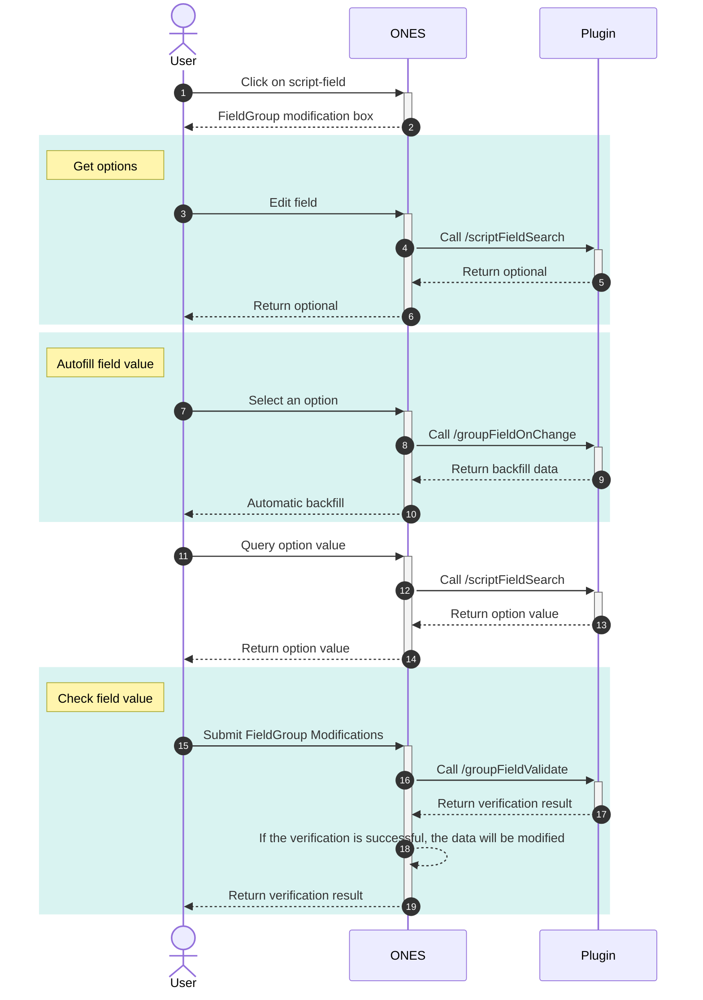

import Image from '@theme/IdealImage'

# FieldGroup

## Requirements

| **ONES** | @ones-op/node-ability |
| :------- | :-------------------- |
| v3.6.0+  | v0.3.7+               |

## Overview

An FieldGroup is composed of a group of field that are related to each other. The ability of the plugin to carry FieldGroup can create FieldGroup in ONES, and can also realize the linkage between fields. Currently, only script-field are supported to create FieldGroup, and the entities that support adding FieldGroup include projects and issue.

This ability is generally available in the following scenarios:

1. Fields are closely related, and an association relationship needs to be established.
2. The value of one field affects the optional values of other field. (For example: Adding regional information such as country, city, township, etc., selecting a different country will result in optional city changes)
3. The values that can be set for the field in the FieldGroup are limited, and the validity needs to be verified when submitting the modification.

:::caution NOTICE
FieldGroups added to ONES cannot be deleted and edited
:::

### Ability performance

After using this ability to add script-field and FieldGroup, you can see the option of FieldGroup when adding issue fields, as shown in the following figure

<Image img={require('./images/fieldgroup0.png')} />

Script field can be edited on the issue's details page after the FieldGroup has been added to the issue

<Image img={require('./images/fieldgroup1.png')} />

## Usage

### Add script-field

FieldGroups can only add **single-selection/multiple-selection** types of script-field

1. **Add script-field to entity**

   Add a script-field to the entity by calling the method provided in the SDK. After the addition is successful, the `fieldUUID` of the field will be returned. Subsequent operations of other FieldGroup need to use these `fieldUUID`, it is recommended to persist when adding.

- **Issue**

  Call [Field.FieldsAdd](../../../../reference/packages/node-ability/node-ability.mdx#FieldsAdd) in your code to add script-field. For details, please refer to the document: [script-field-selection](../script-field-selection/script-field-selection.mdx)

  Example: Adding a single-selection script field to a work item in the plugin lifecycle `Install()` method

  ```typescript
  import { Field } from '@ones-op/node-ability'

  export async function Install() {
    const FieldsAddRes = await Field.FieldsAdd({
      Name: 'task_field',
      Type: 1001, //Indicates adding a single-selection type script field
    })
    if (FieldsAddRes.Error) {
      throw new Error('Failed to create field')
    }
    const { UUID: fieldUUID } = FieldsAddRes
  }
  ```

- **Params**

  | Param | Type   | Description                                                                       |
  | :---- | :----- | :-------------------------------------------------------------------------------- |
  | Name  | string | field name                                                                        |
  | Type  | int    | script-field type<br />- 1001: single-selectionion<br/>- 1002: multiple-selection |

- **Project**

  Call [Field.ItemsAdd](../../../../reference/packages/node-ability/node-ability.mdx#ItemsAdd) in code to add script-field

  Example: Adding a single-selection script field to a project in the plugin lifecycle `Install()` method

  ```typescript
  import { Field, FieldTypeEnum, PoolEnum } from '@ones-op/node-ability'
  //Add a script-field of type single-selection to the project
  export async function Install() {
    const ItemsAddProjectRes = await Field.ItemsAdd({
      FieldType: FieldTypeEnum.SingleLabel, //Indicates adding a single-selection type script-field
      Name: 'project_field',
      ItemType: 'field',
      Pool: PoolEnum.Project, //Entity type is project
      ContextType: 'team',
      required: false,
    })
    if (ItemsAddProjectRes.Error) {
      throw new Error('Failed to create field')
    }
    const { UUID: fieldUUID } = ItemsAddProjectRes
  }
  ```

  **Params**

  | Param       | Type   | Description                                                                                                                     |
  | :---------- | :----- | :------------------------------------------------------------------------------------------------------------------------------ |
  | FieldType   | string | script-field type<br />- `FieldTypeEnum.SingleLabel`: single-selectionion<br />- `FieldTypeEnum.MultiLabel`: multiple-selection |
  | Name        | string | Field name                                                                                                                      |
  | ItemType    | string | Fixed value：`field`                                                                                                            |
  | Pool        | string | Fixed value：`PoolEnum.Project`: project                                                                                        |
  | ContextType | string | context type                                                                                                                    |
  | required    | bool   | Is it required                                                                                                                  |

2. **Data source**

   The data for the script-field needs to be provided by the plugin

   Add the `/scriptFieldSearch` API in `plugin.yaml`, even if you add multiple **single-selectionion/multiple-selection** types of script-field, you only need to configure it once.

   ```yaml title="config/plugin.yaml"
   apis:
     - type: addition
       methods:
         - POST
       url: /scriptFieldSearch
       function: GetOptions
   ```

   Write the `GetOptions` processing function. If there are multiple **single-selectionion/multiple-selectionion** types of script-field at the same time, they can be logically divided according to the `fieldUUID` returned when adding script-field.

   ```typescript
   interface OptionType {
     uuid: string // fieldUUID
     value: string //field value
   }
   export async function GetOptions(request: PluginRequest): Promise<PluginResponse> {
     const body = request?.body as any
     const options: OptionType[] = [] //Returned option data
     for (let i = 0; i < 3; i++) {
       options.push({
         uuid: 'fieldValueUUID-' + i.toString(), //The `uuid` of the option value
         value: 'fieldValue-' + i.toString(), //option value
       })
     }

     return {
       statusCode: 200,
       body: {
         code: 200,
         body: {
           options: options,
         },
       },
     }
   }
   ```

   The following is an example of the content in the request body when getting the option value of the script-field. The `relations` field contains the `fieldUUID` and the current field value of all fields in the FieldGroup. The `field_uuid` field is the `fieldUUID` of the script-field that triggered this request.When using `uuids` for query, other query contexts will be invalid, only kv mapping query is used

   ```json
   "body": {
     "relations": [
       {
         "field_uuid": "3LhidrCX",
         "field_value": null
       },
       {
         "field_uuid": "WGmNxtyW",
         "field_value": null
       },
     ],
     "field_uuid": "3LhidrCX",
     "uuids":[],
     "UserUUID": "SFBs7BHh"
   }
   ```

### Create FieldGroup

Establish an association relationship for multiple fields to form an FieldGroup, and add the FieldGroup to the entity. The business object types of fields and FieldGroup must be consistent; otherwise, the addition will fail.

- **Create FieldGroup**

  ```typescript
  const relateionsTask: any[] = []
  // The `fieldUUIDs` array is the `uuid` array of the added script-field
  fieldUUIDs.forEach((fieldUUID, index) => {
    const relation = {
      FieldUUID: fieldUUID,
      FieldParentUUID: '',
      Position: index,
    }
    relateionsTask.push(relation)
  })
  const AddGroupFieldRes = await Field.AddGroupField({
    ObjectType: PoolEnum.Task,
    Name: 'issueFieldGroup',
    Relations: relateionsTask,
  })
  ```

- **Params**

  The parameters of the [Field.AddGroupField](../../../../reference/packages/node-ability/node-ability.mdx#AddGroupField) method are as follows:

  | Param      | Type               | Description                                                                                                                                                                                                                                                      |
  | :--------- | :----------------- | :--------------------------------------------------------------------------------------------------------------------------------------------------------------------------------------------------------------------------------------------------------------- |
  | ObjectType | string             | The entity type of the FieldGroup, optional value:<br />- `PoolEnum.Project`: project<br />- `PoolEnum.Task`: issue                                                                                                                                              |
  | Name       | string             | FieldGroup name                                                                                                                                                                                                                                                  |
  | Relations  | IRelationMessage[] | `IRelationMessage` Contains the following field<br />- `FieldUUID`: The `fieldUUID` of the field<br />- `FieldParentUUID`: The parent field `UUID`, which means forming a hierarchical relationship with this field<br />- `Position`:Position in the FieldGroup |

### Autofill field value

When editing the value of an field in the FieldGroup, a request will be sent to the plugin, carrying the values of all fields in the current FieldGroup. Developers can backfill field values into the edit page by responding to this request.

- **Add configuration**

  ```yaml title="config/plugin.yaml"
  apis:
    - type: addition
      methods:
        - POST
      url: /groupFieldOnChange
      function: GroupFieldOnChange
  ```

- **Write handler function**

  `field_values` is the data that needs to be backfilled

  ```typescript
  interface FieldValueType {
    field_uuid: string //The `UUID` of the field
    option_uuids: string[] //`UUID` array of field values
  }
  export async function GroupFieldOnChange(request: PluginRequest): Promise<PluginResponse> {
    const body = request?.body as any
    const field_values: FieldValueType[] = []

    return {
      statusCode: 200,
      body: {
        code: 200,
        body: {
          field_values: field_values,
        },
      },
    }
  }
  ```

- **Request content**

  The `group_uuid` field is the `UUID` of the FieldGroup, the `change_field_uuid` field is the `fieldUUID` of the field, and `field_values` contains all the fields in the edit panel of the current FieldGroup.

  ```json
  "body": {
    "group_uuid": "4cE7QxNW",
    "change_field_uuid": "3LhidrCX",
    "field_values": [
      {
        "field_uuid": "3LhidrCX",
        "option_uuids": [
          "China"
        ]
      },
      {
        "field_uuid": "WGmNxtyW",
        "option_uuids": null
      }
    ],
    "UserUUID": "SFBs7BHh"
  }
  ```

### Check field value

When submitting the modification of the value of the field in the FieldGroup, the `/groupFieldValidate` API will be requested, and the value of all fields in the current FieldGroup will be carried. The developer can verify the validity of the modified data. Whether the verification is successful or not depends on whether the status code is `200`. If the verification fails, the modification will be invalid. When the verification is successful, an field value update can also be completed.

- **Add configuration**

  ```yaml title="config/plugin.yaml"
  apis:
    - type: addition
      methods:
        - POST
      url: /groupFieldValidate
      function: GroupFieldValidate
  ```

- **Write handler function**

  The data in `option` is the field value that needs to be updated

  ```typescript
  interface UpdateType {
    field_uuid: string //The `UUID` of the field
    option_uuid: string //The `UUID` of the field value
    option_value: string //field value
  }
  export async function GroupFieldValidate(request: PluginRequest): Promise<PluginResponse> {
    const body = request?.body as any
    const options: updateType[] = []

    return {
      statusCode: 200,
      body: {
        code: 200,
        body: {
          options: options,
        },
      },
    }
  }
  ```

- **Request content**

  The `field_groups` field contains the data of the FieldGroup `UUID` and all fields in the FieldGroup, which can be verified based on these data

  ```json
  "body": {
    "UserUUID": "SFBs7BHh",
    "field_groups": [
      {
        "group_uuid": "4cE7QxNW",
        "field_values": [
          {
            "field_uuid": "3LhidrCX",
            "option_uuids": [
              "China"
            ]
          },
          {
            "field_uuid": "WGmNxtyW",
            "option_uuids": [
              "Guangdong"
            ]
          }
        ]
      }
    ]
  }
  ```

### Update field value

Each option value of a **single-selectionion/multiple-selection** script-field has a uuid, and the value of a certain field stores the `UUID` of the option value. You can modify the interface display by modifying the option value corresponding to the uuid.

- **Update option value**

  ```typescript
  const UpdateFieldOptionRes = await Field.UpdateFieldOption([
    {
      TeamUUID: globalThis.onesEnv.teamUUID,
      FieldUUID: fieldUUID,
      UUID: 'valueUUID',
      Value: 'value',
      ObjectType: 3,
    },
  ])
  ```

- **Params**

  | Param      | Type   | Description                                                                    |
  | :--------- | :----- | :----------------------------------------------------------------------------- |
  | TeamUUID   | string | The `uuid` of team                                                             |
  | FieldUUID  | string | `fieldUUID` for script-field                                                   |
  | UUID       | string | `UUID` of the option value                                                     |
  | Value      | string | option value                                                                   |
  | ObjectType | int    | Entity type, optional values are as follows:<br />- 1: project<br />- 2: issue |

### Sequence diagrams

After adding script-field and FieldGroups, the complete field modification process is as follows:



## Examples

[Location FieldGroup](./location-fieldgroup.md)
