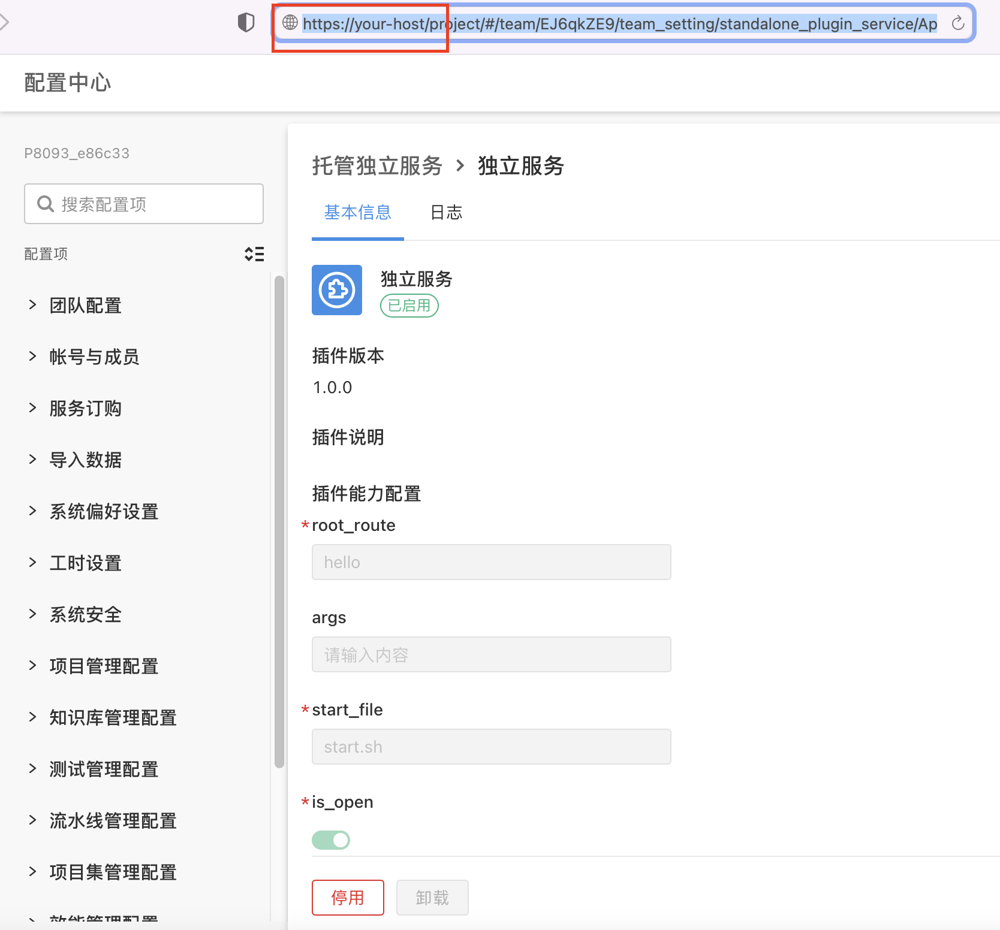
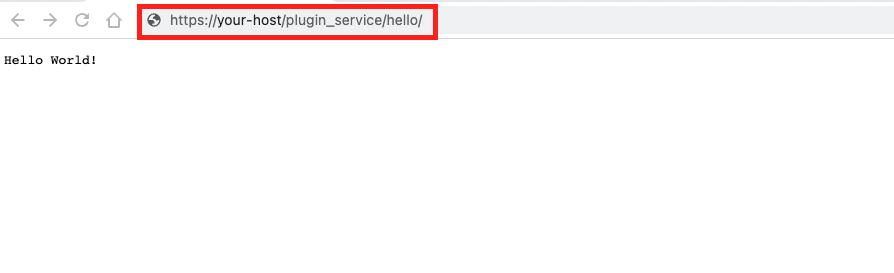

# Host standalone application

## Requirements

| **ONES** |
| -------- |
| 3.10.28+ |

## Overview

Open platform provides the ability to host standalone applications, which is an independent and complete web service, which can be common network services such as static website service, file storage service or proxy service. Using this ability, standalone applications can be deployed in the ONES in the form of plugin, and maintained and managed uniformly by the internal mechanism of the ONES. More customized features can be achieved by using this ability, such as the following scenarios:

1. When you want to implement a standard external service built into ONES, such as API account synchronization, general storage service, etc.
2. Deploy existing services to ONES so that plugin or other external services can be invoked
3. Static website service, which embeds an independent website in the subdomain name of the ONES deployment instance

#### Ability performance

Embed an existing service into the ONES, and the effect is as follows:

- Enable the service locally, and access the service to return the result

  

- Package the service into a plugin and install and enable it in the ONES. The following figure shows the plugin details page where the plugin is installed to an environment:

  

- As shown in the following figure, the service built into the ONES can be accessed through a specific URL, and the result returned is no different from that of the local deployment.

## Usage

### Step 1: Develop standalone applications and compile and generate executable files

**Standalone applications need to meet the following requirements**

- Standalone application parameter reception

  When starting an standalone application, the platform passes two parameters, `port` and `args`, to the standalone application, where the `port` parameter is the `port` that the standalone application listens to, and `args` is the other parameter passed into the standalone application. Therefore, these two parameters must be received and processed in the standalone application.

- Record standalone application process PID

  In a standalone application, you must record the process PID to the `pid.txt` file in the current directory

- Executable files for standalone applications need to be compiled according to the system architecture of the running environment

  The system architecture of the running environment for standalone applications is **Linux amd64**
  It is recommended to compile the standalone application binaries in the native **Linux amd64** environment. To ensure the normal startup of the standalone application, you need to self check according to the following process:

  1. Build a private deployment environment and copy the binaries of the web service into the container of the private deployment environment to try to run it to ensure that it can be executed

  2. On the **Linux amd64** machine, copy the binaries of the web service to the docker container with the underlying image `node:16.13.1` and try to run it to ensure that it can be executed.

  3. ```shell
     # Run the following command on Linux amd64 machine
     docker run -itd --name=node16  node:16.13.1
     docker cp ./web_service node16:/web_service
     docker exec -it node16 bash
     ./web_service
     ```

**Recommended writing for standalone application**

```go
// Goland
package main
import (
    "flag"
    "fmt"
    "github.com/gin-gonic/gin"
    "log"
    "os"
    "strconv"
)

var (
    port int
    args string
)

func init() {
    flag.IntVar(&port, "port", 0, "int flag value")
    flag.StringVar(&args, "args", "", "int flag value")
}

func main() {
    pid := os.Getpid()
    fmt.Printf("Process PID: %d \n", pid)

    err := os.WriteFile("./pid.txt", []byte(strconv.Itoa(pid)), 0644)
    if err != nil {
        log.Fatal("Failed to record the process", err)
    }

    flag.Parse()
    r := gin.Default()
    r.GET("/", func(c *gin.Context) {
        c.String(200, "Hello World!")
    })
    fmt.Println("port:", port)
    fmt.Println("args:", args)
    log.Fatal(r.Run(fmt.Sprintf(":%d", port)))
}
```

### Step 2: Write standalone application management scripts to start and stop standalone application

Management scripts for standalone applications need to meet the following requirements

- Ensure that the binary of the standalone application has permission to execute the **shell** file

- Need to support `start` and `stop` instructions

- The `start` instruction needs to receive the parameter `port`, `args`, for example: `./hello_service --port=PARAMS_PORT --args=Args`

- The `start` instruction needs to be started in the background when it is implemented, for example:`/usr/bin/nohup ./hello_service --port=$PARAMS_PORT --args=$Args >/dev/null 2>&1 &`

It is recommended to write it. If there is no special requirement, you can use it directly. Just change the name of the binary file in the startup command (replace the `hello_service` in the following).

```shell
#!/bin/bash

usage() {
    echo -e "Usage: $(basename $0) [options]"
    echo -e " start"

    exit 1
}

# Deal with startup service
start() {
    echo "/usr/bin/nohup ./hello_service --port=$PARAMS_PORT --args=$ARGS >/dev/null 2>&1 &"
    /usr/bin/nohup ./hello_service --port=$PARAMS_PORT --args=$ARGS > nohup.out 2>&1 &
}

# Processing stop service
stop() {
  # The pid.txt here must be consistent with the interior of the service
  echo "kill -9 $(cat pid.txt)"
  kill -9 "$(cat pid.txt)"
}

parse_config() {
    for arg in ${ARGS}
    do
        case ${arg} in
            --port=*)
                PARAMS_PORT=${arg#*=}
                ;;
            --path=*)
                PATH=${arg#*=}
                ;;
            --args=*)
                ARGS=${arg#*=}
                ;;
        esac
    done
}

ARGS="$@"
# Declaration instruction (this is the entrance)

parse_config
case $1 in
help) usage;;
start) start;;
stop) stop;;
*) usage;;
esac
```

### Step 2: Ability configuration to add standalone applications to the plugin

By adding the `web-service` ability using the op tool or manually adding the ability configuration of standalone applications to the `plugin.yam` of the plugin project, the ability configuration template is as follows:

```yaml
abilities:
  - id: qRUFfcomn
    name: 'hello_service_plugin'
    version: 1.0.0
    abilityType: web_service
    config:
      - key: root_route
        value: file_storage
        fieldType: Input
        show: false
      - key: start_file
        value: 'start.sh'
        fieldType: Input
        show: false
      - key: is_open
        value: false
        fieldType: Input
        show: false
      - key: args
        value: 'name'
        fieldType: Input
        show: false
```

The role of each configuration in `abilities.config` is shown in the following table, and whether to display it on the plugin details page is decided according to the show attribute in each data:

| **Configuration item** | **Action**                                                                                          |
| ---------------------- | --------------------------------------------------------------------------------------------------- |
| root_route             | When the standalone application is started, the access path is generated based on the configuration |
| start_file             | Name of the standalone application management script                                                |
| is_open                | Indicates whether external access is allowed                                                        |
| args                   | Parameters passed to standalone applications                                                        |

### Step 4: Add binaries and management scripts to the workspace directory of the plugin project

Copy the binaries and management scripts of the standalone application to the `workspace` directory of the plugin project, and the directory structure is as follows:

```
workspace          //Plugin project workspace directory
├── hello_service  //Executable files for standalone applications
└── start.sh       //Management scripts for standalone applications
```

### Access standalone application

Standalone applications support both external and internal access after the plugin is successfully installed and enabled:

- **External access**

  url splicing rules： `url = {{ONES-host}}/plugin_service/{{root_route}}`，`ONES-host` is the access address of the ONES, and `root_route` is the plugin ability configuration.

  eg：`https://your-host:{{port}}/plugin_service/file_storage/`

  - `https://your-host:{{port}}` this paragraph is the domain name based on your environment.
  - `plugin_service` is a specific prefix that accesses independently owned
  - `file_storage` is the value of `root_route` that you declare in your ability.

- **Internal access**

  Standalone deployment: `http://127.0.0.1:9008/{{root_route}}`

  Highly available deployment：`http://plugin-service-proxy-svc:9007/{{root_route}}`

## Examples

- [Scene One: ONES underlying storage interfacing with external storage](./standalone-application-scene-one)
