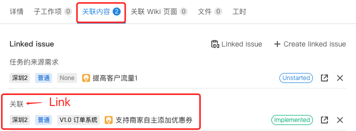
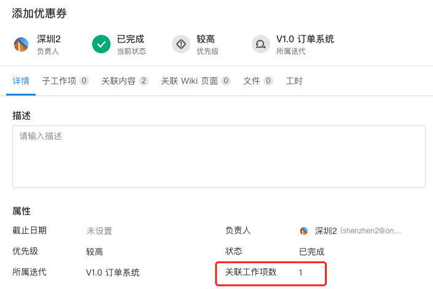

# Scene 1： Automatically count the number of relationships of a certain type of issue

## Scene description

Users want to automatically count the number of issue related to the "link" of a issue and display it in the form of issue property.

The following figure shows that the issue has two link contents, and what the user needs is the number of issue under `Link`.



## Performance

Through the way of script property, the number of issue whose link relationship is "Link" is automatically counted and displayed.


## Solution

### Implementation idea:

Use "Plugin Script properties - Number" ability.In the script property calculation method, the uuid of a issue requests ONES to obtain the number of issue link relationship with its "Link". The assembly script property calculation method returns parameters and returns, and you can enable the plugin to add the script property to the issue.

## Plugin development

1. Use OP tool to add ability "Plugin Script properties - Number".

2. Modify the configuration related to script property in the `{{plugin root directory}}/config/plugin.yaml`.

```yaml
service: ...
apis: ...
modules: []
abilities:
  - name: 脚本属性数字
    version: 1.0.0
    abilityType: ScriptFieldFloat
    function:
      calcFieldValue: linkTime
    config:
      - key: FieldName
        value: 关联工作项数
        fieldType: Input
        show: false
    id: ...
```

3. In the script property method `linkTime`, use graphQL to query the number of "Link" issue in batches.
   > Note: In the case of batch input of issue(task) uuid, we try to use graqhQL only once for processing, otherwise a large number of network requests will be generated.

```typescript
import { fetchONES } from '@ones-op/node-fetch'
import type { PluginRequest, PluginResponse } from '@ones-op/node-types'

export const linkTime = async (request: PluginRequest): Promise<PluginResponse> => {
  const body = request?.body as any
  const returnValue: any[] = []
  if (body.fieldUUID && body.taskUUIDs && body.taskUUIDs.length > 0) {
    const uuidArray: any = []
    for (const taskUUID of body.taskUUIDs) {
      uuidArray.push(taskUUID)
    }
    const jsonUuidArray = JSON.stringify(uuidArray)
    console.log(JSON.stringify(uuidArray))
    const tempAbility = await fetchONES({
      path: `/team/${globalThis.onesEnv.teamUUID}/items/graphql`,
      method: 'POST',
      body: {
        query:
          '{\n    tasks(\n        filter: {   \n            uuid_in: ' +
          jsonUuidArray +
          ',\n        }\n    ){  \n        uuid\n        name\n        linkTypeIduuid0001In{\n            uuid\n            name\n        }\n    }\n}',
        variables: {},
      },
      root: true,
    })
    //@ts-ignore
    const linkData = tempAbility?.body?.data.tasks
    for (let i = 0; i < linkData.length; i++) {
      returnValue.push({
        taskUUID: linkData[i]['uuid'].toString(),
        value: linkData[i]['linkTypeIduuid0001In'].length * 100000, //具体返回的值，可以根据业务逻辑去统计
      })
    }
  }
  return {
    body: {
      code: 200,
      body: {
        values: returnValue,
      },
    },
  }
}
```

4. After the plugin is developed, the plugin can be installed to create the script property `关联工作项数`, which can be used by adding the script property to the work item.
