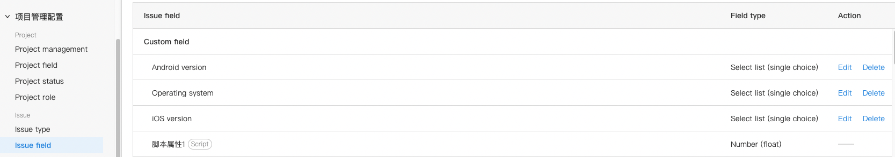

# Plugin Script properties - Number

## Requirements

| **ONES** |
| :------- |
| 3.6+     |

## Overview

This ability allows the plugin implement a special [issue property](https://guide.ones.pro/wiki/#/team/LBrdb4wE/space/6XDAYB1a/page/DXn8kLTt),which is implemented by the plugin,we call it **script property**.The value of the **script property** is calculated entirely by its own implementation rules, and the user cannot actively modify its value.Plugin developers can complete a variety of business development by implementing different script attribute value calculation rules.

Scenarios where script properties apply:

1. Count the value by a certain calculation rule
2. Hoped that the value is accurate and cannot be artificially altered

When the plugin executes the install method, the issue property is created and added to the global properties list. The user can add this property to the desired issue.



When the plugin is unabled/uninstalled, the value of this property becomes 0, becoming a read-only property that loses its statistical function. This property is put back into use when the plugin is re-enabled/installed.

## Usage

Add this ability through the OP tool, and then modify the relevant configuration, as shown in the following steps.

### Add and use ability through the OP tool：

**Step 1**: Use the Command Line to enter the OP command in the plugin root directory to add ability (this directive requires OP tool version 1.0 or above)

```shell
npx op add ability
```

Select and add `script-field-float@1.0.0`


The OP tool will ask if you want to use the default value, just choose yes, and the OP tool will add the following to the plugin

- The OP tool adds `abilitiy` field related paragraphs in `{{plugin root directory}}/config/plugin.yaml`
  ```yaml
  service:
    app_id: ...
    name: ability-scriptFloat
    ...
  apis:
    ...
  abilities:
    - id: ...
      name: 脚本属性数字
      version: 1.0.0
      abilityType: ScriptFieldFloat
      function:
        calcFieldValue: calcFieldValues
      config:
        - key: FieldName
          value: ''
          fieldType: Input
          show: false
  ```
- The OP tool adds files to the plugin in `{{plugin root directory}}/backend/src/script-field-float.ts`

  ```typescript
  import type { PluginRequest, PluginResponse } from '@ones-op/node-types'

  // 示例方法 脚本浮点型的计算方法
  // 一次计算多个task的field_uuid
  // 请求的格式：
  // {
  //     fieldUUID: "xxx",
  //     taskUUIDs: ["aaa", "bbb", "ccc"]
  // }

  // 返回的格式：
  // {
  //     body:{
  //         code: 200,
  //         body: {
  //             values: [
  //                 {
  //                     taskUUID: "aaa",
  //                     value: 1.2
  //                 },
  //                 {
  //                     taskUUID: "bbb",
  //                     value: 2.3
  //                 },
  //             ]
  //         }
  //     }
  // }
  export const calcFieldValues = async (request: PluginRequest): Promise<PluginResponse> => {
    const body = request?.body as any
    const returnValue: any[] = []

    //需要数字统计的工作项的uuid数组
    if (body.fieldUUID && body.taskUUIDs && body.taskUUIDs.length > 0) {
      for (const taskUUID of body.taskUUIDs) {
        returnValue.push({
          taskUUID: taskUUID, //工作项UUID，请注意该工作项是已经存在脚本属性
          value: 200000, //具体返回的值，可以根据业务逻辑去统计
        })
      }
    }

    return {
      body: {
        code: 200,
        body: {
          values: returnValue,
        },
      },
    }
  }
  ```

  **Step 2**: Modify the corresponding content of the script property in the `{{plugin root directory}}/config/plugin.yaml`, where `config` is the configuration of the script property, and the value corresponding to the 'FieldName' key is the script property's name. Change it to the name you need. Here, change it to **脚本属性 1**, the value of `calcFieldValue` corresponds to the script property method name, and you can change it to the method name you want. Here, change it to **countFunc**.

  ```yaml
  service:
    app_id: ...
    name: ability-scriptFloat
    ...
  apis:
    ...
  abilities:
    - id: ...
      name: 脚本属性数字
      version: 1.0.0
      abilityType: ScriptFieldFloat
      function:
        calcFieldValue: countFunc
      config:
        - key: FieldName
          value: 脚本属性1
          fieldType: Input
          show: false
  ```

  **第三步**: Modify the script property method, which defaults to the `calcFieldValues` method of `{{plugin root directory}}/backend/src/script-field-float.ts`. Note that the value in the returned parameter `returnValue` defaults to floating point, and its unit defaults to `1 / 100000`. You can modify your script property calculation logic according to the content in the comments. You can implement this method in any path at the backend of the plugin, but be careful to throw the method.

## Examples

- [Automatically count the number of relationships of a certain type of issue](sample-script-field-float1.md)
