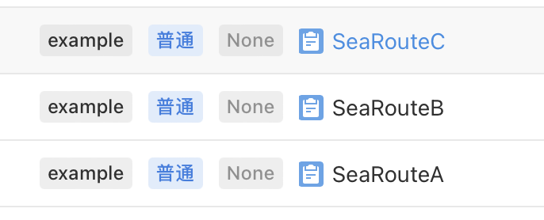
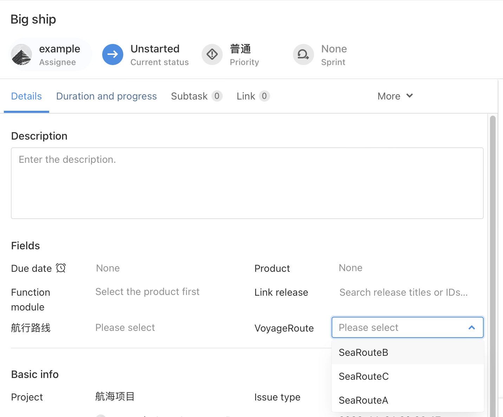

# Scene 1： Automatically give a list of voyage routes

## Scene description

The user hopes that for each freighter, all the routes of the voyage will be given automatically so that it is convenient for the user to choose.

**All sailing routes**



## Performance

For each freighter, you can choose your own route, as shown in the figure.



## Solution

### Implementation idea:

Use the `Plugin Script properties - Selection` ability，to create the script property of the radio menu of "VoyageRoute".In the script property calculation method, you can assemble them into the option values of the radio menu by searching for all issue with "SeaRoute" in their names.Finally, install the plugin and enable it, and add the "VoyageRoute" issue property to the desired work item.

## Plugin development

1. Add script property related configuration in `{{plugin root directory}}/config/plugin.yaml`

```yaml
service:
  app_id: ...
  name: ability-scriptSelection
  ...
apis:
  - type: addition
    methods:
      - POST
    url: /scriptFieldSearch
    function: GetOptions
```

2. In the `install` method called when the plugin is installed, write a method to create the script property of the "VoyageRoute" radio menu.

```typescript
import { Field } from '@ones-op/node-ability'
import { Logger } from '@ones-op/node-logger'

export async function Install() {
  Logger.info('[Plugin] Install')
  //Call the script property add method to create a script property of a numeric type
  const FieldsAddRes = await Field.FieldsAdd({
    Name: 'VoyageRoute',
    Type: 1001, //1001 is single，1002 is multil
    Renderer: 1,
    FilterOption: 0,
    SearchOption: 1,
  })
  if (FieldsAddRes.Error) {
    //If the addition fails, an exception is thrown
    throw new Error('Failed to create property')
  }
  //Add a UUID with a successfully returned property
  const { UUID: fieldUUID } = FieldsAddRes
  Logger.info('fieldUUID:', fieldUUID)
  return {
    body: {
      message: 'Field Add UUID:',
      fieldUUID,
    },
  }
}
```

3. In the `GetOptions` method, use the graphQL to find the issue with "SeaRoute" in its name, and assemble it into the corresponding data format.

```typescript
export async function GetOptions(request: PluginRequest): Promise<PluginResponse> {
  const body = request?.body || {}

  const tempData = await fetchONES({
    path: `/team/${globalThis.onesEnv.teamUUID}/items/graphql`,
    method: 'POST',
    body: {
      query:
        '{\n    tasks (\n        filter: {\n            name_match: "SeaRoute"\n        }\n    ){  \n        uuid\n        name\n    }\n}',
      variables: {},
    },
    root: true,
  })
  //@ts-ignore
  const data = tempData?.body?.data.tasks
  let optionsTempName = 'vcxzoiy'
  let optionsValue: any[] = []
  for (let i = 0; i < data.length; i++) {
    optionsValue.push({
      uuid: optionsTempName + i.toString(),
      value: (data[i]['value'] = data[i]['name'].toString()),
    })
  }
  let resp = <PluginResponse>{
    body: {
      code: 200,
      body: {
        options: optionsValue,
      },
    },
  }
  return resp
}
```

4. Install the plugin and start it, and add the "VoyageRoute" property to the corresponding issue type.
