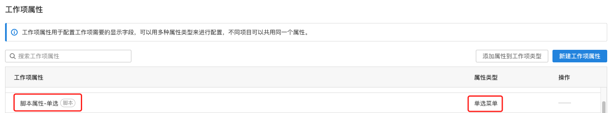

# Plugin Script properties - Selection

## Requirements

| **ONES** |
| :------- |
| 3.6+     |

## Overview

This ability allows the plugin implement a special [issue property](https://guide.ones.pro/wiki/#/team/LBrdb4wE/space/6XDAYB1a/page/DXn8kLTt)，which is implemented by the plugin，and we call it `script property`.Script property and system property of the same type are rerepresented in the same way in **ONES**.The difference between them is that the option values of script property are calculated by its own business logic, and plugin developers can complete a variety of business development by implementing different rules for calculating the values of script property.

When the plugin executes the install method, the issue property is created and added to the global properties list. The user can add this property to the desired issue.



When this script property is added to a issue, it behaves the same as other issues properties.


## Usage

You can use the ability by following these steps.

**Step 1**: Add new content in the `apis` field in the file `config/ plugin.yaml`.

```yaml
service:
  app_id: ...
  ...
apis:
  - type: addition
    methods:
      - POST
    url: /scriptFieldSearch
    function: GetOptions
```

**Step 2**: Complete the declaration of script property in the `install` method called when the plugin is installed.

```typescript
import { Field } from '@ones-op/node-ability'
import { Logger } from '@ones-op/node-logger'
import type { PluginRequest, PluginResponse } from '@ones-op/node-types'

export async function Install() {
  Logger.info('[Plugin] Install')
  //Call the script property add method to create a script property of type "radio menu"
  const FieldsAddRes = await Field.FieldsAdd({
    Name: '脚本属性-单选',
    Type: 1001, //Multiple selection code is 1002
    Renderer: 1,
    FilterOption: 0,
    SearchOption: 1,
  })
  if (FieldsAddRes.Error) {
    //If the addition fails, an exception is thrown
    throw new Error('Failed to create property')
  }
  //Add a UUID with a successfully returned property
  const { UUID: fieldUUID } = FieldsAddRes
  Logger.info('fieldUUID:', fieldUUID)
  return {
    body: {
      message: 'Field Add UUID:',
      fieldUUID,
    },
  }
}
```

> In the `FieldsAdd` method, the parameter Type is 1001 for single selection and 1002 for multiple selection

**第三步**: In the `GetOptions` method, complete the construction of the script property option values in the following format.

```typescript
import type { PluginRequest, PluginResponse } from '@ones-op/node-types'

export async function GetOptions(request: PluginRequest): Promise<PluginResponse> {
  const body = request?.body || {}
  let resp = <PluginResponse>{
    body: {
      code: 200,
      body: {
        options: [
          {
            uuid: 'zxcvzzzz', //custom 8-bit uuid
            value: '选项1', //the value of option 1
          },
          {
            uuid: 'zxcvzzxx', //custom 8-bit uuid
            value: '选项2', //the value of option 2
          },
        ],
      },
    },
  }
  return resp
}
```

## Examples

- [Automatically give a list of voyage routes](sample-script-field-selection1.md)
