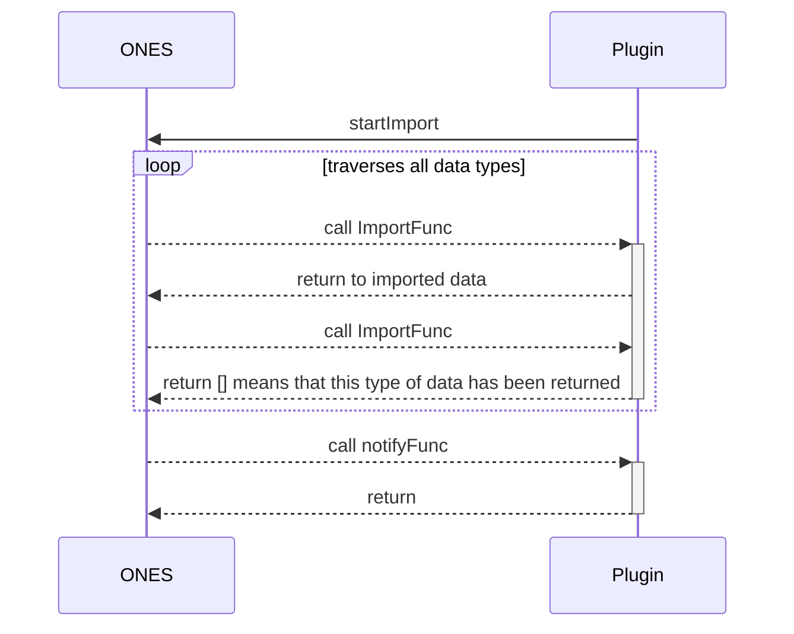

# Third import

## Requirements

| **ONES**  | @ones-op/node-third-import |
| :-------- | :------------------------- |
| v3.11.39+ | v0.1.2+                    |

## Overview

Sometimes we need to import third data into ONES in batches. Due to the need to connect with different third parties, plugins are generally used to realize data conversion and import. The third import ability defines a set of data import specifications and processes, which simplifies the process of plugin importing data to ONES, and only needs to implement data conversion according to the specifications to complete the import.

## Usage

### Implementation principle

The entire data import process is started by the plugin calling `startImport`, and then ONES starts to call the plugin method for different data types to obtain data. Each data type will be called multiple times until the plugin returns an empty array. When the import of all data types is complete or an error occurs during the import process, the plugin will be notified of the result of this import.



### Step 1: Installation dependency

Enter the `/backend` directory of the plugin project, and execute the following command for dependent installation:

```shell
npm i @ones-op/node-third-import
```

### Step 2: Add configuration

Use `npx op add ability` to add `third-import@1.0.0` type ability. Generate the `backend/src/third-import.ts` file and add ability configuration in the plugin configuration file.

Example configuration:

```yaml title="config/plugin.yaml"
abilities:
  - id: 5I-CjPX_
    name: third-party import
    version: 1.0.0
    abilityType: ThirdImport
    function:
      importFunc: importFunc
      notifyFunc: notifyFunc
```

| **ONES**  |
| :-------- |
|  |
  In `abilities`.`config`, plug-in developers are supported to customize the notification message.

The configuration items corresponding to custom notification messages need to be manually added by the plug-in developer, and some configuration items are supported (if no configuration message is added, the default value will be used).

For example, when you don't care about third-party notifications, you only need to add three configuration items: msgTitleNotice, msgFailedContent, and msgSuccessContent.


Example configuration:

```yaml title="config/plugin.yaml"
abilities:
  - id: 5I-CjPX_
    name: third-party import
    version: 1.0.0
    abilityType: ThirdImport
    function:
      importFunc: importFunc
      notifyFunc: notifyFunc
    config:
      - key: msgTitleNotice
        value: 'This is a title'
        fieldType: Input
      - key: msgFailedContent
        value: 'This is the content for the import failure'
        fieldType: Input
      - key: msgSuccessContent
        value: 'This is the content of the successfully imported'
        fieldType: Input
      - key: msgThirdTitleFailed
        value: 'When an import fails，the third-party notification has this title'
        fieldType: Input
      - key: msgThirdTitleDone
        value: 'when an import success，the third-party notification has this title'
        fieldType: Input
```


### Step 3: Start importing

Call the `startImport` method to start importing third data.

**Entry:**

| **Parameter** | **Type** | **Description**                                                                                                   | **Required** | **Default Value** |
| :------------ | :------- | :---------------------------------------------------------------------------------------------------------------- | :----------- | :---------------- |
| userUUID      | string   | user uuid                                                                                                         | Y            | -                 |
| abilityId     | string   | ability id in plugin ability configuration                                                                        | Y            | -                 |
| password      | string   | Import user's default password when logging in for the first time (the default password needs to be alphanumeric) | Y            | -                 |
| serverId      | string   | If you import the same batch of data, you need to ensure the same `server_id`                                     | Y            | -                 |
| teamUUID      | string   | The unique ID of the team, only required for organization plugins                                                 | N            | -                 |

**Example:**

```typescript
import { startImport } from '@ones-op/node-third-import'

await startImport(user_uuid, abilityId, password, server_id, teamUUID)
```

### Step 4: Implement the import function

When the plugin calls `startImport` to start the import, the system will automatically start the import process. After the import process starts, `importFunc` will be called multiple times to obtain the imported data. Each time the function is called, `importFunc` will be passed in to indicate the data type imported by this call, and the plugin can return the corresponding data according to this field. When there is no data of this type to be imported, an empty array [] can be returned, and the next data type will be imported until all types are imported.

:::tip

The definitions of all imported data types can be found in [@ones-op/node-third-import](../../../reference/packages/node-third-import/node-third-import.md) content.

:::

**Entry:**

| **Parameter** | **Type** | **Description**                                |
| :------------ | :------- | :--------------------------------------------- |
| import_type   | string   | The data type of this import                   |
| pre_data      | any      | the last data imported last time for this type |

**Example:**

```typescript
import type { ThirdUser } from '@ones-op/node-third-import'

export async function importFunc(request: PluginRequest): Promise<PluginResponse> {
  const { import_type } = request?.body as any
  const data: any[] = []

  if (import_type === 'ThirdUser') {
    const user: ThirdUser = {
      resource_id: 'xxxx',
      name: 'hosea',
      email: 'xiaoming@ones.com',
      phone: '18888888888',
      title: 'xxx',
      company: 'ONES',
      status: 10,
      create_time: 1665310367819,
      modify_time: 1665310367819,
    }

    data.push(user)
  }

  return {
    body: {
      code: 200,
      body: data,
    },
  }
}
```

### Step 5: Implement the notification function

The `notifyFunc` function will be automatically generated in `backend/src/third-import.ts`. After the import process is completed, this function will be called and the result of this data import will be returned. According to whether the import is successful, the corresponding content will be returned in `body` in the input parameter of the function.

- Imported successfully

  | Param      | Type | Description              |
  | :--------- | :--- | :----------------------- |
  | is_success | bool | Whether it is successful |

- import failed

  | parameter    | Type   | Description               |
  | :----------- | :----- | :------------------------ |
  | process_name | string | Indicates the failed link |
  | error_msg    | string | error message             |

**Example:**

```typescript
export async function notifyFunc(request: PluginRequest): Promise<PluginResponse> {
  Logger.info('receive notify', JSON.stringify(request?.body))

  return {
    body: {
      code: 200,
      body: {},
    },
  }
}
```
