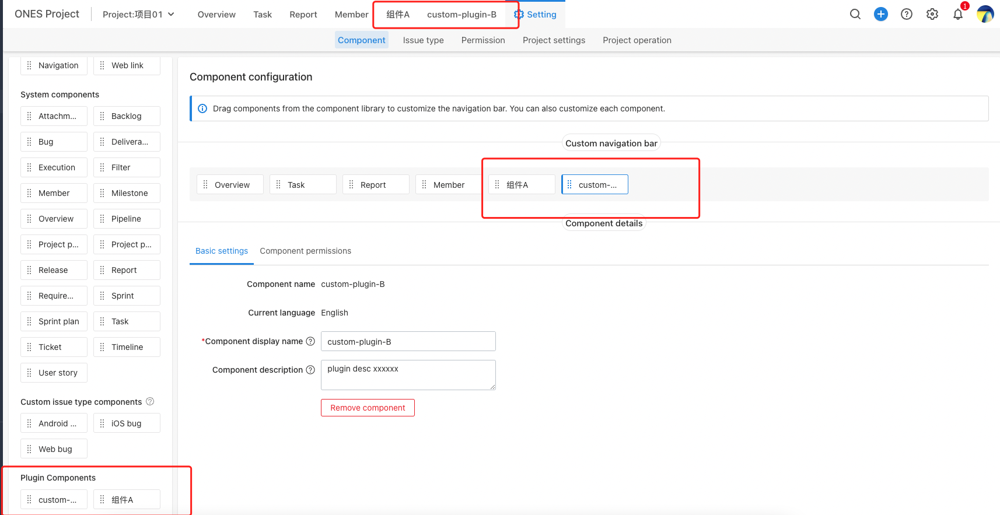
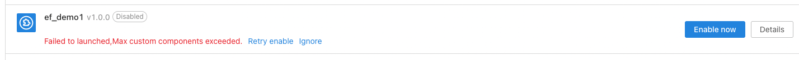

# The ability which realize project custom components

## Ability description

- The existing components of the standard product cannot be satisfied some scenarios.
- In order to diverse User-defined configuration requirements.

For the above scenarios, plugin-developers can use this ability to add custom components to standard product. Then, we can use it according to the unified standard.Such as the order of components in the navigation bar and the basic configuration.



Function of this Ability:

- Custom components, support user-defined configuration component name, component description;

- When the plug-in carrying this ability is enabled, the custom components defined by the ability will appear in the project component template, and users can use these components according to the unified standard;

- When the plug-in that support the ability is disable/uninstall, the custom components defined by the ability and the objects created by the user using these components will be deleted from the project;

## How to use this ability

### Ability Declare

we can declare this ability in plugin.yaml file. For example:

```yaml
service:
  app_id: Wr1aVwZS
  ...
modules:
  - entry: modules/ones-login-ptLT/index.html
    id: ones-login-ptLT
    moduleType: ones:project:component:new
    title: front-end slot
abilities:
  - id: tRUFWEsd
    name: custom component plugin
    abilityType: ProjectCustomComponent
    function:
      copyPluginData: copyTest
    version: 1.0.0
    relateModule:
      componentModuleEnter: 'ones-login-ptLT'
    config:
      - key: component_name
        show: false
        value: component a
      - key: component_desc
        show: false
        value: this is component description.
      - key: is_support_copy
        show: false
        value: true
```

:::caution Attention

'componentModuleEnter' is a key param，which must be the modules.id of the [ones:project:component:new](../../api/slot/module.md) front-end slot.

If the param 'is_support_copy' is true, you also need to implement "copyTest()" function of "backend/src/plugin_copy.ts".

:::

If the user needs to customize the configuration component name and component description, you need to set the field 'show' of component_name and component_desc to true.

In general, we also need to consider [bilingual scenarios](../base/i18n/index.md), we can use the param 'label' field to achieve this.

```yaml
service:
  app_id: Wr1aVwZS
  ...
modules:
  - entry: modules/ones-login-ptLT/index.html
    id: ones-login-ptLT
    moduleType: ones:project:component:new
    title: front-end slot
abilities:
  - id: tRUFWEsd
    name: custom component plugin
    abilityType: ProjectCustomComponent
    function:
      copyPluginData: copyTest
    version: 1.0.0
    relateModule:
      componentModuleEnter: 'ones-login-ptLT'
    config:
      - key: component_name
        label: '{{.ComponentName}}'
        show: true
        value: plugin name
        fieldType: Input
      - key: component_desc
        label: '{{.ComponentDesc}}'
        show: true
        value: plugin desc
        fieldType: TextArea
      - key: is_support_copy
        show: false
        value: true
```

### Ability use range

Project project management

- Project settings to add custom components
- Project settings, drag-and-drop custom components to generate objects
- Project settings, you can modify the custom components object information, and you can move the position of these objects

## FAQ

### How to bind custom component abilities and front-end slots?

The plugin.yaml file has a configuration parameter 'componentModuleEnter', which is used to bind the relations between custom component abilities and front-end slots.

### How to create multiple custom abilities?

The abilities in plugin.yaml are an array. The ProjectCustomComponent ability can be used multiple times, note that the id should be different.

:::caution Attention

A plugin supports less than 10 ProjectCustomComponent type abilities. If one plugin has defined more than 10 ProjectCustomComponent abilities, it will enable failed with an error message.



:::
