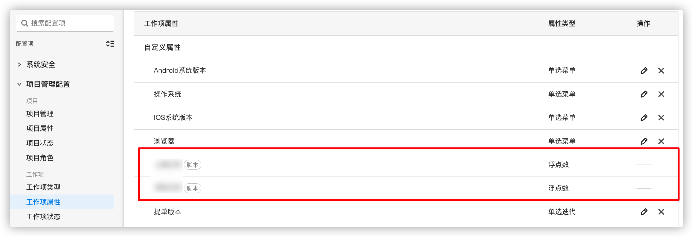

# 插件承载脚本属性 - 数字

## 能力描述

插件可以提供数字类型的脚本属性的业务实现，使用该能力后，全局工作项属性列表会多出属性类型为“浮点数”的脚本属性，该脚本属性还可以添加至具体项目的工作项类型中。



当承载有该能力的插件停用/卸载后，属性值为 0，该属性成为一个失去统计功能的只读属性；

当承载有该能力的插件停用/卸载后，又重新启用/安装插件，属性重新被调用

## 能力使用

### 能力声明

在 plugin.yaml 中声明使用该能力

```yaml
abilities:
  - id: qRUFfcomn
    name: 脚本属性浮点型
    version: 1.0.0
    abilityType: ScriptFieldFloat
    function:
      calcFieldValue: calcFieldValues
    config:
      - key: FieldName
        value: 上海工时
        fieldType: Input
        show: false
```

在"backend/index.js"的 "install()" 函数中添加创建脚本属性的方法，在插件安装过程中，就会创建了该脚本属性。

```javascript
import {PluginRequest, PluginResponse} from "@ones-op/node-types";

// 示例方法 脚本浮点型的计算方法
// 一次计算多个task的field_uuid
// 请求的格式：
// {
//     fieldUUID: "xxx",
//     taskUUIDs: ["aaa", "bbb", "ccc"]
// }

// 返回的格式：
// {
//     body:{
//         code: 200,
//         body: {
//             values: [
//                 {
//                     taskUUID: "aaa",
//                     value: 200000
//                 },
//                 {
//                     taskUUID: "bbb",
//                     value: 200000
//                 },
//             ]
//         }
//     }
// }
export const calcFieldValues = async (request: PluginRequest): Promise<PluginResponse> => {
    const body = request?.body as any
    const returnValue: any[] = []

    //需要数字统计的工作项的uuid数组
    if (body.fieldUUID && body.taskUUIDs && body.taskUUIDs.length > 0) {
        for (const taskUUID of body.taskUUIDs) {
            returnValue.push({
                taskUUID: taskUUID,     //工作项UUID，请注意该工作项是已经存在脚本属性
                value: 200000          //具体返回的值，可以根据业务逻辑去统计
            })
        }
    }

    return {
        body: {
            code: 200,
            body: {
                values: returnValue
            }
        }
    }
}

```

## FAQ

##### 如果我要创建多个字段怎么办？

plugin.yaml 中的 abilities 是一个数组。 可以将 ScriptFieldFloat 能力使用多次，注意 id 应该不一样

##### 如果系统中存在同名属性是怎么处理的？

同名属性分为两种情况。同名不同类型，这个时候启用插件会报错。同名同属性并且没有插件承载该属性的情况下，可以承载。
