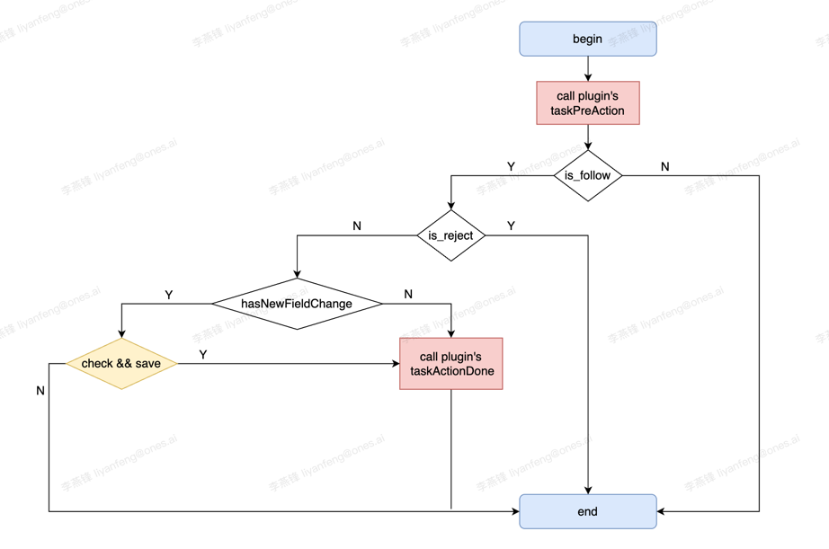

# 工作项处理器

## 能力描述

当系统产生“工作项更新”事件时，注册了该能力的插件将在此事件生效（落盘）前，收到这个事件的数据，并能够对其进行一些操作，例如：

1. 忽略：不处理此事件；
2. 拒绝：阻止此事件生效；
3. 接受：不修改此事件，但关注其后续处理结果（处理完成后通知插件此事件的结果）；
4. 修改：修改事件的内容（修改现有的 new value，或者增加新的 field 处理）；

## 能力范围

- 已覆盖：

  1. 包括工作项属性、脚本属性、状态的变化；
  2. 包括标品前端操作以及直接调用接口产生的事件；

- 未覆盖
  1. 不包括 message、上传文件等不直接改变属性/状态的操作；
  2. 不包括计算属性如停留次数、间隔时间等的变化；
  3. 不包括后置动作触发的变动；
  4. 不包括工时的处理（工时是一个单独的 item 类型，在后续能力中增加对应的类似能力）；
  5. 不包括当前系统中会跳过“步骤”直接修改状态的功能触发的状态变更；

## 能力触发点

1. 工作项详情页面进行属性（包含状态）修改
2. 批量修改工作项属性
3. 批量变更工作项类型

## 能力使用

插件方法调用流程图



##### 使用步骤

1. 使用 op 工具添加能力


包含以下文件变更：

- 文件修改：config/plugin.yaml 上新增了能力配置

- 文件新增：backend/src/taskeventhandler.ts

2. 配置 config/plugin.yaml

在能力 config 下，配置插件能力要关注的“工作项类型”和“工作项属性”

支持配置多个“工作项类型”和“工作项属性”，以**“中英文逗号”**分隔

```yaml
abilities:
  - id: de265bd9-9otf
    name: 工作项处理器
    abilityType: TaskEventHandler
    version: 1.0.0
    function:
      taskActionDoneFunc: taskActionDone
      taskPreActionFunc: taskPreAction
    config:
      - fieldType: Input
        key: issueTypeScope
        show: true
        label: '工作项类型'
        value: '需求,缺陷,任务'
      - fieldType: Input
        key: field
        show: true
        label: '工作项属性'
        value: '截止日期,负责人，截止日期'
```

3. 修改 backend/src/taskeventhandler.ts

文件包含了两个方法：

- taskPreAction ：落盘前调用，支持添加属性修改

- taskActionDone ：落盘后调用

在两个的方法里新增对应的处理逻辑

```typescript
// 落盘前调用，支持添加属性修改
export async function taskPreAction(request: PluginRequest): Promise<PluginResponse> {
  var body = request?.body as any
  var userUUID = body.user_uuid
  var lang = body.lang
  var events = body.task_events
  var action = events[0].action
  Logger.info('nEvents', events)
  Logger.info('userID:', userUUID)
  Logger.info('lang', lang)
  Logger.info('action', action)
  return {
    statusCode: 200,
    body: {
      code: 200,
      body: {
        is_follow: true,
        is_reject: false,
        reject_reason: '拒绝理由',
        task_events: events,
        other_data: '其他数据',
      },
    },
  }
}
// 落盘后调用
export async function taskActionDone(request: PluginRequest): Promise<PluginResponse> {
  var body = request?.body as any
  var events = body.task_events
  var otherData = body.other_data
  var userUUID = body.user_uuid
  var lang = body.lang
  var action = events[0].action
  Logger.info('ans event', events)
  Logger.info('ans other_data', otherData)
  Logger.info('ans userID:', userUUID)
  Logger.info('ans lang', lang)
  Logger.info('ans action', action)
  return {
    statusCode: 200,
    body: {
      code: 200,
    },
  }
}
```

4. taskPreAction 操作举例

- 忽略：设置返回的“is_follow = false”

- 拒绝：设置返回的“is_follow = true” && “is_reject = true”

- 接受：设置返回的“is_follow = true” && “is_reject = false”

- 修改：设置返回的“is_follow = true” && “is_reject = false” 并对“event”对象添加属性修改；

如下所示：填写 field_name 和 value 即可

```typescript
var body = request?.body as any
var events = body.task_events
var action = events[0].action
// 添加属性修改
var aField = {
  field_name: '标题',
  value: '哈哈哈-插件',
}
events[0].task_fields.push(aField)
return {
  statusCode: 200,
  body: {
    code: 200,
    body: {
      is_follow: true,
      is_reject: false,
      reject_reason: '',
      task_events: events,
      other_data: '其他数据',
    },
  },
}
```

## 结构定义

1. taskPreAction 入参

| 字段        | 字段类型    | 是否必填 | 描述         |
| ----------- | ----------- | -------- | ------------ |
| user_uuid   | string      | Y        | 用户 id      |
| lang        | string      | Y        | 当前用户语言 |
| task_events | []TaskEvent | Y        | 变更的数据   |

2. taskPreAction 出参

| 字段          | 字段类型    | 是否必填 | 描述                                           |
| ------------- | ----------- | -------- | ---------------------------------------------- |
| is_follow     | string      | Y        | 是否关注                                       |
| is_reject     | string      | Y        | 是否拒绝                                       |
| reject_reason | string      | N        | 拒绝原因                                       |
| task_events   | []TaskEvent | Y        | 变更的数据（插件可以添加变更属性值）           |
| other_data    | interface   | N        | 其他数据（该数据会传递到 taskActionDone 方法） |

3. taskActionDone 入参

| 字段        | 字段类型    | 是否必填 | 描述                                        |
| ----------- | ----------- | -------- | ------------------------------------------- |
| user_uuid   | string      | Y        | 用户 id                                     |
| lang        | string      | Y        | 当前用户语言                                |
| task_events | []TaskEvent | Y        | 变更的数据                                  |
| other_data  | interface   | N        | 其他数据（该数据会来自 taskPreAction 方法） |

4. taskActionDone 出参

无

5.TaskEvent

| 字段                      | 字段类型          | 是否必填 | 描述                                                                                                                         |
| ------------------------- | ----------------- | -------- | ---------------------------------------------------------------------------------------------------------------------------- |
| task_fields               | []TaskEventField  | Y        | 变更字段列表                                                                                                                 |
| task_uuid                 | string            | Y        | task 的 uuid                                                                                                                 |
| action                    | string            | Y        | update:普通属性<br />transit：状态变更（带有步骤属性）<br />change_issue_type：工作项类型变更<br />publish_version：版本发布 |
| issue_type_scope_uuid     | string            | Y        | 工作项类型 ScopeUUID                                                                                                         |
| issue_type_scope_name     | string            | Y        | 工作项类型 Scope 的 Name                                                                                                     |
| issue_type_scope_name_map | map[string]string | Y        | 工作项类型 Scope 各个语言版本的 Name                                                                                         |

6.TaskEventField

| 字段             | 字段类型          | 是否必填 | 描述                                                                                                          |
| ---------------- | ----------------- | -------- | ------------------------------------------------------------------------------------------------------------- |
| field_uuid       | string            | N        | 字段 id                                                                                                       |
| field_type       | string            | N        | 字段类型                                                                                                      |
| field_name       | string            | N        | 属性的 Name 的 key                                                                                            |
| field_name_map   | map[string]string | N        | 属性各个语言版本的 Name 比如： <br />en: 'Assignee/Owner' <br />origin: '{{field.assign}}' <br />zh: '负责人' |
| field_value_type | string            | N        | 字段值类型 0-未知/1-int/2-string/3-[]string                                                                   |
| value            | interface         | N        | 字段值                                                                                                        |

## 能力注意事项

1. TaskEvent.action 为 “transit”、“publish_version”时

2. 不允许插件进行状态修改（即使修改了也不会生效）；

3. taskPreAction 处理逻辑早于步骤属性必填校验，如果插件将步骤属性的必填项值改为空值，则会报错；

4. TaskEvent.action 为“change_issue_type”时，不允许插件进行工作项类型和父工作项的修改（即使修改了也不会生效）；

5. TaskEvent 暂不支持删除某个属性的变更；
