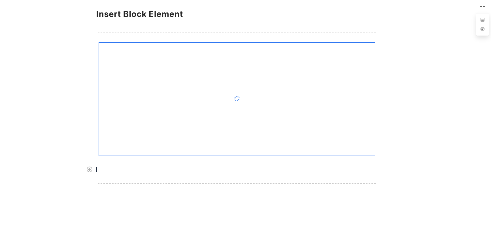
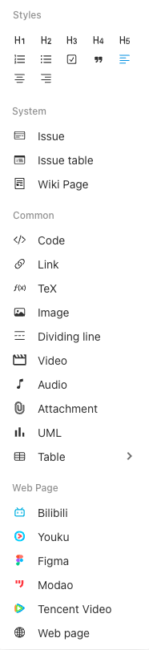
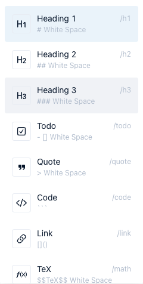

# Insert A Block Element



This ability can declare a block element in the `wiki`, and occupies a whole line. The element in the block cannot be edited. If the content in the block needs to be edited,
declare a new entry, the entry will be displayed in the toolbar zone which can be clicked by the user and open the edit page.




The user can insert the ability in two ways: click the menu on the left or type the shortcut. You can config it in the `plugin.yaml`.

For detailed declarations, please refer to the configuration instructions.

## Compatibility

### Environment Requirements

|   ONES    |
| :-------: |
| v3.10.20+ |

## Install

Move into the `/web` directory, and install this package with the following command:

```bash npm2yarn
npm install @ones-op/store
```

## Manual

### Add Config

```yaml title="config/plugin.yaml"
modules:
  - id: ones-wiki-editor-embed-Pl6y
    title: issue
    moduleType: ones:wiki:editor:embed
    macroShortcut: issue
    describe: Insert the issue
    # Icon of macro
    icon: macro-icon.svg
    modules:
      - id: ones-wiki-editor-embed-syM2
        title: show
        # Scene of slot,
        # `render` used to render the display interface
        # `toolbar` used to render the edit interface
        scene: render
        entry: modules/ones-wiki-editor-embed-Pl6y/ones-wiki-editor-embed-syM2/index.html
      - id: ones-wiki-editor-embed-BUmK
        # The title and icon will render when the user hovers over the block element of macro
        title: edit
        icon: edit.svg # Required
        scene: toolbar
        preload: true # Required
        manual: true # Required
        entry: modules/ones-wiki-editor-embed-Pl6y/ones-wiki-editor-embed-BUmK/index.html
```

A macro plugin consists of two parts:

- Display Interface(`scene: render`), Required, used to render the data in the wiki. When one user is editing the element, this element for another user will be disabled.

:::caution caution

The element used to accept data from the user(e.g. `<input>`) cannot be used in the block element(which intercept lots of DOM event, so the edit element cannot respond to
the input from the user). These editing operations must be placed in the edit interface which triggers by the `toolbar`.

:::

- Edit interface(`scene: toolbar`), Required, Triggered by the toolbar. Each time it is opened, the edit interface will be reinitialized,
  and when it is closed, the instance of the edit interface will be destroyed.

### Open The Edit Interface Actively

In most cases, the edit interface is opened when the user clicks the button in the toolbar. If wants to open it automatically when the user inserts the macro into the wiki document
for the first time, The parameter `isTriggerByUser` is useful to implement this with the help of a local variable.

Display interface

```tsx
let shouldOpenEditPage = true

function App() {
  const document = useDocumentInfo<unknown, boolean>()

  useEffect(() => {
    if (document.isTriggerByUser && shouldOpenEditPage) {
      // Go to edit interface
      document.goToState({
        builtIn: false,
        value: {
          id: 'ones-wiki-editor-embed-BUmK',
          title: 'edit',
        },
        customData: true,
      })
      shouldOpenEditPage = false
    }
  }, [document])

  return <div />
}
```

Edit Interface

```tsx
function App() {
  const document = useDocumentInfo<unknown, boolean>()

  const cancel = useCallback(() => {
    if (document.toolbarState.customData) {
      document.destroy()
    } else {
      // 关闭 toolbar
      document.goToState({
        builtIn: true,
        value: 'init',
      })
    }
  }, [document])

  return <Modal title="Plugin development" onCancel={cancel} />
}
```

### Save The Data

When invoking the function `saveData`, the data will be saved to the wiki document. If the data is simple(e.g. URL, text, etc.), it's OK to save it to the document.
But if the data is large, recommended saving the data in the backend database by communicating with backend services, and then save the returned `ID` in the document.

:::caution caution

The data in the document will be used to revoke, version rollback, etc. Every time the user performs those operations, the editor will return the corresponding version
of the data to the plugin for rendering.

:::

While saving the data, the plugin needs to tell the editor how to export this data when the user export it to word or PDF(for example, the issue plugin will
save the ID into the document. When exported to PDF, this data will render as a link). Now only three formats are supported(text, link, image). This has been defined
in the API section. Among them, the image is special, you need to save the image to the background server of the editor by calling the `uploadResource` method,
and the server will return the file name of the resource. Finally, use the returned file name to generate an export format, refer to the following example.

:::caution caution

When uploading the resource to the editor service by using `uploadResource`, the resource is bound to the document. If the user needs to copy the macro to a new document,
the resource in the previous document is need to bind to the current document too. So there is a fixed field `resources` in the data, if the `resources` exists,
the platform will bind the resources to the new document.

The resources in the `exportSpec` do not need to add to the fixed field `resources`, the platform handles it by default.

Do not pass a custom value to the field `resources`, otherwise it will be treated as a resource ID.

```ts
document.saveData(
  {
    resources: [resourceId],
  },
  {
    exportSpec: [
      {
        type: 'image',
        data: resourceName,
      },
    ],
  }
)
```

:::

```ts
const document = useDocumentInfo()

document
  .uploadResource(File /** the image file that needs to be exported  */, 'test.svg'), () => {})
  .then((resourceName) => {
    document.saveData(
      // the data that saves to the document
      {
        data: value,
        // Do not pass a custom value to the field `resources`, otherwise it will be treated as a resource ID.
        resources: [resourceId]
      },
      {
        exportSpec: [
          {
            type: 'image',
            data: resourceName,
          },
        ],
      }
    )
    // close toolbar
    document.goToState({
      builtIn: true,
      value: 'init',
    })
  })
```

### Plugin Runtime Status

The runtime status of the plugin can be get by the param `status`, and the plugin can modify the status by function `setStatus`,
for example, when the data in the document is not expected, the plugin needs to tell the user to edit the data by call function `setStatus`.
For the definition of specific states, please refer to the `API` type definition.

```ts
const document = useDocumentInfo()
document.setStatus(EmbedPluginRuntimeStatus.DATA_INVALID)
```

## API

Check out the API documentation for the [@ones-op/store](../../../api/packages/store.mdx#useDocumentInfo) library.
