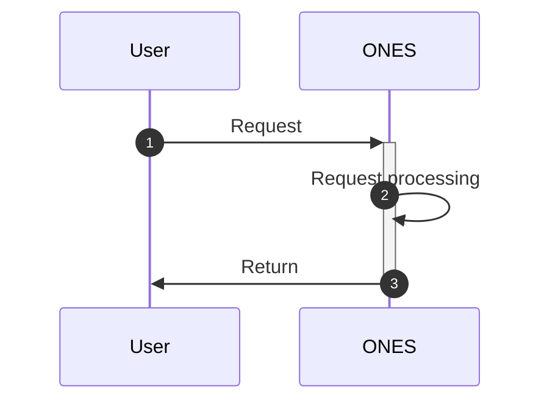

# ONES API hijacking

## Requirements

| **ONES** |
| -------- |
| 3.6+     |

## Overview

Sometimes we need to change the performance of certain behaviors in the ONES, add some operations before and after a certain behavior or replace the behavior itself to meet business. The plugin can use the ONES API hijacking ability to support all ONES API, such as prefix hijacking, subffix hijacking and replace API;

- Prefix hijacking means that when the request enters ONES, it will be forwarded to the plugin before it is processed. After the request is modified by the plugin, it will be sent back to ONES and continue to execute the original logic. It is generally used to modify the parameters of the request, or to check the request for verification

- Subffix hijacking means that when the request is processed in ONES, it will be passed to the plugin. After the plugin modifies its content, it will be sent back to ONES and returned to the requester. Generally used to process the response content.

- Replace API, the plugin can "replace" an ONES API, allowing the plugin to fully customize a request from ONES.

hijack and replace are relatively low-level operations, which may cause unknown risks to ONES function. Generally speaking, the use of ONES API hijacking ability is considered only if other abilities do not meet the requirements.

> **Note: this ability is about to be abandoned and does not guarantee subsequent compatibility!**

## Usage

### **Instruction for use**

1. Currently, only one plugin can hijack or replace the same API using the ONES API hijacking ability. There are conflicts when multiple plugins are configured on the same API.
2. If you modify the plugin configuration file (`config/plugin.yaml`), you need to run `npx op invoke clear` and rerun the `npx op invoke run` directive for the configuration to take effect.

### Usage of ONES API hijacking ability:

#### Standard request process:



#### replace

- Principle

  ```mermaid
  sequenceDiagram
      autonumber
      User->>ONES: Request
      ONES->>+Plugin: Forwarding
      Plugin->>-ONES: Return
      ONES->>User: Return
  ```

- Sample configuration

  ```yaml
  apis:
    - type: replace #API type: replace
      methods: #API request mode
        - GET
      url: /users/me #Hijacking API url
      scope: project/wiki #Project or wiki API. Without this attribute, it defaults to project
      function: jackFunc #The name is consistent with the function name in the code
  ```

- Sample writing of processing method

  In the plugin code, if the plugin also needs to request the replaced ONES API, it needs to include in the request header: `headers: { 'Replace': "replace", }`

  ```typescript
  import { Logger } from '@ones-op/node-logger' //Dependency packages that need to be imported
  import { fetchHttp, fetchONES } from '@ones-op/node-fetch'

  //processing function
  export async function jackFunc(
      request: PluginRequest<Record<string, any>>
  ): Promise<PluginResponse> {
      let userUUID = ''
      let userToken = ''
      if (request.headers['Ones-User-Id'] != null) {
      userUUID = request.headers['Ones-User-Id']
      userToken = request.headers['Ones-Auth-Token']
  }
  const response = await fetchONES({
      path: `/users/me`,
      method: 'GET',
      headers: {
          'Ones-User-Id': [userUUID],
          'Ones-Auth-Token': [userToken],
      },
      root: false, //Default is true
  })
  if (response) {
      return response
  }
  return {
      body: {},
  }
  ```

- Matters needing attention

  The API request parameters should pay attention to the following points:

  - The ONES API is hijacked, so the url entered must be consistent with the API url that accesses the ONES.

  - Confirm whether the replaced API itself is a POST or GET

  - To confirm what parameters need to be set in the request header of the replaced API, please refer to [ONES-API](https://docs.partner.ones.cn/zh-CN/docs/ones/readme/) document.

#### prefix

- Principle

  ```mermaid
  sequenceDiagram
      autonumber
      User->>+ONES: Request
      ONES->>+Plugin: Return
      Plugin->>Plugin: Do prefix processing.
      Plugin->>-ONES: Return request
      ONES->>ONES: Request processing
      ONES->>-User: Return
  ```

- Sample configuration

  ```yaml
  apis:
    - type: prefix #API type: prefix
      methods:
        - GET
      url: /标品url
      scope: project/wiki
      function: prefixFunc
  ```

- Sample writing of processing method

  ```typescript
  //Prefix hijacking
  export async function prefixFunc(
    request: PluginRequest<Record<string, any>>
  ): Promise<PluginResponse> {
    let body = request?.body
    // code
    return {
      // Returns the request header that is processed or returned as is
      body: body,
    }
  }
  ```

#### suffix

- Principle

  ```mermaid
  sequenceDiagram
      autonumber
      User->>+ONES: Request
      ONES->>ONES: Request processing
      ONES->>+Plugin: Forwarding
      Plugin->>Plugin: Do subfix processing
      Plugin->>-ONES: Return
      ONES->>-User: Return
  ```

- Sample configuration

  ```yaml
  apis:
    - type: prefix #API type: suffix
      methods:
        - GET
      url: /Standard url
      function: suffixFunc
  ```

- Sample writing of processing method

  ```typescript
  //suffix hijacking
  export async function suffixFunc(
    request: PluginRequest<Record<string, any>>
  ): Promise<PluginResponse> {
    let body = {}
    // code
    return {
      // Any body can be returned
      body: body,
    }
  }
  ```

### Debug example

- Use the curl tool to access the API `/users/ me` as an example:

  ```shell
  curl --location --request GET 'https://yourhost/users/me' \
  --header 'Ones-User-Id: {user_uuid}' \
  --header 'Ones-Auth-Token: {user_token}' \
  --header 'Content-Type: application/json' \
  --data ''
  ```

- Code request parameter example

  ```
  url：https://yourhost/users/me
  headers:
      Ones-User-Id:{user_uuid}
      Ones-Auth-Token:{user_token}
      ...
  method: GET
  ```
