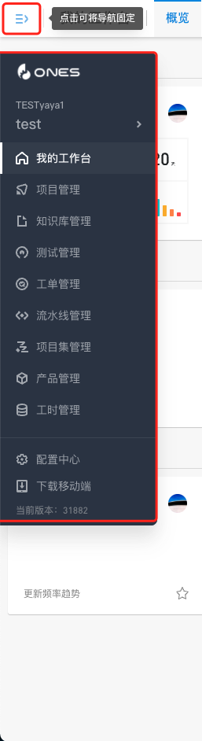
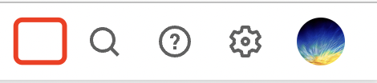

# Global slot

不与系统功能耦合或者作用于整个系统的插槽为全局插槽

## about:blank

空白页模块，可脱离系统独立访问，插件安装后的页面 URL 为：

```
${location.protocol}://${location.host}/plugin/${组织id}/${团队id}/${service.app_id}/${service.version}/modules/${模块id}/index.html
```

:::caution

该插槽脱离系统独立访问，所以无法使用 [`@ones-op/store`](../packages/store.md) 获取系统数据

:::

## ones:global:banner

顶栏公告模块，用于展示全局的公告信息

## ones:global:error:code

全局错误码模块，用于拦截指定错误码以自定义提示信息，模块独有配置参数如下：

|     属性     | 说明                       |            类型             | 必填 | 默认值 |
| :----------: | :------------------------- | :-------------------------: | :--: | :----: |
| errorMessage | 错误码与错误信息的配置对象 | `Recode<ErrorCode, string>` |  是  |        |

- 示例：

```yaml
modules:
  - id: ones-global-error-code-Q2fV
    title: 错误码
    moduleType: ones:global:error:code
    errorMessage:
      ConstraintViolation.BetaRelatedFieldNotDeletable: 该属性已被「Beta数据相关逻辑」调用，不可被删除
      ConstraintViolation.BetaRelatedFieldNotEditable: 该属性已被「Beta数据相关逻辑」调用，不可被编辑
```

该模块适用于新增预设错误提示信息，如果错误提示是动态生成的，也可以由后端通过接口返回以下格式的错误信息进行自定义：

```json
{
  "code": 500,
  "errcode": "AlreadyExists.User.EmailExists",
  "model": "plugin.sso",
  "reason": "自定义提示信息",
  "type": "error"
}
```

|  属性   | 说明                                                                                                                                                             |              类型              | 必填 | 默认值 |
| :-----: | :--------------------------------------------------------------------------------------------------------------------------------------------------------------- | :----------------------------: | :--: | :----: |
|  code   | HTTP 状态码                                                                                                                                                      |            `number`            |  是  |        |
| errcode | 系统错误码                                                                                                                                                       |            `string`            |  是  |        |
|  model  | 插件标识，必须带有 `plugin.` 前缀                                                                                                                                |            `string`            |  是  |        |
| reason  | 自定义提示信息                                                                                                                                                   |            `string`            |  是  |        |
|  type   | 提示信息类型，对应 [ONES Design toast 组件](https://bangwork.github.io/ones-design/?path=/docs/core-toast--toast%E5%85%A8%E5%B1%80%E6%8F%90%E7%A4%BA) 的展示形态 | `'info'` `'warning'` `'error'` |  是  |        |

## ones:global:modal:upload

全局弹窗模块，用于在上传文件前展示

:::caution

在富文本编辑器里（如描述），通过复制粘贴的方式插入图片，插槽将不会被激活

:::

## ones:global:trigger

[Trigger 事件](../../abilities/frontend/trigger/index.md)，可以帮你在 ONES 的某些操作（Action）触发时，对操作的数据进行修改或者取消操作。

## ones:layout:sider

系统侧边栏菜单模块，用于隐藏侧边栏菜单功能



## ones:layout:header:action:new

系统顶栏右侧操作模块，用于在系统顶栏右侧追加新操作内容



## ones:layout:header:action:search

系统顶栏右侧操作模块，用于替换系统顶栏右侧「搜索」操作模块


## ones:layout:header:action:add

系统顶栏右侧操作模块，用于替换系统顶栏右侧「新建」操作模块


## ones:layout:header:action:help

系统顶栏右侧操作模块，用于替换系统顶栏右侧「帮助」操作模块


## ones:layout:header:action:settings

系统顶栏右侧操作模块，用于替换系统顶栏右侧「设置」操作模块


## ones:layout:header:action:notification

系统顶栏右侧操作模块，用于替换系统顶栏右侧「通知」操作模块


## ones:layout:header:action:avatar

系统顶栏右侧操作模块，用于替换系统顶栏右侧「头像」操作模块


