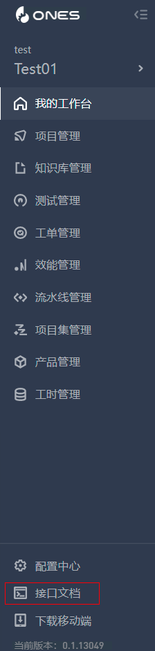

# 接口访问

##能力描述

提供请求外部接口与请求 ONES 接口能力，插件可以访问外部接口或者 ONES 标准系统提供的接口。
具体的 ONES 接口，可以参考实例的 api 文档。文档可以在这里找到：



访问外部接口，请根据对应的接口说明来传递参数、返回结果。

##能力声明

```typescript
import { fetchHttp, fetchONES } from '@ones-op/node-fetch'
```

##API
##fetchHttp
外部接口请求方法。

example:
```typescript
async function fetchBaidu() {
    const response = await fetchHttp({
        url: 'https://www.baidu.com',
        method: 'GET',
    })
    return response
}
```
入参

|参数|类型|说明|默认值|
| ----- | ----- | ----- | ----- |
|url\*|string|请求地址|\-|
|method\*|string|请求类型|\-|
|body|object | Uint8Array | string|请求体|\-|
|headers|Record<string, string[]>|请求头|\-|

返回

|参数|类型|说明|
| ----- | ----- | ----- |
|body|object | Uint8Array | string|返回体|
|headers|Record<string, string[]>|返回头|
|statusCode|number | string | undefined|状态码|

##ONES 标准系统提供的接口
###fetchONES说明
每个插件都会生成一个超级用户，每个超级用户在访问ONES 标准系统提供的接口时，会拥有所有数据的访问权限。
使用fetchONESONES 接口请求方法时，入参中带入 root=true，就可以使用超级用户访问。

入参

|参数|类型|说明|默认值|
| ----- | ----- | ----- | ----- |
|path\*|string|请求路径|\-|
|method\*|string|请求类型|\-|
|body|object | Uint8Array | string|请求体|\-|
|headers|Record<string, string[]>|请求头|\-|
|root|boolean|是否以插件管理员身份请求|true|

返回

|参数|类型|说明|
| ----- | ----- | ----- |
|body|object | Uint8Array | string|返回体|
|headers|Record<string, string[]>|返回头|
|statusCode|number | string | undefined|状态码|

###Example
```typescript
  const response = await fetchONES(
    {
        path: `/team/${globalThis.onesEnv.teamUUID}/items/view`,
        method: 'POST',
        body: {
            query: {
                must: [
                    { equal: { item_type: 'field' } },
                    { in: { pool: ['project'] } },
                    { in: { 'context.type': ['team'] } },
                ],
            },
            view: ['[default]'],
        },
        root: true, //默认为true
    }
)


return response
}
```
我们在请求ones插件接口的时候，会默认使用插件用户，如果想要使用其他用户，可以参考如下写法，
在plugin.yaml声明被劫持的接口，
```typescript
apis:
  - type: replace
    methods:
      - GET
    url: /users/me
    function: getUserme
```
修改代码如下，先将root设置为false，在请求头中添加"Ones-User-Id"、"Ones-Auth-Token"，这两个选项的内容信息可以在被劫持接口的对应方法中获得。
```typescript
export async function getUserme(request: PluginRequest<Record<string, any>>): Promise<PluginResponse>{
  let userUUID = "" 
  let userToken = "" 
  if (request.headers["Ones-User-Id"] != null) {
       userUUID = request.headers["Ones-User-Id"];
       userToken = request.headers["Ones-Auth-Token"];
   }
   const response = await fetchONES({
         path: `/users/me`,
         method: 'GET',
         headers: {
             'Ones-User-Id': [userUUID],
             'Ones-Auth-Token': [userToken],
         },
         root: false, //默认为true
       }
    )
    if (response){
      return response
    }
    return {
      body: {},
    };
 }
```