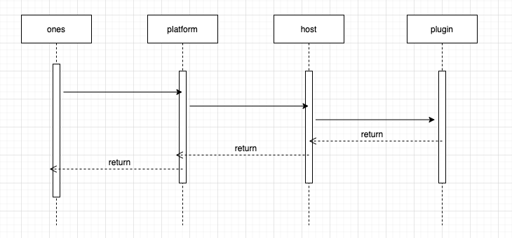
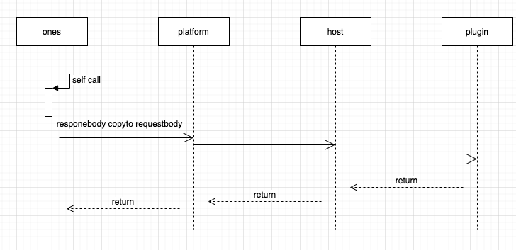

# 接口注册与劫持

##能力描述

插件可以劫持所有 project 对外提供的标准接口，支持前置/后置方式； 插件可以注册新的接口，支持新的插件专用的内部接口或外部接口；

* 所谓前置劫持，是指当请求进入标准系统时，未被处理前就被转发到插件，由插件对请求进行修改后，回传给标准系统并继续执行。一般用于修改请求的参数，或检查请求是否满足特定条件；
* 所谓后置劫持，是指当请求在标准系统完成处理后，将会被传递给插件，由插件对齐进行内容进行修改后再回传给标准系统，并返回给请求方。一般用于对应答内容进行加工；
* 另外，插件可以”替换“掉现有系统的某个接口，让插件能够对现有系统的某个请求进行完全的自定义处理。

注意：劫持和替换都是比较底层的操作，可能对系统功能产生未知风险。同时，目前对某个接口，只能有一个插件对它进行劫持或替换。多个插件处理同一个接口会存在冲突。

插件可以注册新的接口，这些接口能够像正常的标准系统接口一样被调用，如果路由以/team/:teamUUID开头，当插件在某个团队安装时，可通过请求 **"/team/:teamUUID(团队的uuid）/xxx"** 访问路由绑定的插件函数。


## 能力使用
### 能力声明
接口注册，可以在plugin.yaml中添加以下内容，"**addition"**和"**external"**都可以新增接口，其中addition是插件级别的接口，而external是团队级别的接口，external类型的接口注册后，对其注册的接口发起请求的时候，会帮助插件开发者在url前拼接**"/team/:teamUUID/"，**

```yaml
apis:
    - type: addition         //接口类型：addition:新增  external新增(会在url前拼接”/team/:teamUUID/“，团队级别的接口新增)
    methods:                 //接口请求方式
      - POST
    url: /testurl            //自定义url
    function: AddFunc        //名称与代码里的函数名保持一致 首字母大写

    - type: addition        
    methods:                 
      - POST
    url: /team/:teamUUID/testurl          
    function: AddRouterFunc        
```
接口劫持，可以在plugin.yaml中添加以下内容

```yaml
apis:
    - type: prefix              //接口类型： replace:替换 prefix:前置 suffix:后置
    methods:                    //接口请求方式
      - GET
    url: /users/me              //标品url
    function: TestJackFunc      //名称与代码里的函数名保持一致 首字母大写
```
#### 1、addition(插件自身实现的接口)


#### 2、replace(插件替换标品接口)


这个路由过程和上面是新建一样的。


⚠️  在插件代码中，如果插件还需要请求标品被替换的接口，需要在请求头中带上

```Plain Text
headers: {
    'Replace': "replace",
}
```
#### 3、prefix(插件前置拦截标品接口)


#### 4、suffix(插件后置拦截标品接口)


### 5 external(team级别的新增接口)
external 的新增接口必须以 /team/:teamUUID开头，当插件在某个团队按照时，可通过请求/team/:teamUUID/xxx访问路由绑定的插件函数。

```yaml
- type: external
  methods:
    - POST
  url: /team/:teamUUID/external
  function: external
```
💡 external 新增的接口可以在请求的时候不需要填写 header 信息

### 调用方法
在生成的 "backend/src/apiHiJack.ts"文件中编写与plugin.yaml的apis添加的函数

```javascript
import {Logger} from '@ones-op/node-logger'

export async function TestJackFunc(request: any) {
    const url = request.url || {}
    const headers = request.headers || {}
    const body = request.body || {}
    Logger.info('[Plugin] TestJack ======= 接口劫持的的URL :', url)
    Logger.info('[Plugin] TestJack ======= 劫持到接口的请求头', headers)
    Logger.info('[Plugin] TestJack ======= 劫持到接口的请求体', body)
    return {
        headers: {},
        statusCode: 200,
        body,
    }
}

export async function AddFunc(request: any) {
    const body = request.body || {}
    Logger.info('[Plugin] 本次注册接口URL:', request.url)
    return {
        headers: {},
        statusCode: 200,
        body,
    }
}
```
### 实现过程
1、启用插件

2、对注册接口进行请求

本地调试：

访问url：[http://127.0.0.1:port](http://127.0.0.1:port/)/testurl

开发环境调试：

访问url：当前开发环境url+端口号/project/api/project/testurl

3、对劫持接口进行请求

访问url就是在plugin.yaml中配置写好的标品url。

### 请求头说明
|参数名|参数位置|值类型|描述|
| ----- | ----- | ----- | ----- |
|Ones-User-Id|HTTP Headers|string|用户 uuid|
|Ones-Auth-Token|HTTP Headers|string|登录成功的 token|
|Ones-Plugin-Id|HTTP Headers|string|对应后端插件的实例ID|
|Ones-Check-Point|HTTP Headers|string|对应权限检查点 team/organization|
|Ones-Check-Id|HTTP Headers|string|对应权限检查点 teamUUID/organizationUUID|

Ones-Plugin-Id 说明：对于前端来说插件类型分为四种

* addition/replace/prefix/suffix 类型即新增接口，Ones-Plugin-Id 需要传入对应的值。
* 插件平台固有接口，Ones-Plugin-Id 传入固定值：`built_in_apis`。


> ### 使用addition:新增类型问题描述
> 插件 addtion 路由, GET 请求传参数会导致接口无法拿到返回值

> ### 出现原因
> 标准系统使用的 fasthttp 包不支持 get 请求传 body。 该问题已经被包修复， 是我们使用的包版本太久

> 处理方式：使用 post 请求。

