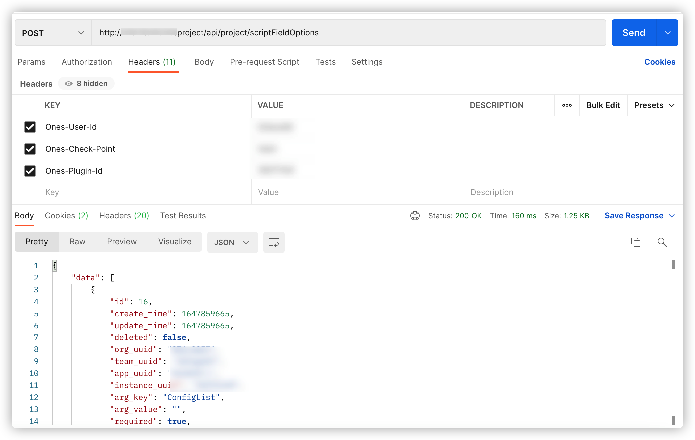
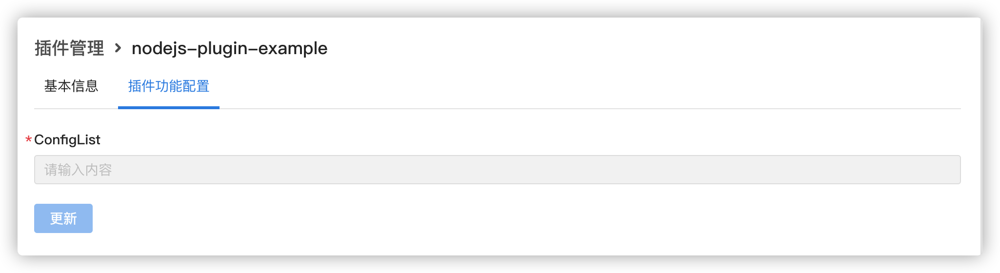

# 插件自定义配置页面

## 能力描述

根据配置文件内容，为插件提供配置页面，用户可以自定义页面内容。

## 能力使用

1. 一旦能力被声明，可以在插件的配置页面找到功能配置；
2. 插件后端可以调用对应的接口，来获取配置页面内容的值；与其它接口调用方法一致；
3. fetchones 请求只需要请求头内带上 AbilityName 不需要 path（平台校验 path 不能为空，所以随便带上一个 path 路径都可以访问，平台会根据 AbilityName 返回结果）

### 声明

**在 plugin.yaml 中添加**

```yaml
service:
  config:
    - key: select_key
      value: ''
      type: 102
      required: true
apis:
  - type: addition
    methods:
      - POST
    url: /scriptFieldOptions
    function: configurationPageTest
```

key：配置页面的显示名称，识别该配置的唯一名称

value：配置的默认值

type：在页面显示的的配置项类型，可以是 101:单行为本，102：多行文本，103：密码文本等。

required：是否必填

**在 index.js 添加示例代码**

```javascript
import { fetchONES } from '@ones-op/node-fetch'

export async function configurationPageTest() {
  const response = await fetchONES({
    path: `/team/${globalThis.onesEnv.teamUUID}`,
    method: 'POST',
    headers: {
      'Ones-Plugin-Id': ['built_in_apis'],
      'Ones-Check-Point': ['team'],
      'Ones-Check-Id': [`${globalThis.onesEnv.teamUUID}`],
      'AbilityName': ['ConfigList'],
    },
    body: {
      instance_id: `${globalThis.onesEnv.instanceId}`,
      team_uuid: `${globalThis.onesEnv.teamUUID}`,
      organization_uuid: `${globalThis.onesEnv.organizationUUID}`,
    },
  })

  return {
    body: response?.body.toString(),
  }
}
```

### API

#### url:-

headers

| 参数          | 类型   | 说明               | 默认值     |
| ------------- | ------ | ------------------ | ---------- |
| AbilityName\* | string | 获取自定义配置列表 | ConfigList |

入参

| 参数              | 类型   | 说明        |
| ----------------- | ------ | ----------- |
| instance_id       | string | 插件实例 id |
| team_uuid         | string | 所属团队 id |
| organization_uuid | string | 所属组织 id |

返回



```json
{
  "data": [
    {
      "id": 9,
      "create_time": 1646277453,
      "update_time": 1646277453,
      "deleted": false,
      "org_uuid": "xxxxxxxx",
      "team_uuid": "xxxxxxxx",
      "app_uuid": "xxxxxxxx",
      "instance_uuid": "xxxxxxxx",
      "arg_key": "Input",
      "arg_value": "",
      "required": true,
      "type": 101
    }
  ]
}
```

### 实现

安装插件后，点击插件详情，可以在插件功能配置中添加自定义配置。



> 用户只有在启用插件时可以编辑内容，否则进入插件详情页内容都是不可编辑模式
