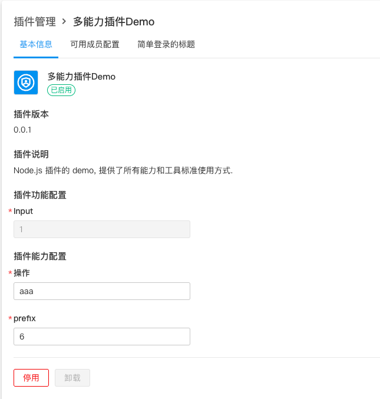
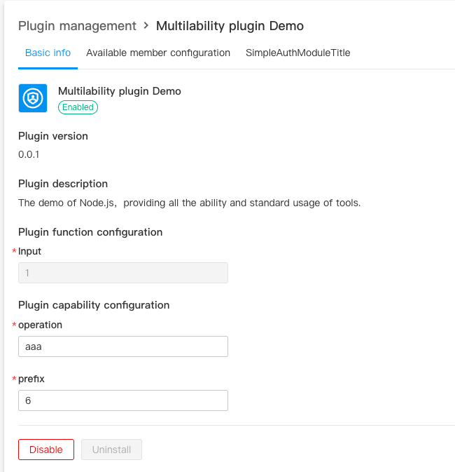

# 插件多语言支持
插件提供了插件的语言跟随系统切换的能力。

例如：插件名称和描述，我希望随着系统的中英文切换而切换

### 多语言声明
在 **config/plugin.yaml **中需要显示为多语言的地方使用** {{.LanguageKey}} **进行替换。

```yaml
service:
  app_id: ykwHs6lm4
  name: "{{.PluginName}}"
  version: 0.0.1
  description: "{{.PluginDescription}}"
```
在 **workspce/language** 下新增 **zh.yaml** 和 **en.yaml**

```yaml
PluginName: Multilability plugin Demo
PluginDescription: The demo of Node.js，providing  all the ability and standard usage of tools.
```
```yaml
PluginName: 多能力插件Demo
PluginDescription: Node.js 插件的 demo, 提供了所有能力和工具标准使用方式.
```
### 多语言使用
插件的实现中也提供了获取语言的方式，方便开发者拓展出更多的业务功能。

```javascript
import { Language } from '@ones-op/node-ability';

// 获取用户语言
const language = await Language.getLanguage(user_uuid)

// 获取语言对应的多语言key的值
const text = await Language.getLanguageString(language, "PluginName")
```
### 效果展示



