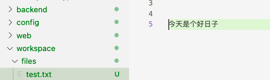

# 插件上传文件

## 能力描述

插件支持上传文件到指定工作项中。

## 能力声明

在代码中添加如下内容，

```javascript
import { PluginFile } from '@ones-op/node-ability'
//上传文件到指定工作项
const file = await PluginFile.uploadFile('files/test.txt', 'taskuuid', 'desc')
```

`uploadFile()`方法参数说明如下，

| 参数名称 | 参数类型 | 参数说明                      | 默认值 |
| -------- | -------- | ----------------------------- | ------ |
| filepath | string   | 文件在 workspace 下的相对路径 | -      |
| taskuuid | string   | 需要上传附件到的工作项 UUID   | -      |
| desc     | string   | 附件描述                      | -      |

❗ 确认插件的 workspace 中存在该文件



返回结果：

```json
file: {
  hash: 'Furn-xxxxxxxxxxxxxxxxxx',
  url: 'http://yourhost/file/attachment/Furn-xxxxxxxxxxxxxxxxxx?e=1651145575&token=xxxxxxxxxxxxx',
  name: 'filename',
  size: 21,
  mime: 'text/plain',
  version: 1
}
```

最后可以在对应工作项的文件列表下看到我们上传的文件，


