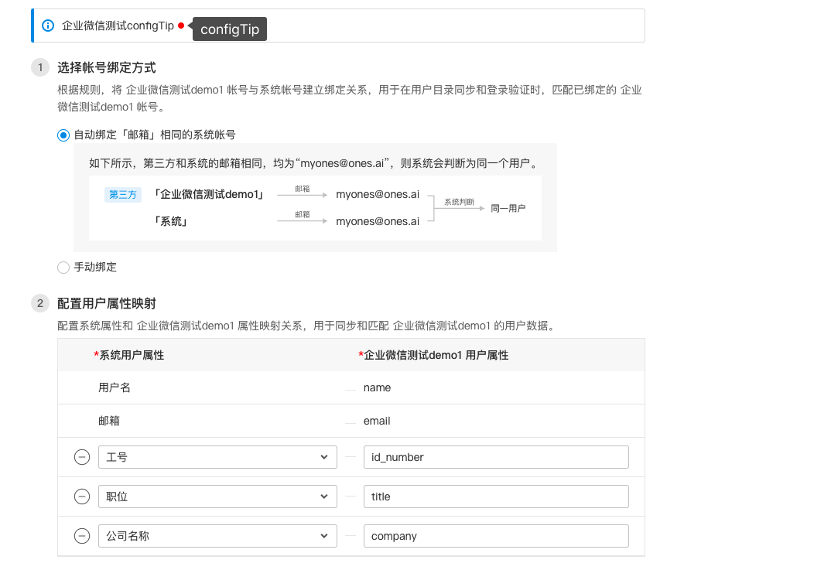
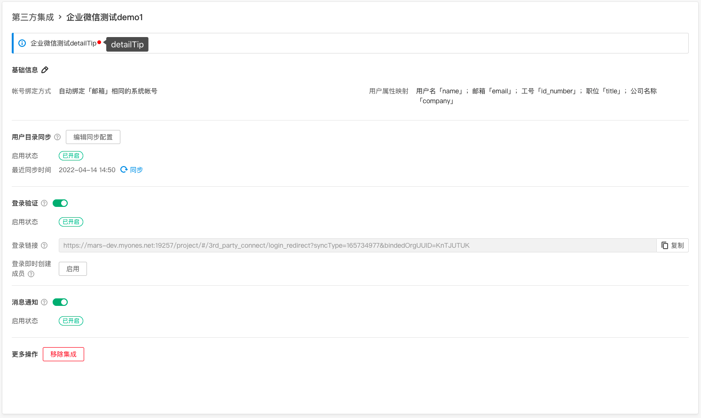
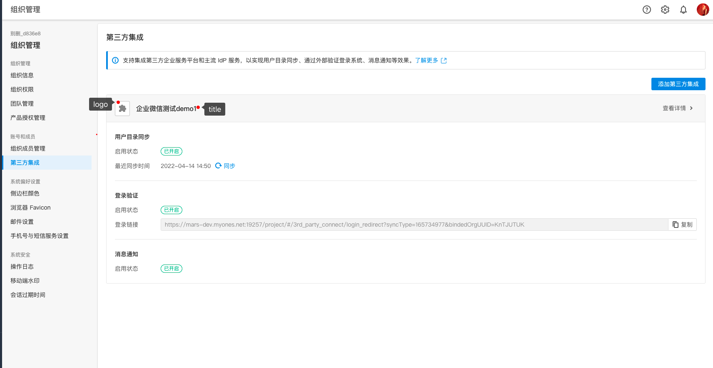
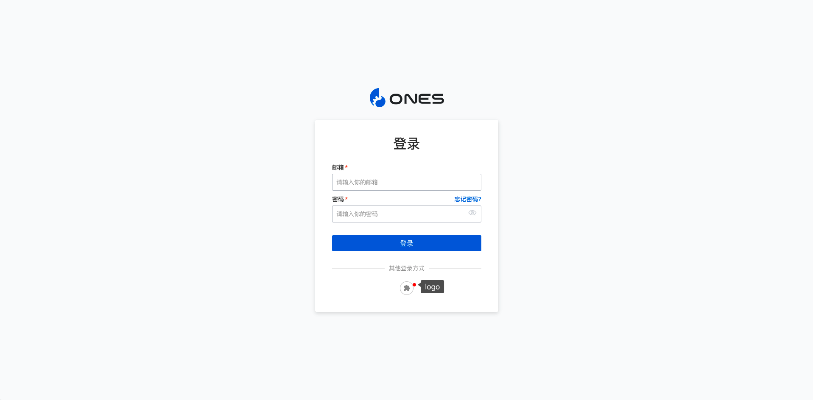
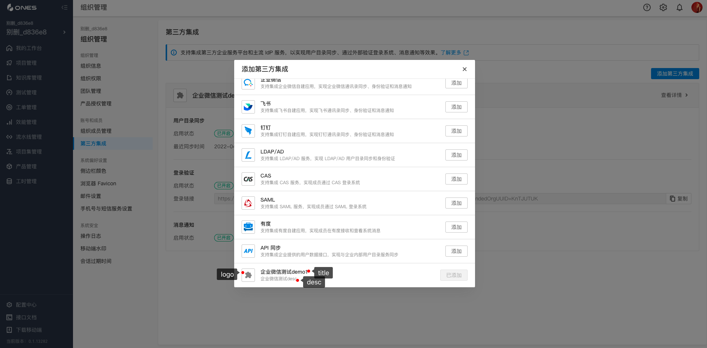

g# 对接三方系统

## 能力描述

支持插件集成某个三方系统，实现以下三种功能：

**登录：用户可通过登录第三方系统，达到登录 ones 系统的功能。**

**组织人员同步：把第三方的部门信息，人员信息同步到 ones 系统的功能。**

**消息推送：实现 ones 可调用第三方消息系统发送消息的功能**

## 能力使用

##### 1、在`plugin.yaml`中添加如下内容，

```javascript
abilities:
    - id: LKJHgdfsx
      name: account
      version: 1.0.0
      abilityType: account
      function:
        sendMessage: SendMessage
        createLoginUrl: CreateLoginUrl
        doExchangeUser: DoExchangeUser
        doPullData: DoPullData
      config:
        # 是否实现了登录功能
        - key: canLogin
          value: true
          show: false
        # 是否实现了同步功能
        - key: canSync
          value: true
          show: false
        # 是否实现了发送消息的功能
        - key: canMessage
          value: true
          show: false
        # 第三方登录的logo地址，写的是文件名，要求该文件放在前端资源根目录下，web/dist/
        - key: logo
          value: "logo.svg"
          show: false
        # 第三方登录名称文案
        - key: title
          value: "企业微信测试demo"
          show: false
        # 第三方描述文案
        - key: desc
          value: "我是企业微信测试demo"
          show: false
        # 第三方详情提醒文案
        - key: detailTip
          value: "我是企业微信测试demo，detailTip"
          show: false
        # 第三方配置提醒文案
        - key: configTip
          value: "我是企业微信测试demo，configTip"
          show: false
```

#####

##### 2、在 account.ts 文件中添加如下内容，

```javascript
// 所有project调插件函数，需要统一返回的结构体格式
function respData(code: number, errcode, model, reason, type, body: Object): PluginResponse {
  return {
      body: {
        code,             // int类型，正常200， 当错误码非200的时候，标品会根据code,errcode,model,reason,type按照标品的标准错误格式返回
        errcode,          // 错误码
        model,            // 错误model
        reason,           // 错误resaon
        type,             // 错误类型
        body,             // 返回给标品相关service的数据
    },
  }
}


/*
   功能点: 返回一个登录的url，根据具体的三方而定
   req:
       request?.body.redirect_url： 调用完第三方登录之后，需要把返回的信息重定向到该地址。

   resp:
        url: 登录三方系统时，调用的url
*/
export async function CreateLoginUrl(request: PluginRequest): Promise<PluginResponse> {
    return respData(200, "200", "", "", "",{
      url: respUrl
    }
}


/*
   需要实现功能点：根据回调信息，获取相关用户信息。

   req:
       key:request.body.auth_info:
       meaning:用户登录后的回调信息json字符串,
       examples:例如登录完企业微信后，会有用户信息发送到标配，其中就有code信息，所以request.body.auth_info == "{\"code\": \"xxxxxx\"}"

   resp:
       {
         third_party_id: userInfo?.userid,    // 唯一用户id
         name: userInfo?.name,                // 名字
         title: userInfo?.position,           // 职位
         avatar: userInfo?.avatar,            // 头像
         email: userInfo?.email,              // email
         phone: userInfo?.mobile              // 手机
       }

*/
export async function DoExchangeUser(request: PluginRequest): Promise<PluginResponse> {
  let userInfo = getUserInfoFromAuthinfo(request.body.auth_info)
  return respData(200, "","","","",{
    third_party_id: userInfo?.userid,    // 唯一用户id
    name: userInfo?.name,                // 名字
    title: userInfo?.position,           // 职位
    avatar: userInfo?.avatar,            // 头像
    email: userInfo?.email,              // email
    phone: userInfo?.mobile              // 手机
  })
}

/*
   功能点：拉取部门信息，用户信息
   req: null
   resp：
       {
          departments: [     // 返回一个部门列表,必须有一个部门id为-1的部门，该部门为根部门
               {
                    third_party_id: "-1",  // 部门唯一id
                    name: agent?.name,     // 部门名称
                    parent_id: "",         // 父部门id
                    next_id: ""            // 在同级部门中，下一个部门的id
               }
          ]
          users: [
            {
                    third_party_id: userid,       // 用户id
                    name: userInfo?.name,         // 用户名称
                    email: userInfo?.email,       // 用户email
                    title: userInfo?.position,    // 职位
                    department_ids: ["-1"]        // 所属部门id
            }
          ]
       }
*/
export async function DoPullData(request: PluginRequest): Promise<PluginResponse> {
  return respData(200, "", "", "", "",{
          departments: [     // 返回一个部门列表,必须有一个部门id为-1的部门，该部门为根部门
               {
                    third_party_id: "-1",  // 部门唯一id
                    name: "根部门",         // 部门名称
                    parent_id: "",         // 父部门id
                    next_id: ""            // 在同级部门中，下一个部门的id
               },
                {
                    third_party_id: "1",   // 部门唯一id
                    name: "部门1",          // 部门名称
                    parent_id: "-1",       // 父部门id
                    next_id: ""            // 在同级部门中，下一个部门的id
               }
          ],
          users: [
            {
                    third_party_id: userid,       // 用户id
                    name: userInfo?.name,         // 用户名称
                    email: userInfo?.email,       // 用户email
                    title: userInfo?.position,    // 职位
                    department_ids: ["-1"]        // 所属部门id
            }
          ]
       }
      )
}

/*
   功能点：发送消息
   req: (request.body)
       {
          "to_users":[
             "xxxxxxxx"   // userid，对应三方系统唯一用户id
           ],
          "message_data": {
            "type": "xxxx", // 消息类型，文本或者外链，使用具体的常量定义
            "title": "xxxx", // 消息标题
            "content": "xxxxx"， // 消息内容
            "link": {
                "link_text": "外链文本",
                "url": "外链信息"
             }
          }
       }
   resp: null

*/
export async function SendMessage(request: PluginRequest): Promise<PluginResponse> {
  // 发消息逻辑
  return respData(200, "","","","",{})
}
```

##### 3、plugin.yaml 配置在产品界面上的表现










