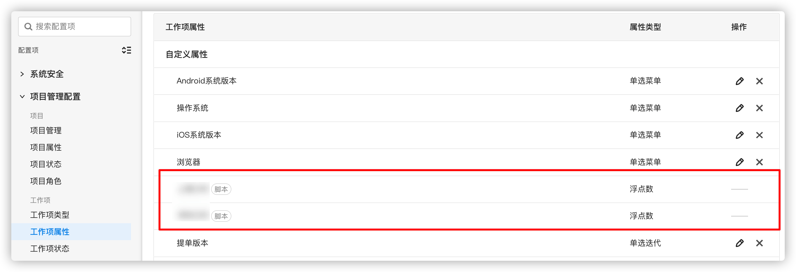

# 插件承载脚本属性 - 数字
## 能力描述
插件可以提供数字类型的脚本属性的业务实现，使用该能力后，全局工作项属性列表会多出属性类型为“浮点数”的脚本属性，该脚本属性还可以添加至具体项目的工作项类型中。




当承载有该能力的插件停用/卸载后，属性值为0，该属性成为一个失去统计功能的只读属性；

当承载有该能力的插件停用/卸载后，又重新启用/安装插件，属性重新被调用


## 能力使用
### 能力声明
在plugin.yaml中声明使用该能力

```yaml
abilities:
  - id: number-option
    name: 插件承载脚本属性-数字
    abilityType: PluginFieldValue
    function:
      calcFieldValue: GetNumber
```
在"backend/index.js"的 "install()" 函数中添加创建脚本属性的方法，在插件安装过程中，就会创建了该脚本属性。

```javascript
import {
  PluginRequest,
  PluginResponse,
} from '@ones-op/node-types';
import {
  Field,
  Notify,
  NotifyWay,
  FieldTypeEnum,
  PoolEnum,
} from '@ones-op/node-ability';

// 安装插件
export async function Install() {
    Logger.info('[Plugin] Install')
    //调用脚本属性添加方法，创建数字类型的脚本属性
    const FieldsAddRes = await Field.FieldsAdd({
	    Name: field_name,
	    Type: 1009,
	    Renderer: 1,
	    FilterOption: 0,
	    SearchOption: 1,
    });
    if(FieldsAddRes.Error){  //如果添加失败，抛出异常
	throw new Error('Failed to create property')
    }
    //添加成功返回属性的UUID
    const { UUID: fieldUUID} = FieldsAddRes
    Logger.info('fieldUUID:',fieldUUID)
    return {
	  body:{
	    message: "Field Add UUID:",fieldUUID
	}
    }    
}
```
FieldsADD方法使用介绍

|参数|类型| 说明                                                            |默认值|
| ----- | ----- |---------------------------------------------------------------| ----- |
|Name|string| 新增的脚本属性名称                                                     |\-|
|Type|int32| 新增的脚本属性类型<br />1001：脚本属性单选<br />1002：脚本属性多选<br />1009：脚本属性浮点型 |\-|


### 实现过程
在"index.ts"的GetNumber()函数中去使用该脚本属性。

```javascript
import {PluginRequest, PluginResponse,} from '@ones-op/node-types';

export async function GetNumber(request: PluginRequest): Promise<PluginResponse> {
    const {body} = request?.body as any
    const returnValue: any[] = []
    //创建的脚本属性UUID
    if (body.fieldUUID) {
        //需要数字统计的工作项的uuid数组
        if (body.taskUUIDs) {
            for (let i = 0; i < body.taskUUIDs.length; i++) {
                var obj = {
                    taskUUID: "", //工作项UUID，请注意该工作项是已经存在脚本属性
                    value: 0      //具体返回的值，可以根据业务逻辑去统计
                }
                obj.taskUUID = body.taskUUIDs[i]
                returnValue.push(obj)
            }
        }
    }
    return {
        body: {
            values: returnValue
        }
    }
}
```