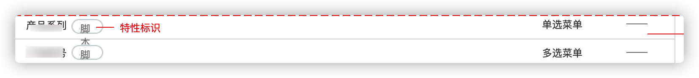

# 插件承载脚本属性 - 单选/多选
## 能力描述
插件可以提供单选/多选类型的脚本属性的业务实现。插件启用后，全局工作项属性列表会多出属性类型为“单选菜单”或“多选菜单”的脚本属性，该脚本属性还可以添加至具体项目的工作项类型中。



这两种属性的表现形式，和系统中的单选/多选的表现形式是一致的。他们的不同点在于，这些脚本属性的数据源，是由插件提供的。

## 能力使用
1. 插件在安装时，注册一个新的脚本属性，并选择它的类型；
2. 实现插件方法，在标准系统需要数据时，按照格式返回这些数据。


### 能力声明
在plugin.yaml中声明使用该能力

```yaml
abilities:
  - id: optionS
    name: 插件承载脚本属性-单选/多选
    abilityType: PluginFieldValue
    function:
      calcFieldValue: GetOptions
```
在"backend/index.js"的 "install()" 函数中添加创建脚本属性的方法，在插件安装过程中，就会创建了该脚本属性。

```javascript
import {
  PluginRequest,
  PluginResponse,
} from '@ones-op/node-types';
import {
  Field,
  Notify,
  NotifyWay,
  FieldTypeEnum,
  PoolEnum,
} from '@ones-op/node-ability';

// 安装插件
export async function Install() {
    Logger.info('[Plugin] Install')
    //调用脚本属性添加方法，创建数字类型的脚本属性
    const FieldsAddRes = await Field.FieldsAdd({
	    Name: field_name,
	    Type: 1001,
	    Renderer: 1,
	    FilterOption: 0,
	    SearchOption: 1,
    });
    if(FieldsAddRes.Error){  //如果添加失败，抛出异常
	throw new Error('Failed to create property')
    }
    //添加成功返回属性的UUID
    const { UUID: fieldUUID} = FieldsAddRes
    Logger.info('fieldUUID:',fieldUUID)
    return {
	  body:{
	    message: "Field Add UUID:",fieldUUID
	}
    }    
}
```
FieldsADD方法使用介绍

|参数|类型| 说明                                           |默认值|
| ----- | ----- |----------------------------------------------| ----- |
|Name|string| 新增的脚本属性名称                                    |\-|
|Type|int32| 新增的脚本属性类型<br /> 1001：脚本属性单选<br />1002：脚本属性多选<br />1009：脚本属性浮点型 |\-|


### 实现过程
在"index.ts"的GetOptions()函数中去使用该脚本属性。

```javascript
import {PluginRequest, PluginResponse,} from '@ones-op/node-types';

export async function GetOptions(request: PluginRequest): Promise<PluginResponse> {
    const {body} = request?.body
    as
    any
    const returnValue: any[] = []
    return {
        body: {
            values: returnValue
        }
    }
}
```