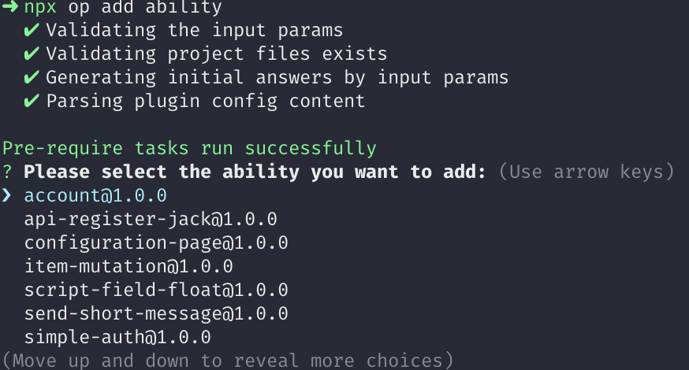

# 添加开放能力

> 插件开发教程: [插件开发入门](../../examples/videos/start.mdx)

在插件根目录运行 op 的 `add` 命令，可以向插件新增开放能力：

```
op add
```

其输出如下：

```
? 请选择插件后端(ability) 或 前端(module)的能力配置:  [Use arrows to move, type to filter]
> 能力 ability
  模块 module
  退出 exit
```

选择「能力 ability」，可以看到如下开放能力列表：



这里可以选择接口相关能力和业务开放能力。详细的能力列表可以参考：

- [接口相关能力列表](../abilities/api/index.md)
- [业务开放能力列表](../abilities/bussiness/index.md)

这里我们以 [简单登录校验](../abilities/bussiness/simple-auth.md) 能力为例，当选择添加该能力后，可以看到在 `/config/plugin.yaml` 文件的 `abilities` 字段中新增了一项内容：

```yaml title="/config/plugin.yaml"
abilities:
  - id: zhongfu-simple-login
    name: 登录
    abilityType: SimpleAuth
    function:
      validateFunc: SimpleAuthValidate
```

同时，在 `/backend/src/index.ts` 文件中，会生成对应的 `SimpleAuthValidate` 方法：

```ts title="/backend/src/index.ts"
// 示例方法 SimpleAuth 简单登录能力使用
export async function SimpleAuthValidate(request: PluginRequest): Promise<PluginResponse> {
  return {
    body: {
      code: 200,
      data: {
        uuid: 'QmPCusvS',
      },
    },
  }
}
```

可以看到，该方法固定返回一个用户 id，表示在每次方法调用时都会将该用户进行登录。

当你在生产环境中使用这段代码时，将此用户 id 修改为真实存在的用户 id 即可。
