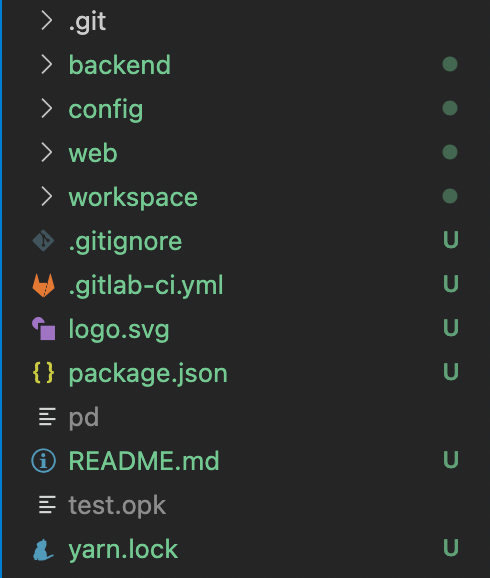
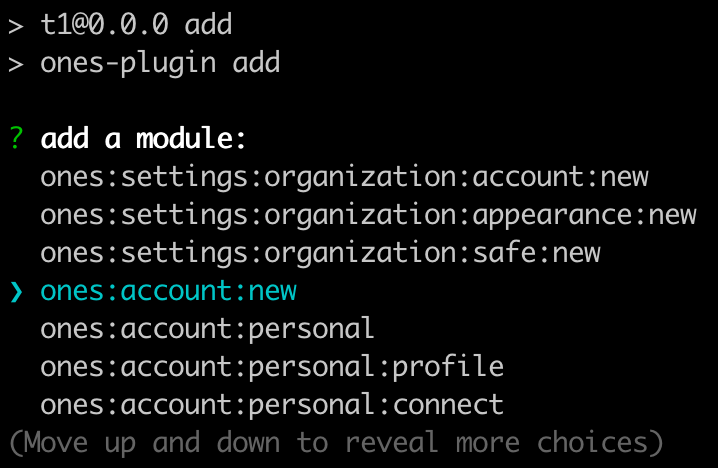

# 向插件添加开放能力

## 添加一种开放能力

在前面的快速开始完成后，我们的插件工程目录如下：



我们可以通过 `add` 命令，来向插件增加开放能力：

```
op add
```

其输出如下：

```
? 请选择插件后端(ability) 或 前端(module)的能力配置:  [Use arrows to move, type to filter]
> 能力 ability
  模块 module
  退出 exit
```

可以使用 ⬆️ ⬇️ 键，来选择插件需要增加的能力。

> 能力：指业务开放能力，以及接口相关能力

> 模块：指前端插槽模块

### 添加能力

选择「能力 ability」，可以看到如下开放能力列表：


这里可以选择的能力，包括接口相关能力，以及业务开放能力。详细的能力列表可以参考：

- [接口相关能力列表](../abilities/api/index.md)
- [业务开放能力列表](../abilities/bussiness/index.md)

#### 添加业务开放能力

这里我们以 [简单登录校验](../abilities/bussiness/simple-auth.md) 能力为例，详细说明能力是如何被加到插件代码里面的，以及需要做什么修改后插件就能工作。

当使用工具添加这个能力后，我们会看到在 config/plugin.yaml 中，增加了一个 `abilities` 的内容如下：

```yaml
abilities:
  - id: zhongfu-simple-login
    name: 登录
    abilityType: SimpleAuth
    function:
      validateFunc: SimpleAuthValidate
```

同时，在 backend/src/index.ts 中，会生成对应的 `SimpleAuthValidate` 方法：

```ts
// 示例方法 SimpleAuth 简单登录能力使用
export async function SimpleAuthValidate(
  request: PluginRequest
): Promise<PluginResponse> {
  return {
    body: {
      code: 200,
      data: {
        uuid: "QmPCusvS",
      },
    },
  };
}
```

可以看到，这个方法固定返回一个用户 id。这表示每次调用都会使这个用户被登录。如果要在你的环境中使用这段代码，需要修改此用户 id 为环境中实际存在的用户 id。

### 添加插槽模块

选择「模块 module」，可以看到如下模块列表：



详细的插槽模块可以参考：[插槽模块列表](../abilities/slot/index.md)

#### 增加前端插槽

这里我们以 `ones:global:banner` 模块为例，详细说明前端插槽是如何被声明和使用的。

当使用工具添加这个模块后，我们会看到在 config/plugin.yaml 中，增加了一个 `modules` 的内容：

```yaml
modules:
  - id: ones-global-banner-3QC4
    title: banner
    entry: modules/ones-global-banner-3QC4/index.html
    moduleType: ones:global:banner
```

同时，在 web/src/modules/ones-global-banner-3QC4 目录中，会生成对应的 index.tsx 与 index.css 文件：


我们会在 index.tsx 入口文件中自动生成如下模版代码：

```ts
import React from "react";
import ReactDOM from "react-dom";
import { ConfigProvider } from "@ones-design/core";
import "./index.css";

ReactDOM.render(
  <ConfigProvider>banner</ConfigProvider>,
  document.getElementById("ones-mf-root")
);
```

你可以将 `<ConfigProvider>banner</ConfigProvider>` 中的 banner 文字替换为自己的插件前端代码。
