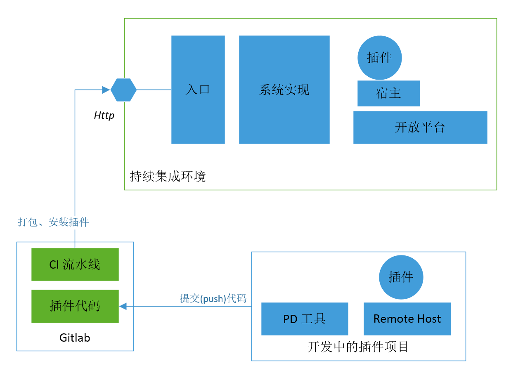

# 插件持续集成测试

> 持续集成教程: [插件持续集成测试](../../examples/videos/ci.mdx)

### 提交代码，自动安装插件到 CI 环境


如图所示，当插件代码托管在 gitlab 上，且进行了相关的配置时，本地代码一旦提交，即会驱动 gitlab 的流水线，打包插件并安装到配置的持续集成环境中。

前置条件：

1. gitlab 上配置了流水线；如果你使用的是 [https://gitlab.plugins.myones.net/](https://gitlab.plugins.myones.net/) 来托管插件代码，则无需配置；
2. 正确配置了项目文件夹中的 **ci-deploy.yaml**** **文件；见下文。

### 使用 OP 工具配置 ci-deploy.yaml
1. 执行 op login -e=sit 命令，登录需要自动安装的环境信息

```bash
% op login -e=sit
? 输入测试环境url: http://120.76.45.123
? 输入用户邮箱: test@ones.ai
? 输入密码: test1234
2022/02/28 23:54:25 登录成功!!
? 选择需要指定的team: GSwm2Lix
2022/02/28 23:54:26 配置修改成功..
2022/02/28 23:54:26 开始生成测试开发环境配置..
2022/02/28 23:54:26 配置ci-deploy.yaml成功!!
```
2. 修改完成查看ci-deploy.yaml文件

```yaml
default.host: http://120.76.45.123/project/api/project
default.ones-check-id: GSwm2Lix
default.ones-check-point: team
default.ones-plugin-id: built_in_apis
default.organization_uuid: 8Z6vS8FZ
default.team_uuid: GSwm2Lix
default.token: foWJVipHgcEqQcL8avmcUG3NFSdMCeylQ4OAYpfp2kv6KArZcSiqUkBj4pHrMWOt
default.user_uuid: Q1duxk8t
```
3. 关于分支
    1. 配置文件中包含 default 开头的配置，这是在其它配置不生效时的默认配置；
    2. 可以配置其它分支号开头的配置组，当本体提交代码的分支命中配置时，流水线将基于此分支的配置，将分支代码打包并部署到持续集成环境；
    3. 这是为了让多个插件开发人员在同一个插件仓库进行开发，或者某个插件升级过程中的分支开发时，其各自的分支相互独立；