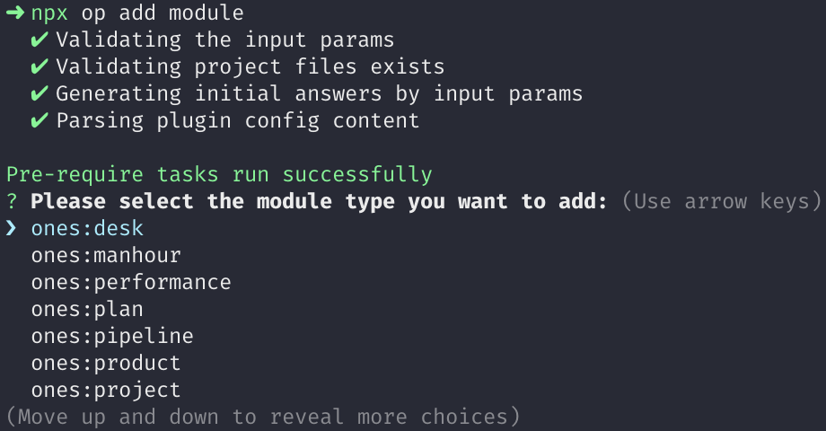

# 添加插槽模块

在插件根目录运行 op 的 `add` 命令，可以向插件新增插槽模块：

```
op add
```

其输出如下：

```
? 请选择插件后端(ability) 或 前端(module)的能力配置:  [Use arrows to move, type to filter]
> 能力 ability
  模块 module
  退出 exit
```

选择「模块 module」，可以看到如下插槽模块列表：



详细的插槽模块可以参考：[插槽模块列表](../../../api/module-type/index.md)

这里我们以 `ones:global:banner` 全局插槽为例，当选择添加这个模块后，可以看到在 `/config/plugin.yaml` 文件的`modules` 字段中新增了一项内容：

```yaml title="/config/plugin.yaml"
modules:
  - id: ones-global-banner-3QC4
    title: banner
    entry: modules/ones-global-banner-3QC4/index.html
    moduleType: ones:global:banner
```

同时，还会生成与 `entry` 字段对应的 `/web/src/modules/ones-global-banner-3QC4` 目录，其中包含 `index.tsx` 与 `index.css` 两个文件：


在 `index.tsx` 入口文件中自动生成的模版代码如下：

```ts title="/web/src/modules/ones-global-banner-3QC4/index.tsx"
import React from 'react'
import ReactDOM from 'react-dom'
import { ConfigProvider } from '@ones-design/core'
import './index.css'

ReactDOM.render(<ConfigProvider>banner</ConfigProvider>, document.getElementById('ones-mf-root'))
```

你可以在 `<ConfigProvider>` 组件下，编写自己的插件前端代码。
