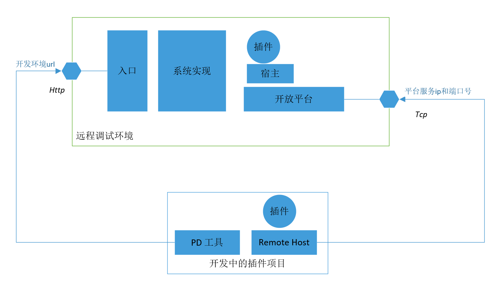
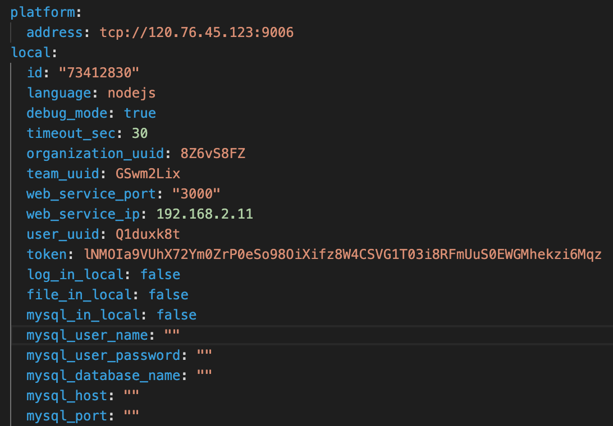
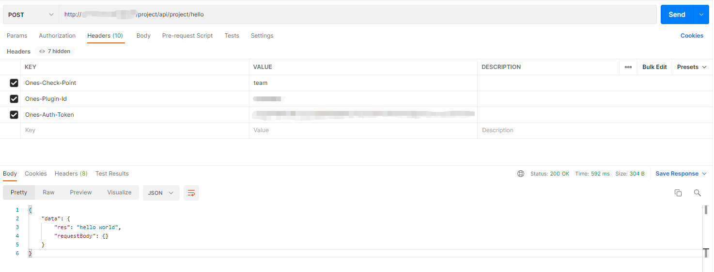
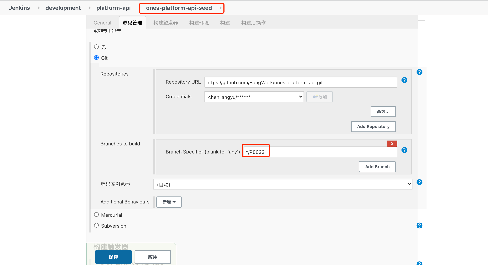
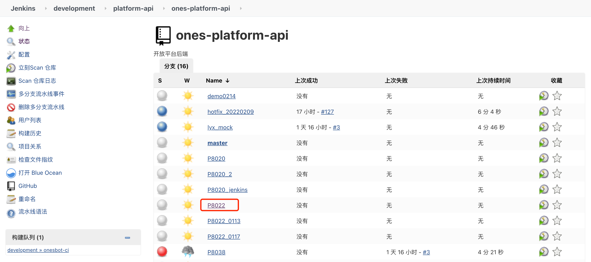
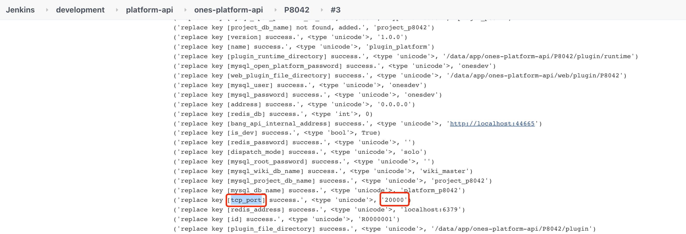

# 在本地调试插件

> 本地调试教程: [插件开发与调试](../../examples/videos/test.mdx)

接下来，我们将一起了解如何使用 插件开发工具，在本地调试插件。

## Step by step
现在我们尝试在本地开发过程中进行实时调试。

#### 1. 登录需要调试的环境

1. 执行 op login 命令，登录需要调试的环境注册信息配置local.yaml文件

```bash
op login 
```
2. 执行login 时输入：

```bash
% op login  
? 输入登录开发环境环境url: https://devapi.myones.net/project/P8022
? 输入用户邮箱: wangxueying@ones.ai
? 输入密码: **********
2022/02/23 16:22:20 登录成功!!
? 选择需要指定的team: GSwm2Lix ones
? 安装插件测试是否指向另一个环境? No
2022/02/23 16:22:31 当前已有历史登录注册用户信息..
? 是否覆盖当前登录注册用户信息: Yes
2022/02/23 16:22:33 注册用户信息成功!
2022/02/23 16:22:33 开始生成本地开发环境配置..
? 请输入平台服务ip和端口号: tcp://119.23.130.213:20001
? 输入推送代码目标分支: master
2022/02/23 16:22:52 配置ci-deploy.yaml成功!!
```
> 关于如何理解这些参数，请参考下面的图文说明。



如图，插件的本地调试，首先需要工具具备远程调试环境的权限，能过获取数据、操作团队等；同时，我们的远程实时调试，实际上是在本地执行一个"远程宿主机"。

因此，login 中填入的主要是就是这两个部分的内容：

* 开发环境 url，及登录信息；
    * 在开发/调试过程中，OP 工具需要能够获取调试环境的授权，以便在调试过程中获取团队等数据；
    * 因此建议使用此环境的登录用户使用组织管理员，以便可以创建新团队并进行调试；
* 平台服务 ip 和端口号；
    * 为了能够本地调试，需要在这里填入远程调试环境的开放平台组件对外的 tcp 服务端口（需要环境配置了对外开放此端口）；
* 关于 ‘安装插件测试是否指向另一个环境?’
    * OP 工具支持[持续集成](https://ones.ai/wiki/#/team/RDjYMhKq/space/H8Z6VeER/page/4D1nzb6a)[测试](https://ones.ai/wiki/#/team/RDjYMhKq/space/H8Z6VeER/page/4D1nzb6a)。开发者可以选择是否复用调试环境用于集成测试；
    * 若选择是，则集成测试时，插件包将会推送到此环境；
    * 若选择否，则进入持续集成测试的配置过程；

至此，需要调试的环境信息已经准备好了。

生成的 local.yaml配置添加如下：



> 关于这里没有涉及到的配置项如 file. mysql. ，请参考[配置文件说明](https://ones.ai/wiki/#/team/RDjYMhKq/space/H8Z6VeER/page/Ln9zBtxa)。

#### 2. 启动本地插件项目

1. 执行 op run命令，启动插件项目

```bash
op run
```
```bash
% op run    
2022/02/25 14:30:49 > node_plugin_demo1@1.0.0 build
> cd backend && npm run build && cd ../web && npm run build
2022/02/25 14:30:49 > node-plugin-template@1.0.0 build
> rm -rf dist && set NODE_ENV=production && rollup -c rollup.config.js
2022/02/25 14:30:49 
/Users/huangyao/go/src/cli-test0214/backend/src/index.ts → dist/index.js...
2022/02/25 14:30:50 created dist/index.js in 756ms
2022/02/25 14:30:50 > cli-test0214@0.0.0 build
> ones-plugin build
/opt/homebrew/bin/npm start
2022/02/25 14:30:51 ----开发环境访问路径：http://120.76.45.123
2022/02/25 14:30:52 {
  action: 'run',
  email: '',
  password: '',
  reinstall: false,
  instance_uuid: undefined,
  hostID: undefined,
  webIp: '192.168.2.11',
  webPort: '3000',
  orgUUID: '8Z6vS8FZ',
  teamUUID: 'GSwm2Lix',
  user_uuid: 'Q1duxk8t',
  token: 'lNMOIa9VUhX72Ym0ZrP0eSo98OiXifz8W4CSVG1T03i8RFmUuS0EWGMhekzi6Mqz',
  webServiceUrl: '192.168.2.11:3000'
}

> cli-test0214@0.0.0 start
> ones-plugin start

asset logo.svg 489 bytes [emitted] [from: public/logo.svg] [copied]
orphan modules 161 KiB [orphan] 22 modules
webpack 5.68.0 compiled successfully in 384 ms
<i> [webpack-dev-server] Project is running at:
<i> [webpack-dev-server] Loopback: http://localhost:3000/
<i> [webpack-dev-server] On Your Network (IPv4): http://192.168.2.11:3000/
<i> [webpack-dev-server] On Your Network (IPv6): http://[fe80::1]:3000/
<i> [webpack-dev-server] Content not from webpack is served from '/Users/huangyao/go/src/cli-test0214/web/public' directory
2022/02/25 14:30:58 本地调试返回值: {"instance_uuid":"5a21a6d7","token":"lNMOIa9VUhX72Ym0ZrP0eSo98OiXifz8W4CSVG1T03i8RFmUuS0EWGMhekzi6Mqz","user_uuid":"Q1duxk8t"}
```
2. 执行run 时会同时启动前端和后端服务，第一次启动后端会返回本地调试返回值。

```bash
2022/02/25 14:30:58 本地调试返回值: {"instance_uuid":"5a21a6d7","token":"lNMOIa9VUhX72Ym0ZrP0eSo98OiXifz8W4CSVG1T03i8RFmUuS0EWGMhekzi6Mqz","user_uuid":"Q1duxk8t"
```
这些信息，可以用返回值添加在postman请求头中来进行调试
#### 4. 本地调试

1. 拿到本地返回值中的instance\_uuid，token
   这些信息也可以在local.yaml中找到，执行时，工具会写入对应的相关信息。
3. 在postman中加入请求头固定值
    1. Ones-Check-Point:team,
    2. Ones-Plugin-Id:(返回值instance\_uuid) 5a21a6d7,
    3. Ones-Auth-Token:(返回值中的token) lNMOIa9V\*\*\*\*\*\*\*\*\*\*\*\*\*\*\*\*\*\*\*\*\*\*\*\*\*\*\*\*\*\*\*\*\*\*\*\*\*\*\*\*\*\*\*\*\*\*\*\*\*\*\*\*\*




4. 拿到返回值"Hello World!"

---
## 注意

1. 如果修改了配置（/config/plugin.yaml），需要重新走 install 生命周期，才能看到效果；
    1. 例如：新增了能力，修改了配置项，声明了新权限点等等
2. 如果使用 ONES dev 环境进行开发，你可以在[ones-platform-api](https://cd.myones.net/job/development/job/platform-api/job/ones-platform-api/)构建环境时控制台输出中获取调试环境的”平台服务ip和端口号“中的端口号，平台服务的ip都是固定的tcp://119.23.130.213：
    1. 首先需要现在ones-platform-api-seed构建项目




2. 构建项目以后即可在ones-platform-api下看到所有分支的项目



3. 进入对应分支的项目构建环境，可以在控制台中输出看到tcp\_port


