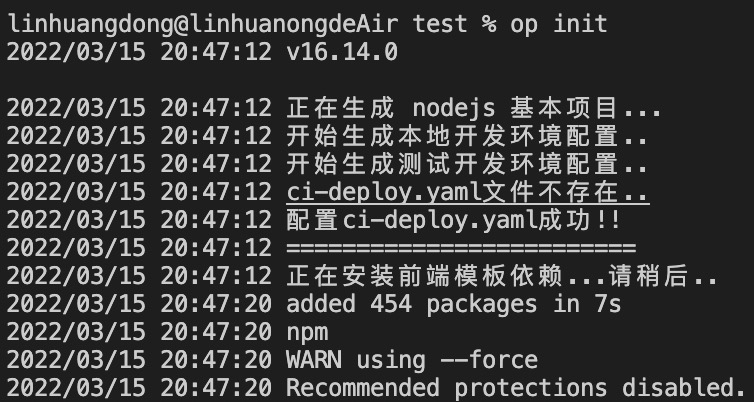
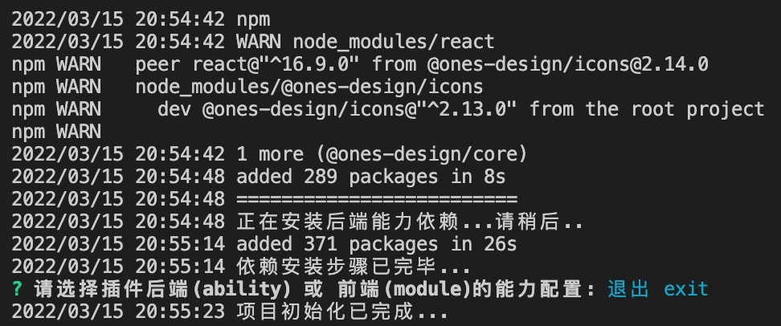
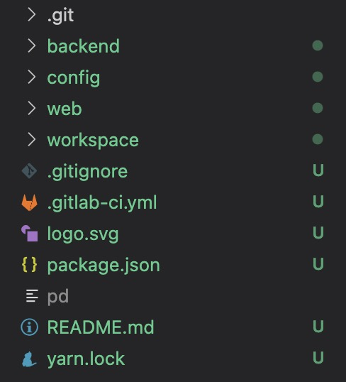

# 创建一个插件

## 插件初始化

1. 创建一个新文件夹作为插件目录，如 `test`
2. 在 `test` 文件夹中打开命令行


3. 运行以下命令来初始化这个插件：

```
op init
```

初始化过程会询问我们是否登录，我们暂时选择: No



4. 最后会询问是否在初始化时添加能力，我们暂时选择: 退出 exit



创建好的插件目录结构如下：



## 插件打包

你可以尝试运行以下命令来打包这个插件

```
op package
```

完成后可以在当前目录中看到打包好的插件 opk 包


## 插件安装

在启用了开放平台的环境中，我们可以上传并安装这个 opk 包：

> 环境：[http://120.76.45.123/](http://120.76.45.123/)
> 账号：test@ones.ai
> 密码：test1234
> 注意：请使用分配给你的环境以及对应的账号、密码。


至此，一个插件的创建与安装便完成了。
