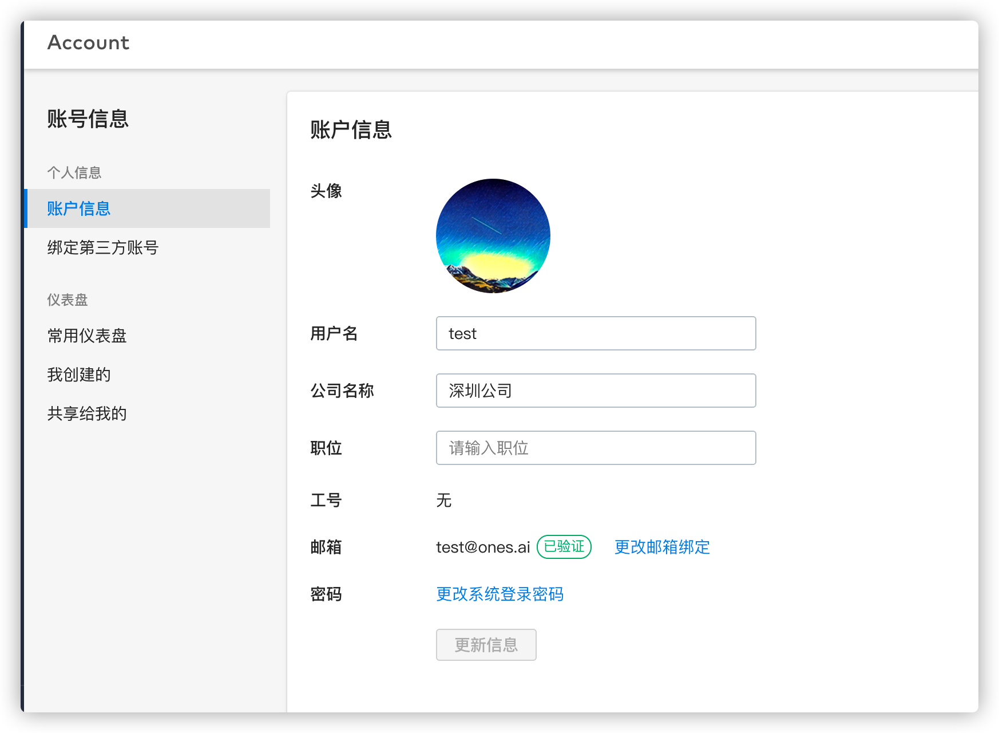
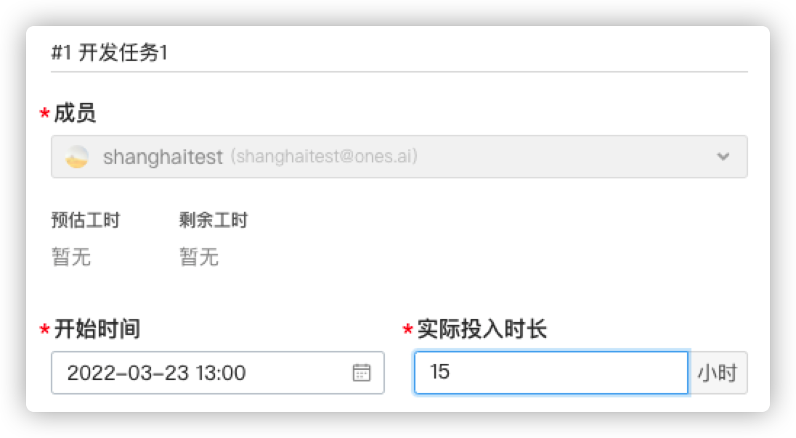

# 3. 分部门统计工时
## 目标
通过一个业务实现较为复杂的插件实现，演示如何使用“脚本属性-数字”来满足标准系统的定制需求；

在此过程中，我们将会：

* 了解如何使用业务开放能力；
* 在插件代码中，调用标准系统的接口，获取标准系统数据（工时数据、人员数据）等；
* 了解如何初始化插件的数据表，并进行读写操作；

## 需求
背景说明：

* 某公司有两个分公司协同工作，他们都使用ONES登记工时；
* 两地的人员常常会基于同一个任务单进行开发工作，并登记自己的工时；


需求描述：

* 作为项目管理员，我希望能够在每个工作项中，看到分属不同大部门（上海、深圳团队）的同事分别登记的工时的总数；


## 产品设计方案


## 技术实现方案
1、插件启用时候创建脚本属性"深圳工时"、"上海工时"，脚本属性类型为1009（浮点型）

2、使用业务开放能力”插件承载脚本属性 - 数字“

3、在对应的文件编写脚本属性的业务逻辑


## 实现过程
1、在plugin.yaml中声明使用该能力

```yaml
abilities:
  - id: number-field-lj0n
    name: 插件承载脚本属性-数字
    abilityType: PluginFieldValue
    function:
      calcFieldValue: getNumber
```
2、在plugin.sql中添加如下内容，该表内容主要是记录生成脚本属性的uuid和名称，

```sql
CREATE TABLE IF NOT EXISTS `{{filedtable}}`
(
    `field_uuid` varchar(50) COLLATE utf8mb4_general_ci NOT NULL DEFAULT '' COMMENT '属性uuid',
    `field_name` varchar(50) COLLATE utf8mb4_general_ci NOT NULL DEFAULT '' COMMENT '属性名字',
    `sort`       int(2)                                 NOT NULL COMMENT '排序',
    PRIMARY KEY (`field_uuid`)
) ENGINE = InnoDB
  DEFAULT CHARSET = utf8mb4
  COLLATE = utf8mb4_unicode_ci;

```


## 代码
在index.js的install()方法中添加如下代码，主要作用是初始化数据表

```javascript
// 安装插件
export async function Install() {
    Logger.info('[Plugin] Install')
    // 初始化数据库
    return importSQL('plugin.sql');
}
```
在 enable()方法中添加如下代码，该代码片段添加后，插件会在开启的时候添加脚本属性，并且将脚本属性的相关信息（uuid、属性名称）写入数据表。

```javascript
// 启用插件
export async function Enable() {
    Logger.info('[Plugin] Enable')
    //清空之前的数据库
    await exec("delete", “delete from filedtable”)
    // 调用脚本属性添加方法，创建数字类型的脚本属性
    const FieldsAddRes1 = await Field.FieldsAdd({
        Name: "深圳工时",
        Type: 1009,
        Renderer: 1,
        FilterOption: 0,
        SearchOption: 1,
    });

    if (FieldsAddRes1.Error) {  //如果添加失败，抛出异常
        console.log("FieldsAddRes1.Error:", FieldsAddRes1.Error)
        throw new Error('Failed to create property')
    }

    //添加成功返回属性的UUID
    const {UUID: fieldUUID1} = FieldsAddRes1
    Logger.info('fieldUUID1:', fieldUUID1)
    var sql = "INSERT INTO filedtable(`field_uuid`,`field_name`, `sort`)" + ` VALUES ("${fieldUUID1}", "深圳工时", 1);`

    await exec("insert", sql)
    const FieldsAddRes2 = await Field.FieldsAdd({
        Name: "上海工时",
        Type: 1009,
        Renderer: 1,
        FilterOption: 0,
        SearchOption: 1,
    });
    if (FieldsAddRes2.Error) {  //如果添加失败，抛出异常
        console.log("FieldsAddRes2.Error:", FieldsAddRes2.Error)
        throw new Error('Failed to create property')
    }
    // //添加成功返回属性的UUID
    const {UUID: fieldUUID2} = FieldsAddRes2
    sql = "INSERT INTO filedtable(`field_uuid`,`field_name`, `sort`)" + ` VALUES ("${fieldUUID2}", "上海工时", 2);`

    await exec("insert", sql)
    console.log("Field Add UUID:", fieldUUID1, fieldUUID2)
}
```


在scriptfieldnumber.ts文件中，编写该插件实现的业务逻辑，代码以及注释如下，仅供参考，具体参数信息应该结合实际开发工作需求设置，

```javascript
import {PluginRequest, PluginResponse,} from '@ones-op/node-types';
import {select} from "@ones-op/node-database";
import {fetchONES} from "@ones-op/node-fetch";


export async function getNumber(request: PluginRequest): Promise<PluginResponse> {
    //从数据库获取fileduuid
    // console.log("body:",request.body)
    const result = await select("select * from filedtable order by sort;")
    var fields = JSON.parse(JSON.stringify(result));
    let returnValue: any[] = []

    //获得脚本属性数据后
    if (fields.length == 2) {
        let sz = fields[0]
        let sh = fields[1]
        let parse = JSON.parse(JSON.stringify(request.body));
        let Json = JSON.parse(parse);
        //获取任务ID
        var taskuuid = Json.taskUUIDs
        //深圳工时统计
        if (Json.fieldUUID == sz.field_uuid) {
            // @ts-ignore
            returnValue = await getTaskManHour(globalThis.onesEnv.teamUUID, taskuuid, "深圳公司")
        }
        //上海工时统计
        if (Json.fieldUUID == sh.field_uuid) {
            // @ts-ignore
            returnValue = await getTaskManHour(globalThis.onesEnv.teamUUID, taskuuid, "上海公司")
        }
    }
    console.log("returnValue:",returnValue)
    return {
        body: {
            values: returnValue
        }
    }
}

async function getTaskManHour(teamUUID, taskuuids, companyName) {
    //graphql语句拼接
    var queryContent =
        `{
            tasks(filter: {uuid_in:$taskUUIDS})
            {
                uuid
                manhours{
                hours
                owner {
                    company
                }
            }
            }
        }`

    var variables = {
        taskUUIDS:taskuuids
    }

    const response = await fetchONES(
        {
            path: `/team/${teamUUID}/items/graphql`,
            method: 'POST',
            body: {
                query: queryContent,
                variables: variables,
            },
            root: true,
        }
    )
    if (response != null) {
        let manhours = 0
        let parse = JSON.parse(JSON.stringify(response));
        let tasksLength = parse.body.data.tasks.length
        let tasks = parse.body.data.tasks
        // console.log("查询到的工作项数目：", tasksLength)
        const returnValue: any[] = []
        for (let i = 0; i < tasksLength; i++) {
            manhours = 0
            let manhoursLength = tasks[i].manhours.length //任务项下登记工时数量
            console.log("任务项" + (i + 1) + "下登记工时数量：", manhoursLength)
            for (let j = 0; j < manhoursLength; j++) {
                //如果查询到的公司名称跟数据库保持的一致，就往对应地区增加工时
                if (tasks[i].manhours[j].owner.company == companyName) {
                    manhours += tasks[i].manhours[j].hours
                }
            }
            //该能力需要返回的是一个数组对象，每个对象中的属性分别是任务的uuid，还有被统计到的值
            var obj = {
                taskUUID: tasks[i].uuid,
                value: manhours
            }
            //往数组中添加已经计算好的工作项工时
            returnValue.push(obj)
        }
        return returnValue
    }
}
```


### 操作步骤
插件安装并且启用后会在工作项属性中显示“上海工时”和“深圳工时”两个脚本属性，


添加登记人公司信息为：”深圳公司”和“上海公司”




在某个项目下的项目的项目配置中选择工作项类型，点击”任务”工作项的“属性与视图”选项，进到如下图页面，点击”添加工作项属性”按钮，


将两个脚本属性添加到该工作项下，


新建一个新的任务时候我们就可以发现，新的脚本属性已经显示到该工作项下了


点击登记工时，这里一共登记了22个小时，


脚本属性自动为该任务统计深圳员工的在该工作项的工时统计信息，并显示出来。


登记上海工时只需要用该部门的员工在该工作项下进行工时登记或修改即可，




插件实例地址：[https://gitlab.partner.ones.ai/example/manhourstatistics](https://gitlab.partner.ones.ai/example/manhourstatistics)