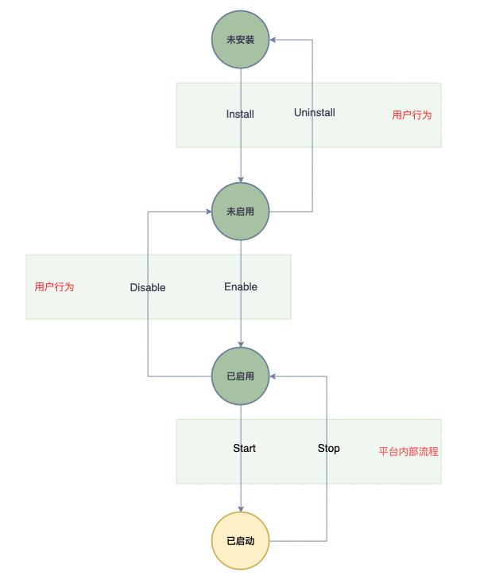

# Plugin lifecycle

## Overview

The lifecycle of a plugin refers to the complete process from uploading to uninstalling the plugin in ONES. From the time the plugin is uploaded to the ONES instance, the state flow of the plugin is shown in the figure below. The state of the plugin changes when the user installs, enables, etc. The lifecycle method will be run when the plugin state changes, and developers can add their own code to the lifecycle method to implement business logic.



## Lifecycle method

Plugin lifecycle methods are divided into organization-level and team-level. According to the type of plugin, the corresponding method is called in the lifecycle. The lifecycle methods of the team-level are: `Install`, `Enable`, `Disable`, `UnInstall`, `Upgrade`, `Start`, `Stop`. The organization-level lifecycle methods are: `OrgInstall`, `OrgEnable`,`OrgDisable`, `OrgUnInstall`, `OrgUpgrade`, `Start`, `Stop`. where the `Start` and `Stop` methods are the same in both levels of plugins.

### Lifecycle methods usage

The lifecycle method is declared in the `/backend/src/index.ts` file of the plugin project. When each plugin project is initialized, the template of the lifecycle method will be generated in advance.

**Method template:**

```typescript
// Method called when the team level plugin is being installed.
export async function Install() {
  Logger.info('[Plugin] Install')
}

// Method called when the team level plugin is being launched.
export async function Enable() {
  Logger.info('[Plugin] Enable')
}

// Method called when the team level plugin is being suspended.
export function Disable() {
  Logger.info('[Plugin] Disable')
}

// Method called when the team level plugin is being uninstalled.
export function UnInstall() {
  Logger.info('[Plugin] UnInstall')
}

// Method called when the team level plugin is being upgraded.
export function Upgrade(oldPluginInfo) {
  const oldVersion = oldPluginInfo.version
  Logger.info('[Plugin] Upgrade', 'old version:', oldVersion)
}

// Method called when the organization level plugin is being installed.
export async function OrgInstall(
  request: PluginRequest,
  teamUUIDList: string[],
  firstInstall: boolean
) {
  Logger.info('[Plugin] OrgInstall')
}

// Method called when the organization level plugin is being launched.
export function OrgEnable(
  request: PluginRequest,
  teamUUIDList: string[]
): void | string[] | Promise<string[]> {
  Logger.info('[Plugin] OrgEnable')
  return []
}

// Method called when the organization level plugin is being suspended.
export function OrgDisable(
  request: PluginRequest,
  teamUUIDList: string[]
): void | string[] | Promise<string[]> {
  Logger.info('[Plugin] OrgDisable')
  return []
}

// Method called when the organization level plugin is being uninstalled.
export function OrgUnInstall(request: PluginRequest, teamUUIDList: string[]) {
  Logger.info('[Plugin] OrgUnInstall')
}
s

// Method called when the organization level plugin is being upgraded.
export function OrgUpgrade(request: PluginRequest, teamUUIDList: string[]) {
  Logger.info('[Plugin] OrgUpgrade')
}
```

**Introduction to the parameters of the organization-level plugin lifecycle method:**

| Param        | Type          | Directions                                                                                                                                                                                                            |
| ------------ | ------------- | --------------------------------------------------------------------------------------------------------------------------------------------------------------------------------------------------------------------- |
| request      | PluginRequest | Relevant information and environment information of the initiator of the request, such as the `uuid` and `token` of the user who triggered the plugin event, and the current language of ONES (multilingual related). |
| teamUUIDList | string[]      | The target team UUID list enabled this time, when the organization-level plugin is enabled, it will be applied to specific teams, and the teams stored in this list are the teams to be effective.                    |

#### **Note**

1. Operations in `Enable` and `Disable` methods must be idempotent.
2. Time-consuming operations should not be performed in lifecycle methods.
