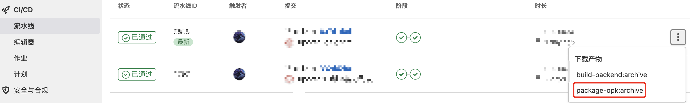

---
nav:
  title: 指南
  order: 1

---

#  简介

&emsp;&emsp;Plugin Develop （简称 PD）是一个 ones开放平台提供的插件开发增强工具，在原有的插件开发基础上简化了配置步骤，为ones插件开发提高效率而生。


# 快速开始

&emsp;&emsp;我们将通过简略的流程来阐述 PD工具的功能，在此之前，我们假设您已经：

<b style="color:green;">

- 拥有 Node.js (16.13.0+版本)开发环境
- 拥有python3 的开发环境
- 拥有cmake工具
- 熟悉 Node.js 开发

</b>

&emsp;&emsp;可以使用以下命令检查

&emsp;&emsp;&emsp;node -v ： 查看Node.js版本

&emsp;&emsp;&emsp;python3:   查看python版本信息

&emsp;&emsp;&emsp;cmake --version ：查看cmake版本(3.xx.x+)


## 1、建立工单

&emsp;&emsp;开发者在【ONES】—【交付物管理】新建【插件】工作项，5分钟后，该工作项的状态将会更新为【已建仓】，并且在GitLab中创建对应的代码仓库


## 2、Clone代码

&emsp;&emsp;将新建的代码仓库git到本地，此时项目下出现新的README.md，完成项目克隆。


## 3、工具下载

&emsp;&emsp;PD 工具下载异常的简单，我们根据操作系统下载适配的工具，并且将工具添加到开发代码仓库，工具下载链接：https://github.com/BangWork/plugin-cli/releases/latest


## 4、插件项目初始化

&emsp;&emsp;使用命令 “**./pd init**” ，如果用户没有登录，工具交互界面会提示用户是否登录，如需登录可以参考<a href="#login">用户登录</a>，跳过登录后，工具会生成新的Node.js 项目模板，并且安装整个插件项目需要的前端、后端依赖，安装失败可以参考[Q&A](../Q&A/troubleshooting.md)，安装完成后会提示用户是否添加能力或模板，如需添加能力或模板可以参考<a href="#add">添加能力</a>。


## <span id="login">5、用户登录</span>

&emsp;&emsp;使用命令 “**./pd login**” ，分别会提醒我们填写以下内容：

&emsp;&emsp;&emsp;&emsp;1、开发环境的URL：https://devapi.myones.net/project/master ,我们可以根据开发需求修改分支，例如可以修改为https://devapi.myones.net/project/P8022

&emsp;&emsp;&emsp;&emsp;2、用户账号

&emsp;&emsp;&emsp;&emsp;3、用户密码

&emsp;&emsp;&emsp;&emsp;4、选择团队或新建团队（新生成的插件会在该团队下）

&emsp;&emsp;&emsp;&emsp;5、输入平台服务ip和端口号，如：tcp://119.23.130.213:20003

&emsp;&emsp;&emsp;&emsp;6、输入推送代码的开发分支，如果在第一步选择了P8022分支，这里会默认为P8022，我们可以直接确认。

&emsp;&emsp;&emsp;&emsp;填写完毕后完成登录操作。

&emsp;&emsp;备注：

**&emsp;&emsp;&emsp;&emsp;在项目初始化的时候，都会检测用户是否登录，如果登录过则会取消该提醒。**

**&emsp;&emsp;&emsp;&emsp;在第二次登录的时候，交互界面会提示是否要覆盖之前的登录信息，如果不覆盖，会修改当前的项目配置（如果没有项目就不修改）。**


## <span id="debug">6、插件调试</span>

&emsp;&emsp;使用命令 “.**/pd run**” ，执行完毕会显示内容如下，

```json
----开发环境访问路径：https://dev.myones.net/project/P8022
{
  action: 'run',
  email: '',
  password: '',
  reinstall: false,
  instance_uuid: undefined,
  hostID: undefined,
  webIp: '127.0.0.1',
  webPort: '3000',
  orgUUID: 'JG******',
  teamUUID: 'TM******',
  user_uuid: 'Wh******',
  token: '********************************************',
  webServiceUrl: '127.0.0.1:3000'
}
Chrome Inspector: devtools://devtools/bundled/inspector.html?experiments=true&v8only=true&ws=127.0.0.1:10000
本地调试返回值: {"instance_uuid":"9c******","token":"********************************************","user_uuid":"Wh******"}
```

&emsp;&emsp;（1）如果是本地开发调试，我们可以使用postman等工具调试该插件，调用插件现有的内置方法，

```pro
 url ：'https://devapi.myones.net/project/P8022/test1' 
 --header 'Ones-Check-Point: team' 
 --header 'Ones-Plugin-Id: c5********' 
 method：GET
```

  &emsp;发起请求后，控制台输出“hello world”即可成功。


&emsp;&emsp;（2）在浏览器中输入 https://dev.myones.net/project/master (或其他分支)，页面打开后， 使用**ONESHelper**指定 API Branch 为：P8022（开发环境的URL），并且打开插件配置。

&emsp;&emsp;（3）在run命令执行后的日志中找到 "devtools://devtools/bundled/inspector.htmlexperiments=true&v8only=true&ws=

127.0.0.1:10000 "的链接，复制到**谷歌浏览器**打开，点击source，可以看到Node.js的插件代码，在代码中设置断点，再使用postman发起请求，控制台会实时输出参数信息，并且支持修改代码。


## <span id="add">7、添加能力</span>

&emsp;&emsp;使用命令 “.**/pd add**” ，交互界面显示可以添加的能力列表，选中需要添加的能力，点击“默认配置”或者“自定义配置”后会将新能力添加到当前的插件中去，能力展示的多样性可以让我们看到**config/plugin.yaml文件新增配置、backend/src目录下会新增新的ts文件**等内容。

&emsp;&emsp;新增能力后需要执行".**/pd runlocal**"命令，选择"**clear**"，然后执行 "**./pd run**" 命令就可以继续执行插件新增能力的调试，调试步骤可以参考<a href="#debug">插件调试</a>

&emsp;&emsp;备注：使用clear的作用是为了重装插件内容。


## 8、本地插件打包

&emsp;&emsp;使用命令 “.**/pd package**” ，会在当前目录下生成“**{工程名}.opk**”的插件包


## 9、生成交付物

&emsp;&emsp;1、使用命令 “.**./pd tag --name=1.0.0 --msg=#273xxx**”，  其中“name”是需要交付的版本号，msg就是在第一步建立工作项的工单号，输入指令后，交互界面会提示开发者输入“token”，该token需要输入的就是我们在gitlab生成的token信息，token生成可以参考网上步骤。

​        2、确认关联工单需求后，交互界面提示

```properties
Tag将会执行如下步骤
        1. 修改plugin.yaml中version与Tag号一致
        2. git add
        3. git commit
        4. git push
        5. 根据分支调用远程仓库Tag接口，并触发CI Yes
```

&emsp;&emsp;再次确认之后，触发 gitlab CI ，完成CI工作后，交互界面提示 “**Tag:1.0.0 Message:#273xxx 创建成功**”后，我们找到对应的代码仓库，做好以下步骤：

（1）点击左侧列表选项的的 “ci/cd”；

（2）点击流水线；

（3）找到最新流水线的下载产物；

（4）点击包含opk的选项；

（5）下载该压缩包完成操作。




