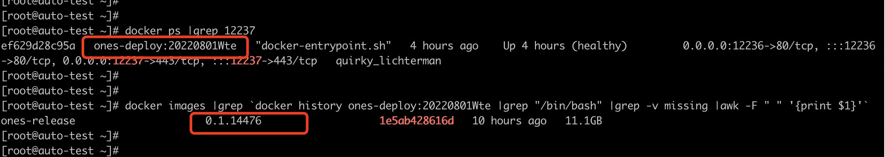
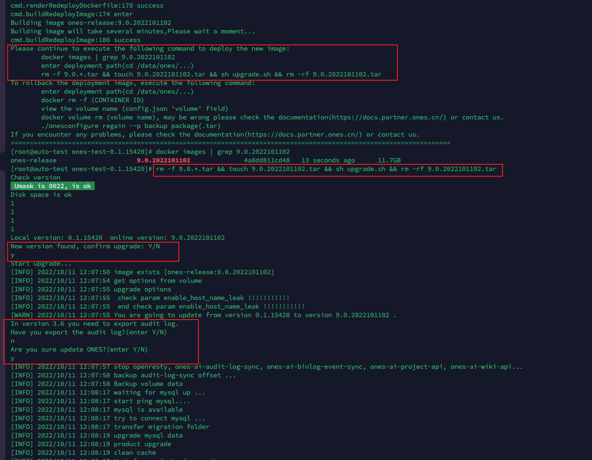
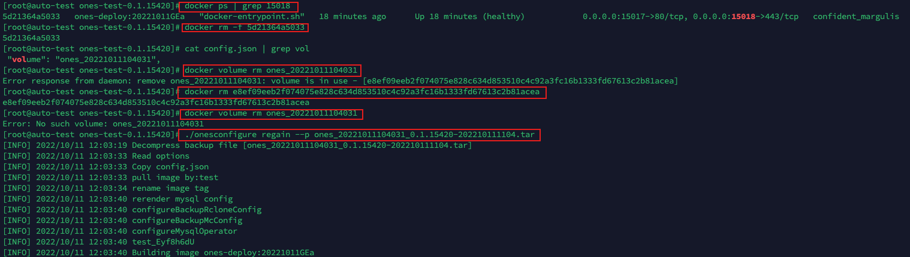
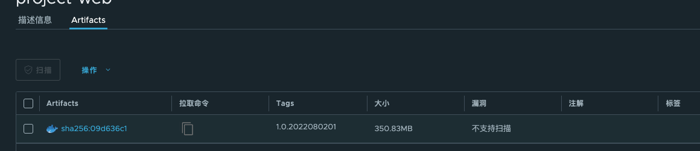

# Deploy

As you can see from the previous article, ONES has open sourced both Project and Wiki. You can develop a single project or two projects at the same time. And, you can build in local environment, then produce a tar file.

This article describes how to use operation and maintenance tool to deploy the tar file in your production or test environment. The current environment of ONES includes: Private Deployment Environment and High Availability Environment. Of course, deploy ones-project-web the same as wiki-web. Now, we will introduce how to use operation and maintenance tool to deploy wiki-web from these two environments.

## Deploy wiki-web

### Private Deployment Environment

#### Preparation

Before you start, do the following preparations:

- Private deployment environment device: You already have a private deployment instance, and subsequent operations are performed on the instance device, such as 192.168.100.10.
- Front-end custom tar package: tar package generated by local build, such as ones-wiki-web.tar.gz.
- Operation and maintenance tool: This tool integrates tarballs into private deployment environments, such as onesopenwiki.

The front-end customized tar package and tool need to be uploaded to the private deployment environment device. There are many ways to achieve, commonly used such as scp, xftp. like:

```bash
scp ones-wiki-web.tar.gz user_name@192.168.100.10:/home/user_name
scp onesopenwiki user_name@192.168.100.10:/home/user_name
```

Confirm permissions. The onesopenwiki tool must have executable permissions. The executing user (root as shown in the picture below) must have permissions such as docker commands.


#### Step By Step

##### Execute the onesopenwiki tool to generate a new ones-release image

```bash
cd ${deployment package directory}
./onesopenwiki rebuild --wiki_web_tar=xxx --ones_release_tag=xxx --ones_release_out_tag=x.x.x.sp-x.x.x
or
./onesopenwiki rebuild --wiki_web_tar=xxx --ones_release_tag=xxx --ones_release_out_tag_major_version=x.x
```

• You can get help information by executing the command ./onesopenwiki rebuild --help.

```bash
[root@auto-test zhangyuan]# ./onesopenwiki rebuild --help
Rebuild the new ones-release image based on the customer Wiki Web tar package

Usage:
  onesopenwiki rebuild [flags]

Flags:
      --ones_release_out_tag string   [option]Tag of output ones-release image, format：${currentVersion}.sp-${ones_release_out_tag_major_version}.${number}
      --ones_release_tag string       [require]Tag of input ones-release image
      --wiki_web_tar string           [require]Tar package of ONES.AI Wiki Web，suffix:.tar.gz
      --ones_release_out_tag_major_version string [require]Tag of output ones-release image tag major_version format: x.x
```

• wiki_web_tar, required. suffix format: .tar.gz. This parameter specifies the front-end custom tar package.

• ones_release_tag parameter, required. The tag of the mirror ones-release used in the private deployment environment.

View the tags of ones-release through deploy dir:

View by docker command:

• ones_release_out_tag parameter, optional. The tag of the new ones-release image after integrating the front-end tar package.

Users can customize the format requirements: ${ current version}.sp-${custom version}(3.6.6.sp-1.0.0|3.6.7.8.sp-1.0.1), and cannot have the same name as the existing ones-release image tag.

For Example :

```bash
#示例
[root@auto-test ones-test-0.1.15420]# ./onesopenwiki rebuild --wiki_web_tar=ones-wiki-web.tar.gz  --ones_release_tag=0.1.15420 --ones_release_out_tag_major_version=1.0
===================================================================================================================
2022-11-11 12:06:45
log: /tmp/ones_open_web.log
cmd.checkRedeploy:101 enter
input params:{OnesReleaseTag:0.1.15420 ProjectWebTar:ones-wiki-web.tar.gz OnesReleaseOutTag: }
Auto generate params...
generate params:{OnesReleaseTag:0.1.15420 ProjectWebTar:ones-wiki-web.tar.gz OnesReleaseOutTag: OnesReleaseOutTagMajorVersion:1.0 }
cmd.checkRedeploy:153 success
workdir:/tmp/ones1336995671
cmd.renderRedeployDockerfile:157 enter
cmd.renderRedeployDockerfile:170 success
cmd.buildRedeployImage:174 enter
Building image ones-release:0.1.15420.sp-1.0.1
Building image will take several minutes,Please wait a moment...
cmd.buildRedeployImage:186 success
Please continue to execute the following command to deploy the new image:
        docker images | grep 0.1.15420.sp-1.0.1
        enter deployment path(cd /data/ones/...)
        rm -rf *.sp-*.tar && touch 0.1.15420.sp-1.0.1.tar && sh upgrade.sh && rm -rf 0.1.15420.sp-1.0.1.tar
To rollback the deployment image, execute the following command:
        enter deployment path(cd /data/ones/...)
        view the port (config.json 'port'|'https_port' field)
		docker ps | grep (port) //get CONTAINER ID
        docker rm -f (CONTAINER ID)
        view the volume name (config.json 'volume' field)
        docker volume rm (volume name), may be wrong please check the documentation(https://docs.partner.ones.cn/) or contact us.
        ./onesconfigure regain --p backup package(.tar)
If you encounter any problems, please check the documentation(https://docs.partner.ones.cn/) or contact us.
===================================================================================================================
```

##### Deploy a new image

Divided into two categories: test environment deployment, production environment deployment. Both, the process is the same, but there are different requirements for the tag number.

Follow the prompts in step 2 to deploy the new image. First cd into the deployment path, and then use upgrade.sh to deploy the new image.

For Example：

```bash
[root@auto-test ~]# docker images | grep 0.1.15420.sp-1.0.1
ones-release                     0.1.15420.sp-1.0.1            269507c43b62   5 minutes ago   11.6GB
[root@auto-test ~]# cd /data/ones/pkg/69test_8fa28d
[root@auto-test 69test_8fa28d]# ls
ones-test-0.1.14476  ones-test-0.1.14476.tar.gz
[root@auto-test 69test_8fa28d]# cd ones-test-0.1.14476
[root@auto-test ones-test-0.1.14476]# ls *.sh
env.sh  ones-deploy.sh  private_check.sh  upgrade.sh
[root@auto-test ones-test-0.1.14476]# rm -rf *.sp-*.tar && touch 0.1.15420.sp-1.0.1.tar && sh upgrade.sh && rm -rf 0.1.15420.sp-1.0.1.tar
Check version
 Umask is 0022, is ok
Disk space is ok
1
1
1
1
Local version: 0.1.15420  online version: 0.1.15420.sp-1.0.1
New version found, confirm upgrade: Y/N
y
Start upgrade...
[INFO] 2022/10/11 12:07:50 image exists [ones-release:0.1.15420.sp-1.0.1]
[INFO] 2022/10/11 12:07:54 get options from volume
[INFO] 2022/10/11 12:07:55 upgrade options
[INFO] 2022/10/11 12:07:55  check param enable_host_name_leak !!!!!!!!!!!
[INFO] 2022/10/11 12:07:55  end check param enable_host_name_leak !!!!!!!!!!!
[WARN] 2022/10/11 12:07:55 You are going to update from version 0.1.15420 to version 0.1.15420.sp-1.0.1 .
In version 3.6 you need to export audit log.
Have you export the audit log?(enter Y/N)
n
Are you sure update ONES?(enter Y/N)
y
[INFO] 2022/10/11 12:07:57 stop openresty, ones-ai-audit-log-sync, ones-ai-binlog-event-sync, ones-ai-project-api, ones-ai-wiki-api...
[INFO] 2022/10/11 12:07:58 backup audit-log-sync offset ...
[INFO] 2022/10/11 12:07:58 Backup volume data
[INFO] 2022/10/11 12:08:17 waiting for mysql up ...
```



##### Verify the result

- Front-end effect verification
- docker commands

```bash
docker ps |grep 443
```

##### Rollback [Optional]

If you need to roll back to the previous environment, follow the prompts in step 2 or view the log content of /tmp/ones_open.log.

```bash
1、Go to the deployment package directory
2、View the deployment environment port number // cat config.json | grep port
3、implement docker ps | grep (port) //get CONTAINER ID
4、implement docker rm -f (CONTAINER ID) //delete container
5、View the deployment environment container volume name // cat config.json | grep volume
6、implement docker volume rm (volume name) //delete container volume This step may report an error, please see the operation example below
7、implement ./onesconfigure regain --p (backup package) // backup package:backup package in the deployment package directory  rollback operation
```



### High Availability Environment

#### Preparation

Before you start, do the following preparations:

- High-availability environment equipment: k8s operates the machine to achieve high-availability update deployment (such as 192.168.100.10).
- Front-end custom tar package: locally build & generate custom tar package, such as ones-wiki-web.tar.gz.
- Operation and maintenance tools: docker , onesopenwiki.
  Install and configure the [dokcer](https://www.docker.com/products/docker-desktop/) environment locally.

Confirm permission. The onesopenwiki tool must have executable permission。

#### Step By Step

##### Execute the onesopenwiki tool to generate a local image

```bash
./onesopenwiki webimage --wiki_web_out_tag=xxx --wiki_web_tar=xxx
```

• You can get help by executing the command ./onesopenwiki webimage --help.

```bash
[root@auto-test zhangyuan]# ./onesopenwiki webimage --help
Build wiki_web image based on the customer Wiki Web tar package

Usage:
  onesopenwiki webimage [flags]

Flags:
      --wiki_web_out_tag string   [option]Tag of output ones-release image, format：${currentVersion}.sp-${ones_release_out_tag_major_version}.${number}
      --wiki_web_tar string       [require]Tar package of ONES.AI Wiki Web，suffix:.tar.gz
```

• wiki_web_tar parameter, required, suffix format: .tar.gz. This parameter specifies the front-end custom tar package.

You can refer to Private Deployment get wiki_web_tar param.

• wiki_web_out_tag parameter, optional. According to the front-end tar package, the tag of the mirror wiki-web is generated.

Users can customize the format requirements: 9.0.yyyymmddxx, all numbers, and cannot have the same name as the existing wiki-web mirror tag.

• Executing this command will generate a local image file, which can be viewed through docker images |grep xxx

For Example：

```bash
[root@auto-test zhangyuan]# ./onesopenwiki webimage --wiki_web_tar=ones-wiki-web.tar.gz
===================================================================================================================
2022-09-11 11:11:22
log: /tmp/ones_open_wiki.log
cmd.checkWebImage:51 enter
input params:{WikiWebTar:ones-wiki-web.tar.gz WikiWebOutTag:}
Auto generate params...
generate params:{WikiWebTar:ones-wiki-web.tar.gz WikiWebOutTag:9.0.2022081100}
cmd.checkWebImage:91  success
workdir:/tmp/ones685568270
cmd.renderWebImageDockerfile:126 enter
cmd.renderWebImageDockerfile:138 success
cmd.buildWebImageImage:142 enter
Building image wiki-web:9.0.2022081100
Building image will take several minutes,Please wait a moment...
cmd.buildWebImageImage:154 success
Show the generated image:
	docker images | grep 9.0.2022081100
===================================================================================================================

```

##### Push the image to the public|private repository

If the image is hosted in the public repository Dockerhub, then refer to "method a" to push to the public repository; if it is a customer's private repository, refer to "method b" to push to the private repository.

• Push to public repository

```bash
docker tag wiki-web:9.0.2022080201 onestest/wiki-web:v9.0.0
docker push onestest/wiki-web:v9.0.0
```


• Push to private repository

Take the private repository 192.168.1.100 as an example:

• Configure trusted private warehouse (optional)

```bash
#Note that if your private repository has a trusted https certificate, you do not need to modify /etc/docker/daemon.json
vim /etc/docker/daemon.json
{
    "insecure-registers":[
        "192.168.1.100"
    ]
}

systemctl restart docker
```

• Login to private repository

```bash
#param u is the login user account; param p is the password of the user.
docker login 192.168.1.100 -u xxx -p xxx
```

• Push to private repository

```bash
docker tag wiki-web:9.0.2022080201  192.168.1.100/project/wiki-web:v9.0.2
docker push 192.168.1.100/project/wiki-web:v9.0.2
```

Login [repository](https://192.168.1.100/) ，and view the image file just uploaded


##### High availability deployment

Log in to the k8s operation machine and perform the following steps to implement the rolling update operation.

```bash
#Configuration file priority description: config/private.yaml > config/public.yaml > default/config.yaml

#Modify config/private.yaml. Add or modify wikiWebImage

# wikiWebImage: 192.168.1.100/project/wiki-web:v9.0.2
vi /data/ones/ones-ai-k8s/config/private.yaml
# Redeploy the high availability environment
make setup-ones
```

##### Verify the result

• Check the tag of the wiki-web image. Such as:

```bash
kubectl -n ones-namespace  get pods -o yaml |grep image |grep wiki-web
```

• Front-end effect verification

##### Rollback [Optional]

If you need to roll back this deployment, you can do following commands.

```bash
#Revert operation 3 changes back
vi /data/ones/ones-ai-k8s/config/private.yaml

make setup-ones
```

## Deploy ones-project-web

You just need to replace ones-wiki-web.tar.gz with ones-ai-web.tar.gz，and change the operation and maintenance tool onesopenwiki to onesopenproject。

In the High Availability Environment, the configuration item wikiWebIm age is changed to projectWebImage.

Other processes is same as the above documents.
