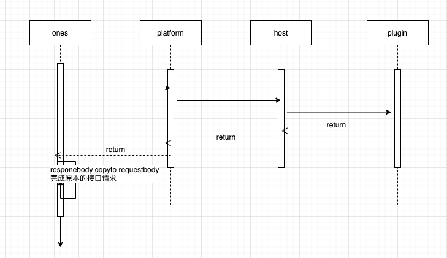
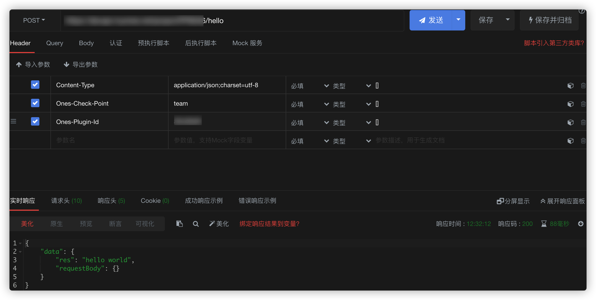
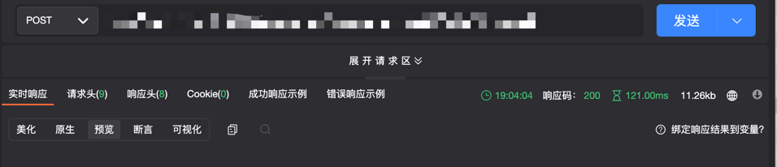

# 接口注册与劫持

## 能力描述

​ 插件可以劫持所有 project 对外提供的标准接口，支持前置/后置方式； 插件可以注册新的接口，支持新的插件专用的内部接口或外部接口；

- 所谓前置劫持，是指当请求进入标准系统时，未被处理前就被转发到插件，由插件对请求进行修改后，回传给标准系统并继续执行。一般用于修改请求的参数，或检查请求是否满足特定条件；
- 所谓后置劫持，是指当请求在标准系统完成处理后，将会被传递给插件，由插件对齐进行内容进行修改后再回传给标准系统，并返回给请求方。一般用于对应答内容进行加工；
- 另外，插件可以”替换“掉现有系统的某个接口，让插件能够对现有系统的某个请求进行完全的自定义处理。

注意：劫持和替换都是比较底层的操作，可能对系统功能产生未知风险。同时，目前对某个接口，只能有一个插件对它进行劫持或替换。多个插件处理同一个接口会存在冲突。

插件可以注册新的接口，这些接口能够像正常的标准系统接口一样被调用，如果路由以/team/:teamUUID 开头，当插件在某个团队安装时，可通过请求 **"/team/:teamUUID(团队的 uuid）/xxx"** 访问路由绑定的插件函数。

## 能力使用

### 接口类型说明

#### 1、addition(插件自身实现的接口)


#### 2、replace(插件替换标品接口)


这个路由过程和上面是新建一样的。

⚠️ 在插件代码中，如果插件还需要请求标品被替换的接口，需要在请求头中带上

```javascript
headers: { 'Replace': "replace", }
```

#### 3、prefix(插件前置拦截标品接口)



#### 4、suffix(插件后置拦截标品接口)


### 5、external(team 级别的新增接口)

external 的新增接口必须以 /team/:teamUUID 开头，当插件在某个团队按照时，可通过请求/team/:teamUUID/xxx 访问路由绑定的插件函数。

### 能力声明

​ **接口注册**，**addition**和**external**都可以新增接口，其中 addition 是插件级别的接口，而 external 是团队级别的接口，external 类型的接口注册后，对其注册的接口发起请求的时候，需要在 url 前拼接**/team/:teamUUID/\*\***，\*\*可以通过参考下述内容进行了解，

在 plugin.yaml 中声明新注册的接口，

```yaml
apis:
  - type: addition         //接口类型：addition:新增
  methods:                 //接口请求方式
    - POST
  url: /hello              //自定义url
  function: hello          //名称与代码里的函数名保持一致

    - type: external         //external新增(团队级别的接口)
  methods:
    - POST
  url: /team/:teamUUID/hello1
  function: hello1
```

​ **接口劫持**，

在 plugin.yaml 中添加以下内容

```
apis:
    - type: replace             //接口类型： replace:替换 prefix:前置 suffix:后置
    methods:                    //接口请求方式
      - GET
    url: /users/me              //标品url
    function: jackFunc          //名称与代码里的函数名保持一致

```

### 调用方法

在 `backend/src/index.ts`文件下编写与 apis 配置的函数方法体，

```javascript
import { Logger } from '@ones-op/node-logger' //需要导入的依赖依赖包
import { fetchHttp, fetchONES } from '@ones-op/node-fetch'

//addition 注册的接口对应方法
export async function hello(request: PluginRequest): Promise<PluginResponse> {
    const body = request.body || {}
    Logger.info('[Plugin] hello ======= 请求成功')
    return {
        body: {
            res: 'hello world',
            requestBody: body,
        },
    }
}

// external 注册的接口对应方法
export async function hello1(request: PluginRequest): Promise<PluginResponse> {
    const body = request.body || {}
    Logger.info('[Plugin] hello1 ======= 请求成功')
    return {
        body: {
            res: 'hello world1',
            requestBody: body,
        },
    }
}

//replace 劫持的接口对应方法
export async function jackFunc(
    request: PluginRequest<Record<string, any>>
): Promise<PluginResponse> {
    let userUUID = ''
    let userToken = ''
    if (request.headers['Ones-User-Id'] != null) {
    userUUID = request.headers['Ones-User-Id']
    userToken = request.headers['Ones-Auth-Token']
}
const response = await fetchONES({
    path: `/users/me`,
    method: 'GET',
    headers: {
        'Ones-User-Id': [userUUID],
        'Ones-Auth-Token': [userToken],
    },
    root: false, //默认为true
})
if (response) {
    return response
}
return {
    body: {},
}

//prefix 前置接口劫持
export async function prefixFunc(
    request: PluginRequest<Record<string, any>>
): Promise<PluginResponse> {
    let body = request?.body
    // code
    return {
        // 返回被处理后或者按原样返回的请求头
        body: body,
    }
}

//suffix 后置接口劫持
export async function suffixFunc(
    request: PluginRequest<Record<string, any>>
): Promise<PluginResponse> {
    let body = {}
    // code
    return {
        // 可以返回任意 body
        body: body,
    }
}

```

### 实现过程

#### 请求插件注册的接口

**`addition`** 接口在 postman 等调试工具中填写参数如下，

```javascript
url：https://yourhost/hello
    headers: Ones-Check-Point:team; Ones-Plugin-Id:{插件实例ID}
method: POST

```

或在终端、命令行内容输入以下内容，

```javascript
curl --location --request POST 'https://yourhost/hello' \
--header 'Content-Type: application/json;charset=utf-8' \
--header 'Ones-Check-Point: team' \
--header 'Ones-Plugin-Id: {插件实例ID}' \
--data ''
```

返回结果如下：



**`external`** 接口在 postman 等调试工具中填写参数如下，
addition 和 external 接口的区别就是 url 多了 team/teamUUID，但是 external 接口请求头可以不用带上 Ones-Check-Point 和 Ones-Plugin-Id

```javascript
url：https://yourhost/team/{teamUUID}/hello1
method: POST
```

或在终端、命令行内容输入以下内容，

```javascript
curl --location --request POST 'https://yourhost/team/{teamUUID}/hello1' \
--header 'Content-Type: application/json;charset=utf-8' \
--data ''
```

​ 返回结果如下：



#### 请求插件劫持的接口

​ **`replace`**接口请求参数需要注意以下几点，
1、劫持的是标品的 url，所以填写的 url 跟标品保持一致；
2、确认被替换接口本身是 POST 请求还是 GET 请求；
3、确认被替换接口请求头需要设置什么参数，请参考 api 接口文档。

```javascript
url：https://yourhost/users/me
    headers:
        Ones-User-Id:{user_uuid}
Ones-Auth-Token:{user_token}
...
method: GET
```

或命令行内容输入以下内容，

```javascript
curl --location --request GET 'https://yourhost/users/me' \
--header 'Ones-User-Id: {user_uuid}' \
--header 'Ones-Auth-Token: {user_token}' \
--header 'Content-Type: application/json' \
--data ''
```

返回结果如下：


### 请求头说明

| 参数名           | 参数位置     | 值类型 | 描述                                     |
| ---------------- | ------------ | ------ | ---------------------------------------- |
| Ones-User-Id     | HTTP Headers | string | 用户 uuid                                |
| Ones-Auth-Token  | HTTP Headers | string | 登录成功的 token                         |
| Ones-Plugin-Id   | HTTP Headers | string | 对应后端插件的实例 ID                    |
| Ones-Check-Point | HTTP Headers | string | 对应权限检查点 team/organization         |
| Ones-Check-Id    | HTTP Headers | string | 对应权限检查点 teamUUID/organizationUUID |

Ones-Plugin-Id 说明：对于前端来说插件类型分为四种

- addition/replace/prefix/suffix 类型即新增接口，Ones-Plugin-Id 需要传入对应的值。
- 插件平台固有接口，Ones-Plugin-Id 传入固定值：`built_in_apis`。

### 接口劫持示例插件

https://gitlab.partner.ones.ai/example/api-register-jack

### FAQ

> ### 使用 addition:新增类型问题描述
>
> 插件 addtion 路由, GET 请求传参数会导致接口无法拿到返回值

> ### 出现原因
>
> 标准系统使用的 fasthttp 包不支持 get 请求传 body。 该问题已经被包修复， 是我们使用的包版本太久

> 处理方式：使用 post 请求。
