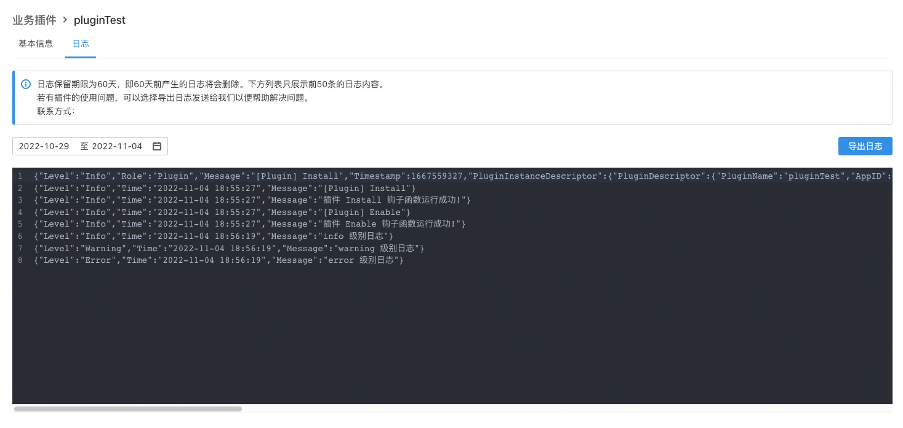

# 插件日志

## 要求

| **ONES** |
| :------- |
| 3.6+     |

## 概述

该能力允许每个插件打印自己的日志，提供了 4 种级别的标准日志打印方法： `debug` ，`info` ，`warning`， `error`, 并且支持导出日志文件。

插件日志会显示在插件详情页中的日志页中，该页面只显示 `info`，`warning`，`error` 级别的日志。

可以在**插件管理**中查看日志详情，具体表现如下图所示。



## 使用

在本地调试时，如果需要将日志打印在控制台，可以在 `config/local.yaml` 中开启配置 `debug_mode: true`。

### 插件日志能力使用：

1. #### 安装依赖

   在插件根目录下运行以下指令安装依赖。（注意，默认该能力是后端使用，并且使用目录在 `backend` 下）

   ```shell
   cd backend
   npm i @ones-op/node-logger
   ```

2. #### 使用示例

   ```javascript
   import { Logger } from '@ones-op/node-logger'

   function logExample() {
     Logger.debug('test')
     Logger.info('hello world')
     Logger.warning('hello', 'world')
     Logger.error('error: ', new Error('error message'))
   }
   ```
