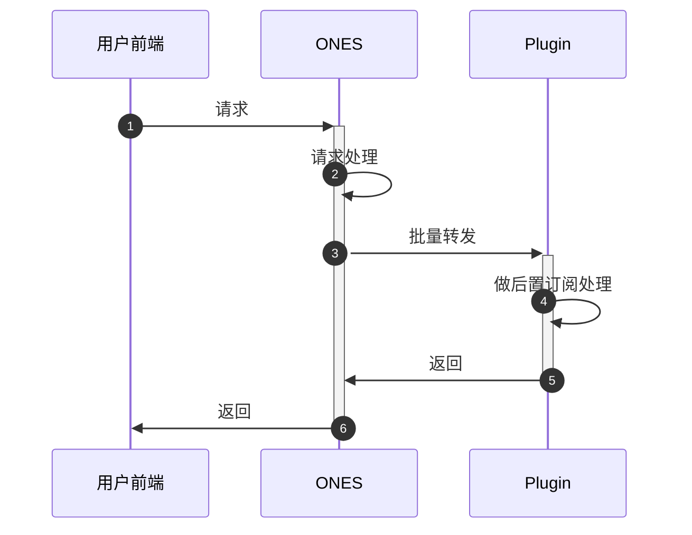

# ONES 接口后置订阅

## 要求

| ONES |
| :--- |
|      |

## 概述

有时候我们需要改变 ONES 系统中某些行为的表现，在某个行为后增加一些操作，插件可以对 ONES 标准系统中所有对外开放的接口进行后置订阅。

## 使用

### 使用须知

1. 组织级别的接口和团队级别的接口的差别在于团队级别接口的 `url` 中包含有 `/team/:teamUUID`。
2. 对于同一个接口在其级别的上下文中，可被多个插件同时进行后置订阅。
3. 对于同一个接口在其级别的上下文中，后置订阅能力跟接口劫持能力不能同时使用。
4. 对于同一个接口在其级别的上下文中，前置拦截跟后置订阅可同时使用。
5. 插件返回结果不影响接口原。
6. 在本地调试中，如果修改了插件配置文件`config/plugin.yaml`，需要运行 `npx op invoke clear` 并重新运行 `npx op invoke run` 指令才能使配置生效。

### 请求流程



### 配置文件

在插件配置文件中的 `apis` 字段加上以下配置：

```yaml title='/config/plugin.yaml'
apis:
  - type: subscribe #接口类型： subscribe:后置订阅
    methods: #接口请求方式
      - GET
    url: /users/me #劫持接口url
    scope: project #project或wiki接口，没有该属性则默认为project
    function: jackFunc #名称与代码里的函数名保持一致
```

### 具体代码

该示例前置拦截了 project 获取个人信息接口，代码中的headers跟body分别是原请求的请求头跟请求体

```typescript
import { Logger } from '@ones-op/node-logger'

export async function jackFunc(
  request: PluginRequest<Record<string, any>>,
): Promise<PluginResponse> {
  const reqBody = request.reqBody as any
  const respBody = request.respBody as any
  const reqHeaders = request.reqHeaders as any
  const respHeaders = request.respHeaders as any
  Logger.error('[Plugin] hello ======= 请求成功')
  Logger.error('[Plugin] respBody ======= 请求成功', respBody)
  Logger.error('[Plugin] respHeaders ======= 请求成功', respHeaders)
  Logger.error('[Plugin] reqBody ======= 请求成功', reqBody)
  Logger.error('[Plugin] reqHeaders ======= 请求成功', reqHeaders)
  return {
    body: {
      res: 'hello world',
      requestBody: {},
    },
  }
}
```

- 注意事项

  接口请求参数需要注意以下几点：

  - 拦截的是 ONES API ，所以填写的 `url` 必须跟访问 ONES API 的 `url` 保持一致；
  - 确认被拦截接口本身是 `POST` 请求还是 `GET` 请求；

### 调试方式

- 使用 `curl` 工具进行访问，以`/users/me`接口为例：

  ```shell
  curl --location --request GET 'https://yourhost/users/me' \
  --header 'Ones-User-Id: {user_uuid}' \
  --header 'Ones-Auth-Token: {user_token}' \
  --header 'Content-Type: application/json' \
  --data ''
  ```

- 代码请求参数示例

  ```
  url：https://yourhost/users/me
  headers:
      Ones-User-Id:{user_uuid}
      Ones-Auth-Token:{user_token}
      ...
  method: GET
  ```
