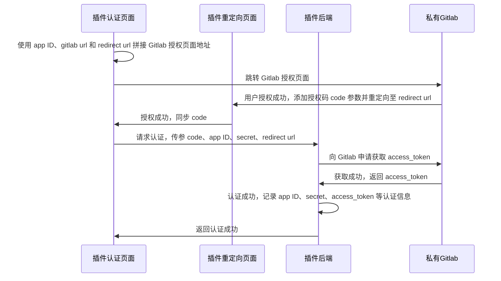

import Image from '@theme/IdealImage'

# 场景一：集成指定版本私有 Gitlab 代码仓

## 场景描述

用户希望集成集成指定版本私有 Gitlab 代码仓，此时可以在插件中使用 “自定义集成代码仓能力” 来实现，这里我们以 Gitlab15.4 版本为例。

## 实现效果

系统安装完插件后，即可在关联代码仓方式列表查看到新增的自定义的 Gitlab15.4 关联方式。

<Image img={require('./images/code-repo-example-connector.png')} style={{ maxWidth: 700 }} />

开发者可以通过修改 [ones:settings:pipeline:default:repo:link](../../slot/module/code_repository/index.md#onessettingspipelinedefaultrepolink) 插槽，自定义如下关联代码仓页面，实现 Gitlab 认证逻辑和添加代码仓逻辑。

<Image img={require('./images/code-repo-example-add-repo.png')} style={{ maxWidth: 700 }} />

新增关联代码仓成功后，即可在代码仓管理页面查看。当代码仓新增提交（Commit）和合并请求（Pull Request）时如果关联了工作项 ID，可以在迭代和工作项下查看到关联的记录。

## 解决方案

### 实现思路

1. 通过 OAuth 认证 Gitlab，获取 Gitlab 的 access_token；
2. 使用获取的 Gitlab access_token，从 Gitlab 查询代码仓进行关联；
3. 关联代码仓前调用 Gitlab api 创建 webhook，同步关联代码仓的提交（Commit）和合并请求（Pull Request）数据到 ONES 系统中，此时插件需定义可用于 Gitlab 访问的接口。

### 插件开发

#### 第一步：添加能力和插槽

参考 [自定义集成代码仓-添加能力和插槽配置](./custom-code-repository.mdx#第一步在插件项目中添加能力和插槽配置)，为插件添加能力和插槽配置，添加完配置如下：

```yaml
service: ...
apis: ...
abilities:
  - id: CkrqExqC
    name: 自定义代码仓库
    version: 1.0.0
    abilityType: CustomCodeRepository
    relateModule:
      addRepoPage: 'ones-settings-pipeline-default-repo-link-R5w-'
    function:
      removeRepoFunc: removeRepo
    config:
      - key: repoToolName
        label: 关联代码仓工具名称
        value: 自定义关联代码仓工具
        fieldType: Input
        show: true
      - key: repoToolDesc
        label: 关联代码仓工具描述
        value: 自定义关联代码仓工具
        fieldType: Input
        show: true
      - key: repoToolIcon
        label: 关联代码仓工具图标
        value: logo.svg
        fieldType: Input
        show: false
modules:
  - id: ones-settings-pipeline-default-repo-link-R5w-
    title: 关联代码仓页面
    moduleType: ones:settings:pipeline:default:repo:link
    entry: modules/ones-settings-pipeline-default-repo-link-R5w-/index.html
```

#### 第二步：实现 OAuth 认证

Gitlab Oauth 认证的主要步骤包括：

- 准备 Gitlab 认证成功的回调页面地址 redirect url；
- 在 Gitlab 中创建应用，使用上一步的 redirect url，获取到 app ID、secret；
- 使用 app ID 和 redirect url 拼接 Gitlab 认证页面地址，用户认证页面授权成功自动跳转到 redirect url，授权码 code 拼在 redirect url 参数中；
- 使用 app ID、secret、redirect url 和上一步获取的 code，调用 Gitlab api 获取到 access_token，此后可以使用该 access_token 访问 Gitlab 的资源。

Gitlab OAuth 可参考官方文档 [Gitlab OAuth](https://docs.gitlab.com/ee/api/oauth2.html) 。

:::caution 注意
Gitlab 15.4 及之后的版本，access_token 不是永久有效的，有效时间一般为 2 个小时。此时需要使用返回的 refresh_token，调用 Gitlab api 获取新的 access_token。
:::

这里为实现 Gitlab 的 OAuth 认证，需要配置如下参数：

- app ID
- secret
- gitlab url
- redirect url

**1. 准备 redirect url**

对于 Gitlab 授权成功回调页面 redirect url，可以通过在插件中新增 `about-blank` 类型插槽来实现。

假设 `about-blank` 插槽配置如下：

```yaml
modules:
  - id: about-blank-BE8t
    title: gitlab
    moduleType: about:blank
    entry: modules/about-blank-BE8t/index.html
```

那么此时 `aboud-blank` 插槽页面的访问规则为：

- 团队级别插件：`{{host}}/plugin/{{org_UUID}}/{{team_UUID}}/{{app_ID}}/1.0.0/modules/about-blank-BE8t/index.html`
- 组织级别插件: `{{host}}/plugin/{{org_UUID}}/{{app_ID}}/1.0.0/modules/about-blank-BE8t/index.html`

然后在 [ones:settings:pipeline:default:repo:link](../../slot/module/code_repository/index.md#onessettingspipelinedefaultrepolink) 插槽页面，按上面规则拼接好 redirect url。

**2. Gitlab 创建应用**

用户在 Gitlab 中使用 redirect url 创建应用，创建成功后可以获取到 app ID、secret。

**3. 实现 Gitlab 认证**

Gitlab 认证流程图如下：



- 插件认证页面：对应 `ones:settings:pipeline:default:repo:link` 插槽；
- 插件重定向页面：对应 `about-blank` 插槽。

`about-blank` 插槽接收授权码 code 并同步到 `ones:settings:pipeline:default:repo:link` 插槽的实现，可以参考 [代码仓管理-第三方认证](../../slot/module/code_repository/index.md#第三方认证)。

#### 第三步：新增关联代码仓

新增关联代码仓主要包括两部分工作：

- 从 Gitlab 查询代码仓；
- 新增代码仓到 ONES 系统。

**1. 从 Gitlab 查询代码仓**

按如下逻辑可以从 Gitlab 查询所有代码仓。

```typescript
import { fetchHttp } from '@ones-op/node-fetch'

export interface GitlabRepo {
  id: number
  uri: string
  namespace: string
  name: string
}

export async function listGitlabRepo(): Promise<GitlabRepo[]> {
  const result: GitlabRepo[] = []

  const gitlabUrl = 'xxx'
  const accessToken = 'xxx'
  const url = `${gitlabUrl}/api/v4/projects`
  const response = await fetchHttp({
    method: 'get',
    url: url,
    headers: {
      accept: 'application/json',
      Authorization: `Bearer ${accessToken}`,
    },
  })
  const body = response?.body as any
  if (response?.statusCode !== 200) {
    throw new Error('gitlab request failed')
  }

  for (let i = 0; i < body.length; i++) {
    const repo: GitlabRepo = {
      id: body[i].id,
      uri: gitlabUrl,
      namespace: body[i].namespace.full_path,
      name: body[i].path,
    }
    result.push(repo)
  }
  return result
}
```

**2. 新增代码仓到 ONES 系统**

当获取到可添加的代码仓列表后，可以调用 [添加代码仓](../../../reference/packages/node-ability/node-ability.md#addrepos) 方法进行添加，需要注意代码仓添加成功与否的结果做文案提示。同时为了避免重复关联代码仓，开发者可以调用 [查询已关联所有代码仓](../../../reference/packages/node-ability/node-ability.md#queryrepos) 方法来查询并过滤。

#### 第四步：新增代码仓提交（Commit）和合并请求（Pull Request）

对于 Gitlab 要想获取代码仓提交（Commit）和合并请求（Pull Request）数据，可以在通过创建 webhook 订阅来获取，此时插件需要新增对应的 webhook 接口。如何在 Gitlab 创建 webhook 可以参考 [Gitlab add hook](https://docs.gitlab.com/ee/api/projects.html#add-project-hook) 文档。

如果插件新增 webhook 接口按如下配置，则提供给 Gitlab 的 webhook url 为 `{{host}}/project/api/project/team/{{team_UUID}}/gitlabWebhook`。

```yaml
apis:
  - type: external
    methods:
      - POST
    url: /team/:teamUUID/gitlab/webhook
    function: gitlabWebhook
```

Gitlab 的代码仓提交（Commit）对应 webhook 的 [push_events](https://docs.gitlab.com/ee/user/project/integrations/webhook_events.html#push-events) 事件，合并请求（Pull Request）对应于 [merge_requests_events](https://docs.gitlab.com/ee/user/project/integrations/webhook_events.html#merge-request-events) 事件，两者可以通过请求头 `X-Gitlab-Event` 区分。Gitlab webhook 事件的数据格式可以参考 [Gitlab webhook events](https://docs.gitlab.com/ee/user/project/integrations/webhook_events.html#webhook-events) 文档。

:::caution 注意
对于使用 webhook 获取代码仓提交（Commit）和合并请求（Pull Request）数据方式，需要注意代码仓在 ONES 系统被移除和插件启用、停用两种场景：

- 对于代码仓在 ONES 系统被移除场景，开发者可以在能力添加的 `removeRepo` 方法新增删除 webhook 逻辑；
- 对于插件启用、停用场景，由于此时插件定义的接口将无法访问，并且新增代码仓提交（Commit）和合并请求（Pull Request）的 SDK 方法将无法调用，开发者可以在插件启用时恢复代码仓的 webhook，在插件停用时删除代码仓的 webhook。

:::
