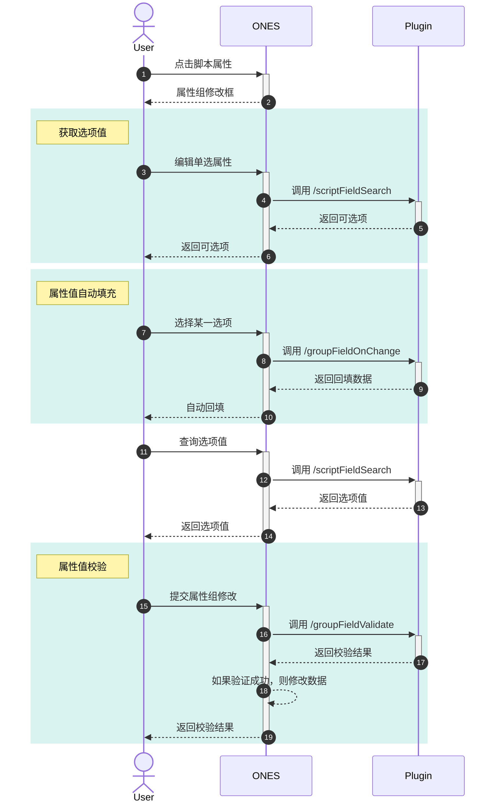

import editFieldGroup1 from './images/edit-field-group1.png'
import editFieldGroup2 from './images/edit-field-group2.png'
import editFieldGroup3 from './images/edit-field-group3.png'
import productSelecttionField from './images/product-selection-field.png'
import projectSelecttionField1 from './images/project-selection-field-1.png'
import projectSelecttionField2 from './images/project-selection-field-2.png'
import projectSelectionFieldConfig from './images/project-selection-field-config.png'
import taskSelectionField1 from './images/task-selection-field-1.png'
import taskSelectionField2 from './images/task-selection-field-2.png'
import taskSelectionFieldConfig from './images/task-selection-field-config.png'

# 单选/多选菜单属性

## 要求

| ONES    | @ones-op/node-ability |
| :------ | :-------------------- |
| v3.6.0+ | v0.3.7+               |

## 概述

该能力允许插件添加类型为**单选/多选菜单**的脚本属性，属性的选项可以由插件代码动态指定。同时，该能力还支持将多个存在关联关系的脚本属性聚合为一个属性组，以便实现多个脚本属性之间的联动效果。

### 能力范围

单选/多选菜单脚本属性支持被添加为**工作项属性**、**项目属性**和**产品属性**。其中工作项和项目的脚本属性支持在 **Performance** 中使用。

### 能力表现

#### 工作项

当单选/多选菜单脚本属性被添加为工作项属性时，你可以像使用系统工作项属性一样将其添加到具体的工作项类型中。

<Image img={taskSelectionFieldConfig} />

<Image img={taskSelectionField1} />

<Image img={taskSelectionField2} />

大多数场景下，脚本工作项属性与 ONES 系统工作项属性的表现一致，但是在以下场景中，二者表现略有不同：

- 在属性与视图配置中，列表属性不支持添加脚本属性
- 在工作项列表中，仅支持基于脚本属性进行筛选，不支持基于脚本属性排序和分组
- 导入工作项时，不支持导入包含脚本属性的工作项
- 在「流程自动化配置」中，不支持更新脚本属性和新建预设了脚本属性值的工作项
- 在「我的工作台」-「仪表盘」-「自定义数据报表卡片」中，不支持将脚本属性作为分析维度

#### 项目

当单选/多选菜单脚本属性被添加为项目属性时，你可以像使用系统项目属性一样将其添加到具体项目中。

<Image img={projectSelectionFieldConfig} />

<Image img={projectSelecttionField1} />

<Image img={projectSelecttionField2} />

大多数场景下，脚本项目属性与 ONES 系统项目属性的表现一致，但是在以下场景中，二者表现略有不同：

- 在项目列表中，仅支持基于脚本属性进行筛选，不支持基于脚本属性排序和分组
- 在「我的工作台」-「仪表盘」-「项目表格卡片」中，不支持添加展示脚本属性

#### 产品

<Image img={productSelecttionField} />

当单选/多选菜单脚本属性被添加为项目属性时，在大多数场景下，其变现与系统产品属性一致但是在以下场景中，二者表现略有不同：

- 在产品列表中，仅支持基于脚本属性进行筛选，不支持基于脚本属性排序和分组

## 使用

### 创建属性

使用`@ones-op/node-ability`中的`Field`模块，在合适的时机（比如插件的 Install 钩子函数中）创建脚本属性。

:::caution

目前该能力只支持在团队级别插件使用

:::

#### 工作项

使用`Field.FieldsAdd`方法可以创建脚本**工作项**属性

```typescript title="backend/src/index.ts"
import { Field } from '@ones-op/node-ability'

export async function Install() {
  Logger.info('[Plugin] Install')
  const FieldsAddRes = await Field.FieldsAdd({
    Name: '单选脚本属性',
    Type: 1001, //多选为1002
  })
  if (FieldsAddRes.Error) {
    throw new Error('Failed to create property')
  }
  const { UUID: fieldUUID } = FieldsAddRes
  Logger.info('create field:', fieldUUID)
}
```

**Field.FieldsAdd 参数介绍**

| 参数 | 类型   | 说明                                            |
| :--- | :----- | :---------------------------------------------- |
| Name | string | 属性名称                                        |
| Type | int    | 脚本属性类型<br />- 1001：单选<br/>- 1002：多选 |

#### 项目/产品

使用`Field.ItemsAdd`方法，可以创建脚本**项目/产品**属性

```typescript title="backend/src/index.ts"
import { Field, FieldTypeEnum, PoolEnum } from '@ones-op/node-ability'
import { Logger } from '@ones-op/node-logger'

export async function Install() {
  Logger.info('[Plugin] Install')
  const ItemsAddProjectRes = await Field.ItemsAdd({
    FieldType: FieldTypeEnum.SingleLabel,
    Name: '单选项目属性',
    ItemType: 'field',
    Pool: PoolEnum.Project,
    ContextType: 'team',
    required: false,
  })
  if (ItemsAddProjectRes.Error) {
    throw new Error('Failed to create field')
  }
  const { UUID: fieldUUID } = ItemsAddProjectRes
  Logger.info('create field:', fieldUUID)
}
```

**Field.ItemsAdd 参数介绍**

| 参数        | 类型   | 说明                                                                                            |
| :---------- | :----- | :---------------------------------------------------------------------------------------------- |
| FieldType   | string | 脚本属性类型：<br />- `FieldTypeEnum.SingleLabel`: 单选<br />- `FieldTypeEnum.MultiLabel`: 多选 |
| Name        | string | 属性名称                                                                                        |
| ItemType    | string | 固定值：`field`                                                                                 |
| Pool        | string | 实体类型: <br />- `PoolEnum.Project`: 项目属性<br />- `PoolEnum.Product`: 产品属性              |
| ContextType | string | 上下文类型                                                                                      |
| required    | bool   | 是否必填                                                                                        |

### 属性可选项 {#options}

要定制脚本属性的选项值，需要在插件配置文件中添加一个接口`/scriptFieldSearch`，ONES 系统内部会通过这个接口获取脚本属性的选项内容。

```yaml title="config/plugin.yaml"
service:
  app_id: ...
  name: ability-scriptSelection
  ...
apis:
  - type: addition
    methods:
      - POST
    url: /scriptFieldSearch
    function: GetOptions
```

在`GetOptions`方法中，构建并返回脚本属性选项值。

```typescript title="backend/src/index.ts"
interface Body {
  field_uuid: string
  uuids?: Array<string> // 只在属性组属性中有用
  relations?: Array<{
    // 只在属性组属性中有用
    field_uuid: string
    field_value: string[]
  }>
}

interface Response {
  body: {
    code: number
    body: {
      options: Array<{
        uuid: string
        value: string
      }>
    }
  }
}

export async function GetOptions(request: PluginRequest<Body>): Promise<Response> {
  const body = request?.body
  const options = [] //返回的选项数据

  for (let i = 0; i < 3; i++) {
    options.push({
      uuid: 'optionsUUID' + i.toString(),
      value: '选项值' + i.toString(),
    })
  }

  return {
    body: {
      code: 200,
      body: {
        options: options,
      },
    },
  }
}
```

完成以上内容，就可以在 ONES 系统中使用我们创建的脚本属性了

### 属性组

有时候，多个脚本属性间会存在一定的关联关系，比如「省份」和「城市」，「城市」的可选项会随着「省份」的选项值而变化，同时，选中某个「城市」后，该「城市」对应的「省份」也需要被自动选中。为了实现这种关联关系，我们可以将这些脚本属性聚合为一个**属性组**。

#### 创建属性组

使用`Field.AddGroupField`方法添加属性组

```typescript
const relations = fieldUUIDS.map((fieldUUID, index) => ({
  FieldUUID: fieldUUID,
  FieldParentUUID: '',
  Position: index,
}))

const AddGroupFieldRes = await Field.AddGroupField({
  Name: '属性组',
  ObjectType: PoolEnum.Task,
  Relations: relations,
})
```

**Field.AddGroupField 参数介绍**

| 参数       | 类型             | 说明                                                                                                                      |
| :--------- | :--------------- | :------------------------------------------------------------------------------------------------------------------------ |
| ObjectType | string           | 属性组的实体类型，可选值：<br />- `PoolEnum.Project`: 项目<br />- `PoolEnum.Product`: 产品<br />- `PoolEnum.Task`: 工作项 |
| Name       | string           | 属性组名称                                                                                                                |
| Relations  | IRelationMessage | 关系信息数组                                                                                                              |

**IRelationMessage**

| 参数            | 类型   | 说明                                   |
| :-------------- | :----- | :------------------------------------- |
| FieldUUID       | string | 属性的`fieldUUID`                      |
| FieldParentUUID | string | 父属性`UUID`，表示和该属性形成层级关系 |
| Position        | string | `Position`:在属性组中的位置            |

#### 属性可选项

对于属性组中的属性，我们同样通过接口 [/scriptFieldSearch](#options) 返回属性可选项。但是在构建属性选项的时候，根据请求参数，需要分三种情况返回：

- 请求参数中包含 uuids：此时 uuids 中包含属性被选中的选项的 ID，应该返回这些 ID 对应的选项
- 请求参数中包含 relations：此时 relations 中包含关联属性的值，应该根据关联属性的值对属性选项进行筛选过滤后返回
- 请求参数中既不包含 relations 又不包含 uuids：此时应该返回所有的属性选项

```typescript
interface Body {
  field_uuid: string
  uuids?: Array<string> // 包含被选中的属性选项ID
  relations?: Array<{
    // 包含关联属性的值
    field_uuid: string
    field_value: string[] | null
  }>
}

interface Response {
  body: {
    code: number
    body: {
      options: Array<{
        uuid: string
        value: string
      }>
    }
  }
}

const locations = {
  Guangdong: ['Guangzhou', 'Shenzhen'],
  Jiangsu: ['Nanjing', 'Suzhou'],
}

const buildOptions = (options) => {
  return {
    body: {
      code: 200,
      body: {
        options,
      },
    },
  }
}

export async function GetOptions(request: PluginRequest<Body>): Promise<Response> {
  const body = request.body || {}
  const { field_uuid, uuids, relations } = body
  if (field_uuid === 'City') {
    const allCitys = Object.values(locations).flat()
    if (uuids) {
      // 如果有uuids，直接返回uuids中的属性值ID对应的选项
      return buildOptions(
        uuids.map((uuid) => {
          return {
            uuid,
            value: uuid, // 例子中，为了简单起见，uuid和value相同
          }
        })
      )
    }
    if (relations) {
      // 如果有relations，则应该根据关联属性,即省份的值，对可选的城市进行筛选，只返回省份下对应的城市
      const province = relations.find((relation) => relation.field_uuid === 'Province')
        ?.field_value[0]
      if (province) {
        return buildOptions(
          locations[province].map((city) => {
            return {
              uuid: city,
              value: city,
            }
          })
        )
      }
    }
    // 既不包含uuids，也不包含relations, 返回所有的城市
    const allCitys = Object.values(locations).flat()
    return buildOptions(
      allCitys.map((city) => {
        return {
          uuid: city,
          value: city,
        }
      })
    )
  }
}
```

#### 属性值联动

对于属性组属性，插件开发者需要实现一个`/groupFieldOnChange`接口：

```yaml title="config/plugin.yaml"
apis:
  - type: addition
    methods:
      - POST
    url: /groupFieldOnChange
    function: GroupFieldOnChange
```

当属性组中的某个属性要被修改时，ONES 系统内部会向插件发送该请求，请求参数中包含了当前属性组中所有属性的值以及本次变更的属性 ID。开发者可以在该请求的处理函数中根据变更的属性的值，联动设置属性组内的其他的关联属性，最终将属性组内的所有属性的值一并返回即可。

比如，我们希望在「城市」属性被修改时，联动设置「省份」属性的值，则可以这样实现：

```typescript
interface Body {
  group_uuid: string // 属性组ID
  change_field_uuid: string // 变更的属性ID
  field_values: Array<{ // 属性组内所有属性的值
    field_uuid: string // 属性ID
    option_uuids: Array<string> | null // 属性值ID
  }>
  UserUUID: string // 当前用户ID
}

interface Response {
  statusCode: number
  body: {
    code: number
    body: {
      field_values: Array<{
        field_uuid: string
        option_uuids: Array<string> | null
      }>
    }
  }
}

const locations = {
  Guangdong: ['Guangzhou', 'Shenzhen'],
  Jiangsu: ['Nanjing', 'Suzhou'],
}

const buildResult = (field_values) => {
  return {
    statusCode: 200
    body: {
      code: 200,
      body: {
        field_values,
      },
    }
  }
}

export async function GroupFieldOnChange(request: PluginRequest<Body>): Promise<Response> {
  const { change_field_uuid, field_values = [] } = request.body || {}
  if (change_field_uuid === 'City') {
    const city = field_values.find((field_value) => field_value.field_uuid === 'City')?.option_uuids[0]
    for (const province of locations) {
      if (locations[province].includes(city)) {
        return buildResult([{
          field_uuid: 'Province',
          option_uuids: [province]
        }, {
          field_uuid: 'City',
          option_uuids: [city]
        }])
      }
    }
  }
}
```

#### 属性值校验

要完成属性组的完整功能，开发者还需要实现一个`/groupFieldValidate`接口

```yaml title="config/plugin.yaml"
apis:
  - type: addition
    methods:
      - POST
    url: /groupFieldValidate
    function: GroupFieldValidate
```

当用户提交了对属性组的修改时，ONES 系统内部会请求该接口，请求参数中包含了当前属性组中所有属性的值，开发者可以在该接口的处理函数中对属性组的值进行合法性校验，校验成功与否取决于状态码是否为 200，检验失败则修改无效。当校验成功时，还能完成一次属性值更新。

```typescript
interface Body {
  UserUUID: string
  field_groups: Array<{
    group_uuid: string
    field_values: Array<{
      field_uuid: string
      option_uuids: Array<string>
    }>
  }>
}

interface Response {
  statusCode: number
  body: {
    code: number
    body: {
      options: Array<{
        field_uuid: string
        option_uuid: string
        option_value: string
      }>
    }
  }
}

export async function GroupFieldValidate(request: PluginRequest<Body>): Response {
  const { field_groups = [] } = request.body
  const options = []
  field_groups.forEach(({ field_values }) => {
    field_values.forEach(({ field_uuid, option_uuids }) => {
      option_uuids.forEach((option_uuid) => {
        options.push({
          field_uuid,
          option_uuid,
          option_value: option_uuid,
        })
      })
    })
  })
  const isValid = checkIsValid(options)
  return {
    statusCode: isValid ? 200 : 500,
    body: {
      code: isValid ? 200 : 500,
      body: {
        options,
      },
    },
  }
}
```

#### 属性值更新

单选/多选菜单脚本属性的每个属性选项都有一个`uuid`，某个属性的值保存的是选项值的 `uuid`。可以通过 `Field.UpdateFieldOption` 修改该 `uuid` 对应的选项值，从而修改界面显示。

```typescript
const UpdateFieldOptionRes = await Field.UpdateFieldOption([
  {
    TeamUUID: globalThis.onesEnv.teamUUID,
    FieldUUID: fieldUUID,
    UUID: 'valueUUID',
    Value: 'value',
    ObjectType: 3,
  },
])
```

**Field.UpdateFieldOption 参数介绍**

| 参数       | 类型   | 说明                                                                  |
| :--------- | :----- | :-------------------------------------------------------------------- |
| TeamUUID   | string | 团队`uuid`                                                            |
| FieldUUID  | string | 脚本属性`fieldUUID`                                                   |
| UUID       | string | 选项值的`UUID`                                                        |
| Value      | string | 选项值                                                                |
| ObjectType | int    | 实体类型，可选值如下：<br />- 1: 产品<br />- 2: 项目<br />- 3: 工作项 |

#### 时序图

在完成脚本属性以及属性组的添加之后，完整的属性修改流程如下所示：



| ONES      |
| :-------- |
| v3.16.18+ |

#### 修改属性组

在创建属性组后，可对属性组做二次修改，包括属性组的名称，属性组内的属性级联关系。
当修改属性组内的名称时，在系统侧会有以下几种变化：

1. 若一个属性组是属于工作项的属性组，并且被配置到对应的工作项视图时，包括配置中心下的工作项的本地视图，配置中心下的工作项视图，项目下的工作项的本地视图，若修改视图后有新增属性，会把新增的属性添加到这些视图的属性配置中，但删除属性不会从这些视图移除属性，有可能会存在某些视图添加成功，某些视图添加失败的情况，这个时候并不会对成功的视图属性配置进行回滚操作，只会把属性组回滚到原有的配置。
2. 若一个属性组是属于项目的属性组，并且被配置到对应的项目属性配置时，若修改视图后有新增属性，会把新增的属性添加到这些项目的属性配置中，但删除属性不会从这些视图移除属性，有可能会存在某些项目配置添加成功，某些项目配置添加失败的情况，这个时候并不会对成功的项目属性配置进行回滚操作，只会把属性组回滚到原有的配置。
3. 因为产品属性配置是全局的，所以并不会有补全属性配置的操作。
4. 在同一时刻，对同一个属性组只能有一个修改该属性组的任务。

##### 通过op工具添加该能力

在`插件根目录`使用命令行输入 OP 命令添加能力（该指令需要 OP 工具版本 1.0 及以上）

```shell
npx op add ability
```

选中并添加`update-field-group@1.0.0`

```typescript
import type {
  Relation,
  UpdateFieldGroupRequest,
  UpdateScriptFieldRequest,
} from '@ones-op/node-ability'
import { Field, PoolEnum, AbilityError } from '@ones-op/node-ability'
import { Logger } from '@ones-op/node-logger'
import type { PluginRequest, PluginResponse } from '@ones-op/node-types'

export async function UpdateTaskFieldGroup(request: PluginRequest): Promise<PluginResponse> {
  const { uuid1, uuid2, groupUUID } = request.body as any
  const relations: Relation[] = [
    {
      FieldUUID: uuid1,
      FieldParentUUID: '',
      Position: 0,
    },
    {
      FieldUUID: uuid2,
      FieldParentUUID: '',
      Position: 1,
    },
  ]
  // 修改属性组
  try {
    const req: UpdateFieldGroupRequest = {
      Name: 'newFieldGroupName',
      Relations: relations,
      ObjectType: PoolEnum.Task,
      GroupUUID: groupUUID,
    }
    const res = await Field.UpdateFieldGroup(req)
    const { jobUUID, status } = res
  } catch (e) {
    if (e instanceof AbilityError) {
      Logger.error('err', e)
    }
  }
  return {
    body: {
      res: 'hello world',
      requestBody: {},
    },
  }
}
```

**Field.Relation 参数介绍**

| 参数            | 类型   | 说明                      |
| :-------------- | :----- | :------------------------ |
| FieldUUID       | string | 脚本属性`fieldUUID`       |
| FieldParentUUID | string | 脚本属性父节点`fieldUUID` |
| Position        | int    | 在属性配置中的顺序        |

**Field.UpdateFieldGroupRequest 参数介绍**

| 参数       | 类型       | 说明                                     |
| :--------- | :--------- | :--------------------------------------- |
| TeamUUID   | string     | 团队`uuid`，只有当插件为组织级别时才生效 |
| Relations  | []Relation | 新的关联关系                             |
| ObjectType | PoolEnum   | 属性组所属类型                           |
| GroupUUID  | string     | 修改的属性组UUID                         |
| Name       | string     | 属性组名称                               |

**更新结果 参数介绍**

| 参数    | 类型   | 说明                                                                                                                      |
| :------ | :----- | :------------------------------------------------------------------------------------------------------------------------ |
| jobUUID | string | 当属性组需要做补全属性配置操作时，会产生一个异步任务来完成这件事件，可通过jobID来查询                                     |
| status  | string | 更新结果，当为"success"时，即已经更新成功，当为"waiting"时，说明有补全属性配置的任务生成，可通过查询异步任务sdk来查询结果 |

#### 查询更新属性组结果

在更新属性组后，若会返回对应的jobID，可通过调用查询sdk来查询该job是否已经完成。

##### 通过op工具添加该能力

在`插件根目录`使用命令行输入 OP 命令添加能力（该指令需要 OP 工具版本 1.0 及以上）

```shell
npx op add ability
```

选中并添加`check-job-status@1.0.0`

```typescript
import type {
  Relation,
  UpdateFieldGroupRequest,
  UpdateScriptFieldRequest,
} from '@ones-op/node-ability'
import { Job, FieldTypeEnum, PoolEnum, AbilityError } from '@ones-op/node-ability'
import { Logger } from '@ones-op/node-logger'
import type { PluginRequest, PluginResponse } from '@ones-op/node-types'

export async function checkJobStatus(request: PluginRequest): Promise<PluginResponse> {
  const status = await Job.CheckJobStatus('jobUUID', 'teamUUID')
  return {
    body: {
      res: 'hello world',
      requestBody: resp,
    },
  }
}
```

**请求结果 参数介绍**

| 参数     | 类型   | 说明                                                                                                  |
| :------- | :----- | :---------------------------------------------------------------------------------------------------- |
| jobUUID  | string | 当属性组需要做补全属性配置操作时，会产生一个异步任务来完成这件事件，这时候会返回一个jobID代表这个任务 |
| teamUUID | string | job所属团队的UUID，只有当插件为组织级别时才生效                                                       |

**查询结果 参数介绍**

| 参数   | 类型   | 说明                                                                           |
| :----- | :----- | :----------------------------------------------------------------------------- |
| status | string | 任务状态，有"success"，"waiting"，"fail"三种状态，分别代表着成功，未完成，失败 |

:::tip

在 ONES 系统中，修改属性组内的属性与修改普通属性的交互略有不同，由于属性组内的属性有关联关系，因此修改属性组内的属性必须整组修改：

- 修改属性组内的属性时，会弹出属性组编辑弹窗：

  <Image img={editFieldGroup1} />

- 批量修改工作项属性时，如果选中了属性组内的属性，属性组内的其他属性也会被自动选中：
  <Image img={editFieldGroup2} />
  <Image img={editFieldGroup3} />

:::tip

## 示例

- [位置信息属性](sample-script-field-selection.mdx)
