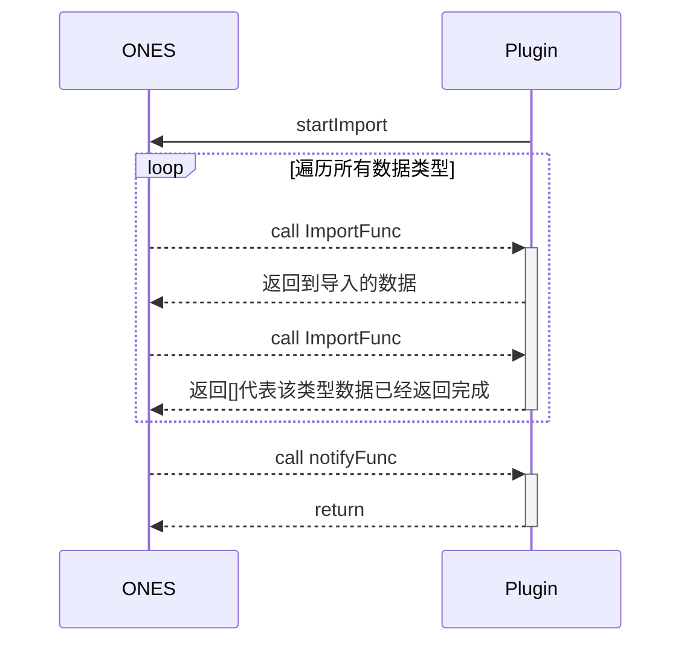

# 第三方数据导入

## 要求

| ONES      | @ones-op/node-third-import |
| :-------- | :------------------------- |
| v3.11.39+ | v0.1.2+                    |

## 概述

有时候我们需要批量导入第三方数据到 ONES 中，由于需要对接不同的第三方，一般使用插件来实现数据转化和导入。第三方数据导入能力定义了一套数据导入的规范和流程，简化了插件导入数据到 ONES 的过程，只需按规范实现数据转化即可完成导入。

## 使用

### 实现原理

整个数据导入流程由插件调用 `startImport` 开始，然后 ONES 开始分不同的数据类型调用插件的方法获取数据，每种数据类型会调用多次，直至插件返回空数组。当所有数据类型的导入完成或导入过程出错时，会通知插件本次导入的结果。



### 第一步：安装依赖

进入插件工程的`/backend`目录，执行以下命令进行依赖安装：

```shell
npm i @ones-op/node-third-import
```

### 第二步：添加配置

使用 `npx op add ability` 添加 `third-import@1.0.0` 类型的能力。生成 `backend/src/third-import.ts` 文件，并在插件配置文件中新增能力配置。

示例配置：

```yaml title="config/plugin.yaml"
abilities:
  - id: 5I-CjPX_
    name: 第三方导入
    version: 1.0.0
    abilityType: ThirdImport
    function:
      importFunc: importFunc
      notifyFunc: notifyFunc
```

在`abilities` 的 `config`中，插件开发者手动添加自定义通知消息内容（如果没有添加配置消息，就使用默认消息）。

#### 自定义通知

**ONES 要求：** v3.14.0+

| 参数                | 值类型 | 说明                                                   | 必填 |
| :------------------ | :----- | :----------------------------------------------------- | :--- |
| msgTitleNotice      | string | 消息的标题                                             | 否   |
| msgFailedContent    | string | 导入失败时，消息的内容                                 | 否   |
| msgSuccessContent   | string | 导入成功时，消息的内容                                 | 否   |
| msgThirdTitleFailed | string | 配置了第三方通知场景，导入失败时，发给第三方消息的标题 | 否   |
| msgThirdTitleDone   | string | 配置了第三方通知场景，导入成功时，发给第三方消息的标题 | 否   |

示例配置：

```yaml title="config/plugin.yaml"
abilities:
  - id: 5I-CjPX_
    name: 第三方导入
    version: 1.0.0
    abilityType: ThirdImport
    function:
      importFunc: importFunc
      notifyFunc: notifyFunc
    config:
      - key: msgTitleNotice
        value: '这是标题'
        fieldType: Input
      - key: msgFailedContent
        value: '导入失败内容'
        fieldType: Input
      - key: msgSuccessContent
        value: '导入成功内容'
        fieldType: Input
      - key: msgThirdTitleFailed
        value: '导入失败时，第三方标题'
        fieldType: Input
      - key: msgThirdTitleDone
        value: '导入成功时，第三方标题'
        fieldType: Input
```

### 第三步：开始导入

调用 `startImport` 方法开始第三方数据的导入。

**入参：**

| **参数**  | **类型** | **说明**                                                   | **必填** | **默认值** |
| :-------- | :------- | :--------------------------------------------------------- | :------- | :--------- |
| userUUID  | string   | 用户 uuid                                                  | 是       | -          |
| abilityId | string   | 插件能力配置中的能力 id                                    | 是       | -          |
| password  | string   | 首次登录时导入用户的默认密码（默认密码需要是字母数字组合） | 是       | -          |
| serverId  | string   | 如果导入的是同一批数据需要保证有相同的 `server_id`         | 是       | -          |
| teamUUID  | string   | 团队唯一标识，仅为组织插件时需要                           | 否       | -          |

**示例：**

```typescript
import { startImport } from '@ones-op/node-third-import'

await startImport(user_uuid, abilityId, password, server_id, teamUUID)
```

### 第四步：实现导入函数

当插件调用 `startImport` 开始导入之后，系统会自动开始导入流程。 导入流程开始后会多次调用 `importFunc` 来获取导入数据。每次调用函数会传入 `importFunc` 来表示本次调用导入的数据类型，插件可根据该字段返回对应的数据。当该类型没有数据需要导入时可返回空数组 []，则会进入下一种数据类型的导入，直至所有类型导入完成。

:::tip

所有导入数据类型的定义可参照 [@ones-op/node-third-import](../../../reference/packages/node-third-import/node-third-import.md) 中的内容。

:::

**入参:**

| **参数**    | **类型** | **说明**                       |
| :---------- | :------- | :----------------------------- |
| import_type | string   | 本次导入的数据类型             |
| pre_data    | any      | 该类型上一次导入的最后一个数据 |

**示例：**

```typescript
import type { ThirdUser } from '@ones-op/node-third-import'

export async function importFunc(request: PluginRequest): Promise<PluginResponse> {
  const { import_type } = request?.body as any
  const data: any[] = []

  if (import_type === 'ThirdUser') {
    const user: ThirdUser = {
      resource_id: 'xxxx',
      name: 'hosea',
      email: 'xiaoming@ones.com',
      phone: '18888888888',
      title: 'xxx',
      company: 'ONES',
      status: 10,
      create_time: 1665310367819,
      modify_time: 1665310367819,
    }

    data.push(user)
  }

  return {
    body: {
      code: 200,
      body: data,
    },
  }
}
```

### 第五步：实现通知函数

在 `backend/src/third-import.ts` 中会自动生成 `notifyFunc` 函数，在导入流程结束之后，会调用该函数并传回本次数据导入的结果。根据是否导入成功，会在该函数的入参中的 `body` 返回对应的内容。

- 导入成功

  | 参数       | 类型 | 说明     |
  | ---------- | ---- | -------- |
  | is_success | bool | 是否成功 |

- 导入失败

  | 参数         | 类型   | 说明           |
  | ------------ | ------ | -------------- |
  | process_name | string | 表示失败的环节 |
  | error_msg    | string | 错误信息       |

**示例:**

```typescript
export async function notifyFunc(request: PluginRequest): Promise<PluginResponse> {
  Logger.info('receive notify', JSON.stringify(request?.body))

  return {
    body: {
      code: 200,
      body: {},
    },
  }
}
```
