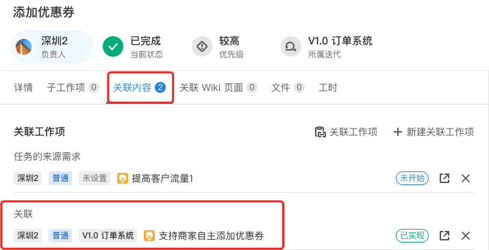
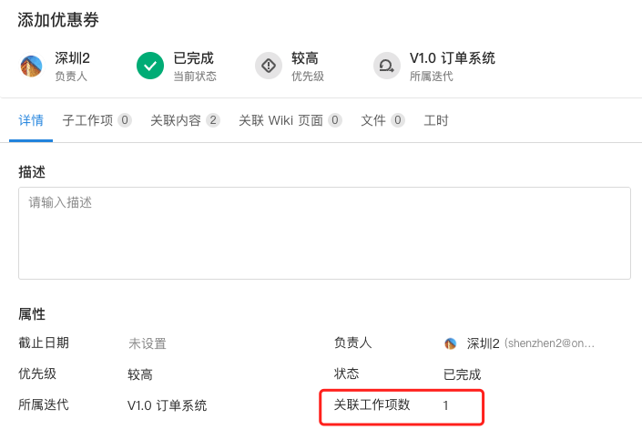

# 场景一： 自动统计工作项某一类关联关系的数量

## 场景描述

用户希望自动化统计某一个工作项的"关联"这个关联关系有关的工作项数量，并以工作项属性的方式展示。

以下图为例说明,该工作项共有 2 个关联内容，而用户需要的是`关联`下工作项的数量。



## 实现效果

通过脚本属性的方式，自动统计该工作项的关联关系为"关联"的工作项数量，并且进行显示。



## 解决方案

### 实现思路：

使用`插件承载脚本属性 - 数字`能力，在脚本属性计算方法中通过某一个工作项的 uuid 请求 ONES 标品获取其"关联"这个关联关系关联的工作项数量，组装脚本属性计算方法返回参数并返回，启用插件添加该脚本属性至工作项中即可。

## 插件开发

1. 使用 op 工具添加脚本属性能力

2. `{{插件根目录}}/config/plugin.yaml`中修改脚本属性相关配置

```yaml
service: ...
apis: ...
modules: []
abilities:
  - name: 脚本属性数字
    version: 1.0.0
    abilityType: ScriptFieldFloat
    function:
      calcFieldValue: linkTime
    config:
      - key: FieldName
        value: 关联工作项数
        fieldType: Input
        show: false
    id: ...
```

3. 脚本属性方法`linkTime`中，使用 graphQL 批量查询工作项的"关联"工作项数目。

> 注意：对于批量传入工作项 uuid 的情况，我们尽量只使用一次 graqhQL 去处理，否则会产生大量网络请求。

```typescript
import { fetchONES } from '@ones-op/node-fetch'
import type { PluginRequest, PluginResponse } from '@ones-op/node-types'

export const linkTime = async (request: PluginRequest): Promise<PluginResponse> => {
  const body = request?.body as any
  const returnValue: any[] = []
  if (body.fieldUUID && body.taskUUIDs && body.taskUUIDs.length > 0) {
    const uuidArray: any = []
    for (const taskUUID of body.taskUUIDs) {
      uuidArray.push(taskUUID)
    }
    const jsonUuidArray = JSON.stringify(uuidArray)
    console.log(JSON.stringify(uuidArray))
    const tempAbility = await fetchONES({
      path: `/team/${globalThis.onesEnv.teamUUID}/items/graphql`,
      method: 'POST',
      body: {
        query:
          '{\n    tasks(\n        filter: {   \n            uuid_in: ' +
          jsonUuidArray +
          ',\n        }\n    ){  \n        uuid\n        name\n        linkTypeIduuid0001In{\n            uuid\n            name\n        }\n    }\n}',
        variables: {},
      },
      root: true,
    })
    //@ts-ignore
    const linkData = tempAbility?.body?.data.tasks
    for (let i = 0; i < linkData.length; i++) {
      returnValue.push({
        taskUUID: linkData[i]['uuid'].toString(),
        value: linkData[i]['linkTypeIduuid0001In'].length * 100000, //具体返回的值，可以根据业务逻辑去统计
      })
    }
  }
  return {
    body: {
      code: 200,
      body: {
        values: returnValue,
      },
    },
  }
}
```

4. 至此插件开发完成，安装插件即可创建脚本属性`关联工作项数`，将该脚本属性添加至工作项中即可使用。
