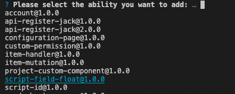

# 插件承载脚本属性 - 数字

## 要求

| **ONES** |
| :------- |
| 3.6+     |

## 概述

该能力允许插件实现了一个类型为“**浮点数**”的特殊的[工作项属性](https://guide.ones.pro/wiki/#/team/LBrdb4wE/space/6XDAYB1a/page/DXn8kLTt)，这个属性由插件实现，我们称之为脚本属性。脚本属性和同类型系统属性在 **ONES** 的表现形式是一样的，它们不同点在于，脚本属性的值完全由它自己的实现规则计算得出，用户不能主动修改它的值。插件开发者可以通过实现不同的脚本属性值计算规则，完成多样的业务开发。

脚本属性的适用场景：

1. 通过某个计算规则来统计数值
2. 希望数值准确，不能人为改动

在插件执行`install()`方法时，会创建该工作项属性，并且添加到全局属性列表中。用户可以将该属性添加到需要的工作项上。


当插件停用/卸载时，该属性值变成 0，成为一个失去统计功能的只读属性。当插件重新启用/安装时，该属性重新投入使用。

## 使用

通过 OP 工具添加该能力，然后再修改相关配置即可，相关步骤如下所示。

### 通过 OP 工具添加并使用能力：

**第一步**: 在`插件根目录`使用命令行输入 OP 命令添加能力（该指令需要 OP 工具版本 1.0 及以上）

```shell
npx op add ability
```

选中并添加`script-field-float@1.0.0`



OP 工具会询问是否使用默认值，选择是即可，OP 工具会为插件添加如下内容

- `{{插件根目录}}/config/plugin.yaml`中 abilities 字段新增相关段落。
  ```yaml
  service:
    app_id: ...
    name: ability-scriptFloat
    ...
  apis:
    ...
  abilities:
    - id: ...
      name: 脚本属性数字
      version: 1.0.0
      abilityType: ScriptFieldFloat
      function:
        calcFieldValue: calcFieldValues
      config:
        - key: FieldName
          value: ''
          fieldType: Input
          show: false
  ```
- OP 工具在插件中新增文件`{{插件根目录}}/backend/src/script-field-float.ts`

  ```typescript
  import type { PluginRequest, PluginResponse } from '@ones-op/node-types'

  // 示例方法 脚本浮点型的计算方法
  // 一次计算多个task的field_uuid
  // 请求的格式：
  // {
  //     fieldUUID: "xxx",
  //     taskUUIDs: ["aaa", "bbb", "ccc"]
  // }

  // 返回的格式：
  // {
  //     body:{
  //         code: 200,
  //         body: {
  //             values: [
  //                 {
  //                     taskUUID: "aaa",
  //                     value: 1.2
  //                 },
  //                 {
  //                     taskUUID: "bbb",
  //                     value: 2.3
  //                 },
  //             ]
  //         }
  //     }
  // }
  export const calcFieldValues = async (request: PluginRequest): Promise<PluginResponse> => {
    const body = request?.body as any
    const returnValue: any[] = []

    //需要数字统计的工作项的uuid数组
    if (body.fieldUUID && body.taskUUIDs && body.taskUUIDs.length > 0) {
      for (const taskUUID of body.taskUUIDs) {
        returnValue.push({
          taskUUID: taskUUID, //工作项UUID，请注意该工作项是已经存在脚本属性
          value: 200000, //具体返回的值，可以根据业务逻辑去统计
        })
      }
    }

    return {
      body: {
        code: 200,
        body: {
          values: returnValue,
        },
      },
    }
  }
  ```

  **第二步**: 修改`{{插件根目录}}/config/plugin.yaml`中脚本属性对应内容,其中`config`为脚本属性的配置，'FieldName'键对应的值为脚本属性名称，将其修改为你需要的称呼，这里修改为**脚本属性 1**，`calcFieldValue`的值对应脚本属性方法名，可以修改其为你想要的方法名，这里修改为**countFunc**。

  ```yaml
  service:
    app_id: ...
    name: ability-scriptFloat
    ...
  apis:
    ...
  abilities:
    - id: ...
      name: 脚本属性数字
      version: 1.0.0
      abilityType: ScriptFieldFloat
      function:
        calcFieldValue: countFunc
      config:
        - key: FieldName
          value: 脚本属性1
          fieldType: Input
          show: false
  ```

  **第三步**: 修改脚本属性方法，其默认为`{{插件根目录}}/backend/src/script-field-float.ts`的`calcFieldValues`方法，注意返回参数`returnValue`中的值默认为浮点数，其单位默认为`1/100000`，按照注释中内容修改自己的脚本属性计算逻辑即可。可以在插件后端任意路径实现该方法，但是请注意将该方法抛出。

## 示例

- [自动统计工作项某一类关联关系的数量](sample-script-field-float1.md)
