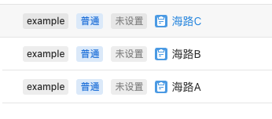
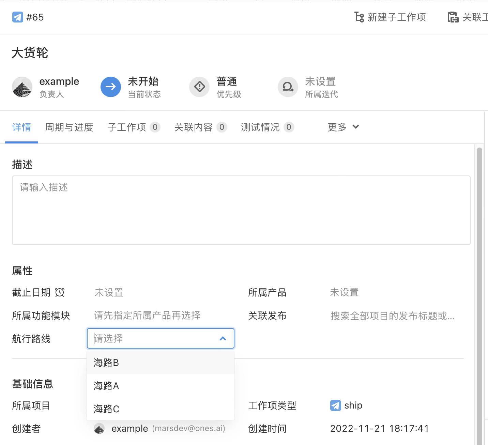

# 场景一： 自动给出航海路线列表

## 场景描述

用户希望对于每个货轮，自动给出航行的所有路线，方便用户进行选择。

**所有航行路线**



## 实现效果

对于每个货轮，可以选择自己的航行路线，如图所示。



## 解决方案

### 实现思路：

使用`插件承载脚本属性 - 单选/多选`能力，创建`航行路线`的单选菜单脚本属性，在脚本属性计算方法中通过搜索所有名字中带有“海路”的工作项，将其组装成单选菜单的选项值。最后安装插件并启用，将`航行路线`工作项属性添加到需要的工作项即可。

## 插件开发

1. `{{插件根目录}}/config/plugin.yaml`中添加脚本属性 - 单选/多选相关配置

```yaml
service:
  app_id: ...
  name: ability-scriptSelection
  ...
apis:
  - type: addition
    methods:
      - POST
    url: /scriptFieldSearch
    function: GetOptions
```

2. 在插件安装时调用的`install`方法内，编写创建`航行路线`单选菜单的脚本属性的方法

```typescript
import { Field } from '@ones-op/node-ability'
import { Logger } from '@ones-op/node-logger'

export async function Install() {
  Logger.info('[Plugin] Install')
  //调用脚本属性添加方法，创建数字类型的脚本属性
  const FieldsAddRes = await Field.FieldsAdd({
    Name: '航行路线',
    Type: 1001, //1001为单选，1002为多选
    Renderer: 1,
    FilterOption: 0,
    SearchOption: 1,
  })
  if (FieldsAddRes.Error) {
    //如果添加失败，抛出异常
    throw new Error('Failed to create property')
  }
  //添加成功返回属性的UUID
  const { UUID: fieldUUID } = FieldsAddRes
  Logger.info('fieldUUID:', fieldUUID)
  return {
    body: {
      message: 'Field Add UUID:',
      fieldUUID,
    },
  }
}
```

3. 在`GetOptions`方法内，使用 graphQL 语句查找名字中带有"海路"的工作项，并且将其组装成相应的数据格式。

```typescript
export async function GetOptions(request: PluginRequest): Promise<PluginResponse> {
  const body = request?.body || {}

  const tempData = await fetchONES({
    path: `/team/${globalThis.onesEnv.teamUUID}/items/graphql`,
    method: 'POST',
    body: {
      query:
        '{\n    tasks (\n        filter: {\n            name_match: "海路"\n        }\n    ){  \n        uuid\n        name\n    }\n}',
      variables: {},
    },
    root: true,
  })
  //@ts-ignore
  const data = tempData?.body?.data.tasks
  let optionsTempName = 'vcxzoiy'
  let optionsValue: any[] = []
  for (let i = 0; i < data.length; i++) {
    optionsValue.push({
      uuid: optionsTempName + i.toString(),
      value: (data[i]['value'] = data[i]['name'].toString()),
    })
  }
  let resp = <PluginResponse>{
    body: {
      code: 200,
      body: {
        options: optionsValue,
      },
    },
  }
  return resp
}
```

4. 安装插件并启动，将"航行路线"属性添加至对应的工作项类型下即可。
