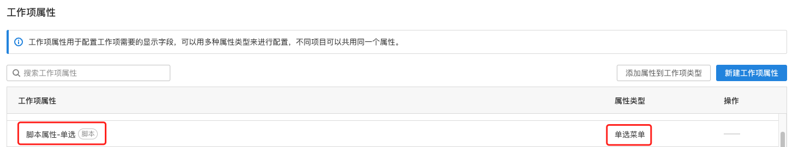

# 插件承载脚本属性 - 单选/多选

## 要求

| **ONES** |
| :------- |
| 3.6+     |

## 概述

该能力允许插件实现了一个类型为“**单选菜单/多选菜单**”的特殊的[工作项属性](https://guide.ones.pro/wiki/#/team/LBrdb4wE/space/6XDAYB1a/page/DXn8kLTt)，这个属性由插件实现，我们称之为脚本属性。脚本属性和同类型系统属性在 **ONES** 的表现形式是一样的，它们不同点在于，脚本属性的各个选项值由它自己的业务逻辑计算得出，插件开发者可以通过实现不同的脚本属性值计算规则，完成多样的业务开发。

在插件安装时，会执行插件的`install()`方法，创建该工作项属性(单选菜单或多选菜单)，并且添加到全局属性列表中。用户可以将该属性添加到需要的工作项类型上。



该脚本属性添加到工作项后，表现与其它工作项属性相同。


## 使用

按如下步骤即可使用能力。

**第一步**: 在`config/plugin.yaml`文件中，`apis`字段内新增内容。

```yaml
service:
  app_id: ...
  name: ability-scriptSelection
  ...
apis:
  - type: addition
    methods:
      - POST
    url: /scriptFieldSearch
    function: GetOptions
```

**第二步**: 在插件安装时调用的`install`方法内，完成脚本属性的声明。

```typescript
import { Field } from '@ones-op/node-ability'
import { Logger } from '@ones-op/node-logger'
import type { PluginRequest, PluginResponse } from '@ones-op/node-types'

export async function Install() {
  Logger.info('[Plugin] Install')
  //调用脚本属性添加方法，创建类型为“单选菜单”的脚本属性
  const FieldsAddRes = await Field.FieldsAdd({
    Name: '脚本属性-单选',
    Type: 1001, //多选为1002
    Renderer: 1,
    FilterOption: 0,
    SearchOption: 1,
  })
  if (FieldsAddRes.Error) {
    //如果添加失败，抛出异常
    throw new Error('Failed to create property')
  }
  //添加成功返回属性的UUID
  const { UUID: fieldUUID } = FieldsAddRes
  Logger.info('fieldUUID:', fieldUUID)
  return {
    body: {
      message: 'Field Add UUID:',
      fieldUUID,
    },
  }
}
```

> FieldsAdd 方法中，Type 参数为 1001 代表单选，1002 为多选

**第三步**: 在`GetOptions`方法中，如以下格式完成脚本属性选项值的构建。

```typescript
import type { PluginRequest, PluginResponse } from '@ones-op/node-types'

export async function GetOptions(request: PluginRequest): Promise<PluginResponse> {
  const body = request?.body || {}
  let resp = <PluginResponse>{
    body: {
      code: 200,
      body: {
        options: [
          {
            uuid: 'zxcvzzzz', //自定义8位 uuid
            value: '选项1', //选项1的值
          },
          {
            uuid: 'zxcvzzxx', //自定义8位 uuid
            value: '选项2', //选项2的值
          },
        ],
      },
    },
  }
  return resp
}
```

## 示例

- [自动给出航海路线列表](sample-script-field-selection1.md)
