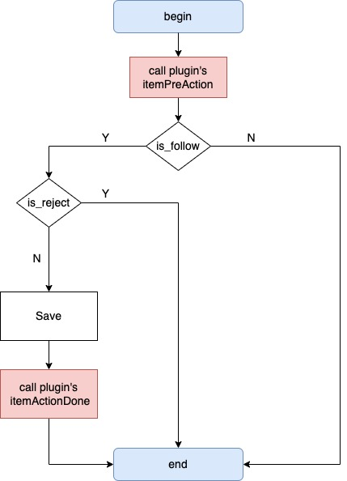

# Item 处理器

## 能力描述

支持拦截 Item 的 Add、Update、Delete 操作，当系统产生 Item 的这些操作时，注册了该能力的插件将在此事件生效（落盘）前，收到这个事件的数据，并能够对其进行一些操作，例如：

1. 忽略，不处理此事件；
2. 接受，不修改此事件，但关注其后续处理结果（处理完成后通知插件此事件的结果）；
3. 修改，修改事件的内容，但不支持新增变更；
4. 拒绝，阻止此事件生效；

## 能力范围

- graphql 中 item 接口中 mutation 的 add、update、delete 相关操作
  - Manhour
  - RemainingHour
  - ActivityRelease
  - Activity
  - Deliverable
  - ActivityRelationLink
  - Project(add、update）
  - Task（add、update）
- 新建和批量新建项目，以及项目属性修改
- 工时模式——普通模式下修改剩余工时，预估工时
- 工作项（范围参考[TaskEventHandler](./task-event-handler.md)）

## 能力方法控制流程图



## 能力使用

1. 使用 op 工具添加能力

   包含以下文件变更：

   - 文件修改：config/plugin.yaml 上新增了能力配置
   - 文件新增：itemHandler.ts

2. 配置 config/plugin.yaml

   在能力 config 下，配置插件能力要关注的“itemType”和“action”

   - itemType:使用小写驼峰，比如：project,remainingHour,activityRelease
   - action:add,update,delete 只有三种枚举值

```yaml
abilities:
  - id: b705b4ec
    name: Item处理器
    version: 1.0.0
    abilityType: ItemHandler
    function:
      itemPreActionFunc: itemPreAction
      itemActionDoneFunc: itemActionDone
    config:
      - key: itemType
        value: project,remainingHour,task #小写驼峰
        fieldType: Input
        label: 'Item类型'
        show: true
      - key: action
        value: update,add,delete
        fieldType: Input
        label: '操作'
        show: true
```

3. 修改 backend/src/itemHandler.ts

   文件包含了两个方法：

   - itemPreAction ：落盘前调用，支持修改属性值
   - itemActionDone ：落盘后调用

   在两个的方法里新增对应的处理逻辑

```ts
// 落盘前调用
export async function itemPreAction(request: PluginRequest): Promise<PluginResponse> {
  var body = request?.body as any
  var userUUID = body.user_uuid
  var lang = body.lang
  var args = body.args
  var itemType = body.item_type
  var action = body.action
  Logger.info('itemType', itemType)
  Logger.info('userID:', userUUID)
  Logger.info('lang', lang)
  Logger.info('args', args)
  Logger.info('action', action)
  var isFollow = true
  var isReject = false
  if (itemType == 'project' && action == 'update') {
    // 项目属性更新
  } else if (itemType == 'project' && action == 'add') {
    // 新建项目
    var pName = args.name
    var pMembers = args.members
    Logger.info('project_name', pName)
    Logger.info('project_member:', pMembers)
  } else if (itemType == 'manhour' && action == 'add') {
    // 工时item 新增
    var hours = args.hours
    Logger.info('hours', hours)
  } else if (itemType == 'remainingHour' && action == 'update') {
    // 剩余工时
    var taskUUID = args.task
    var hours = args.hours
    Logger.info('hours', hours)
    Logger.info('taskUUID', taskUUID)
    args.hours = 3838000
  } else if (itemType == 'manhour' && action == 'update') {
    // 工时item 更新
    var type = args.type
    if (type == 'estimated') {
      // 预估工时
      var hours = args.hours
      Logger.info('hours', hours)
      args.hours = 2828000
    }
  } else if (itemType == 'task') {
    var events = body.args // TaskEventHandler取值的用法是 body.task_events
    for (var i = 0; i < events[0].task_fields.length; i++) {
      var field = events[0].task_fields[i]
      Logger.info('=========', i, '=============')
      Logger.info('field_uuid:', field.field_uuid)
      Logger.info('field_type:', field.field_type)
      Logger.info('field_name:', field.field_name)
      Logger.info('field_name_map:', field.field_name_map)
      Logger.info('field_value_type:', field.field_value_type)
      Logger.info('value:', field.value)
      isFollow = true
      isReject = false
    }
  }
  return {
    statusCode: 200,
    body: {
      code: 200,
      body: {
        is_follow: isFollow,
        is_reject: isReject,
        reject_reason: '拒绝理由',
        args: args,
        other_data: '其他数据',
      },
    },
  }
}
// 落盘后调用
export async function itemActionDone(request: PluginRequest): Promise<PluginResponse> {
  var body = request?.body as any
  var userUUID = body.user_uuid
  Logger.info('ans userUUID', userUUID)
  var itemType = body.item_type
  Logger.info('ans itemType', itemType)
  var action = body.action
  Logger.info('ans action', action)
  var lang = body.lang
  Logger.info('ans lang', lang)
  var graphqlQuery = body.graphql_query
  Logger.info('ans query', graphqlQuery)
  var args = body.args
  Logger.info('ans args', args)
  var otherData = body.other_data
  Logger.info('ans otherData', otherData)
  return {
    statusCode: 200,
    body: {
      code: 200,
    },
  }
}
```

# 结构定义

## itemActionDone 方法定义

##### 入参

| 参数          | 类型                                                                                                                                                                                                                              | **是否必填** | 说明              |
| ------------- | --------------------------------------------------------------------------------------------------------------------------------------------------------------------------------------------------------------------------------- | ------------ | ----------------- |
| user_uuid     | string                                                                                                                                                                                                                            | Y            | 用户 id           |
| item_type     | string                                                                                                                                                                                                                            | Y            | item 类型         |
| action        | string                                                                                                                                                                                                                            | Y            | add/update/delete |
| lang          | string                                                                                                                                                                                                                            | Y            | 语言              |
| graphql_query | graphql.Query                                                                                                                                                                                                                     | N            |                   |
| args          | 新增项目：add_project<br/>修改项目属性：update_project<br/>预估工时-普通模式：estimated_manhour<br/>剩余工时-普通模式：remain_manhour <br/>工作项：[TaskEvent](./task-event-handler#结构定义)<br/>其他：map[string]interface<br/> | Y            | 参数值            |

返参

| 参数          | 类型                 | **是否必填** | 说明                                 |
| ------------- | -------------------- | ------------ | ------------------------------------ |
| is_follow     | string               | Y            | 用户 id                              |
| is_reject     | string               | Y            | item 类型                            |
| reject_reason | string               | N            | 拒绝理由                             |
| args          | map[string]interface | Y            | 参数值                               |
| other_data    | interface            | N            | 其他数据（该参数会传递给 done 方法） |

### itemActionDone 方法定义

入参

| 参数          | 类型              | **是否必填** | 说明                       |
| ------------- | ----------------- | ------------ | -------------------------- |
| user_uuid     | string            | Y            | 用户 id                    |
| item_type     | string            | Y            | item 类型                  |
| action        | string            | Y            | add/update/delete          |
| lang          | string            | Y            | 语言                       |
| graphql_query | graphql.Query     | N            |                            |
| args          | 同 itemActionDone | Y            | 参数值                     |
| other_data    | interface         | N            | 其他数据（来自 preAction） |

返参

无

### add_project 定义

| 参数         | 类型     | 说明      |
| ------------ | -------- | --------- |
| uuid         | string   | 项目 id   |
| name         | string   | 项目名称  |
| members      | []string | 成员      |
| template_id  | string   | 模版 id   |
| program_uuid | string   | 项目集 id |

### update_project(更新项目属性)

| 参数         | 类型      | 说明      |
| ------------ | --------- | --------- |
| key          | string    | key 值    |
| item_type    | string    | item 类型 |
| 其他字段 key | interface |           |

### estimated_manhour（普通模式）定义

| 参数  | 类型   | 说明      |
| ----- | ------ | --------- |
| task  | string | 工作项 id |
| hours | int64  | 预估工时  |
| type  | string | estimated |

### remain_manhour（普通模式）定义

| 参数  | 类型   | 说明                      |
| ----- | ------ | ------------------------- |
| key   | string | manhour-工作项 id-用户 id |
| hours | int64  | 剩余工时                  |
